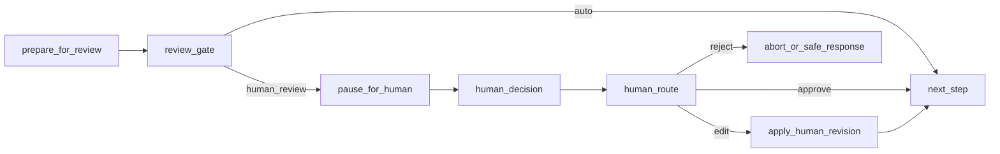

# Human-in-the-Loop

Standard strategies for adding human approval, editing, and rejection to LangGraph graphs.

## 1. Runtime Model

1. The graph pauses through `interrupt`.
2. Execution state is stored in the persistence layer.
3. The resumption target is identified by `thread_id`.
4. A human decision is delivered through explicit input such as `Command(resume=...)`.
5. The graph runs again in the same thread context.

Core principles:

- Treat Human-in-the-Loop as a pause-resume problem.
- Design it on the assumption of durable persistence.
- Treat human decisions as structured input.

## 2. Decision Types

- `approve`: continue as-is
- `edit`: continue after modification
- `reject`: abort or return a safe response

Even escalation-style flows should be normalized into these three tokens in the end.

## 3. Standard Pattern

## 4. Implementation Rules

- Do not treat `interrupt` as a normal exception.
- Do not wrap `interrupt` in a bare `try/except`.
- Assume that nodes may execute again from the beginning during resumption.
- Side effects before `interrupt` must be idempotent.
- The order of multiple interrupts must be deterministic.
- Human input should go through the same validation pipeline as machine-generated output.

## 5. State Contract

| Key | Meaning |
| --- | --- |
| `review_required` | whether human review is required |
| `review_reason` | why review is required |
| `review_payload` | structured data shown to the human |
| `human_decision` | approve, edit, reject |
| `human_feedback` | free-form input |
| `human_revision` | revised result |
| `resume_token` | identifier for the resume point |
| `review_actor` | identifier of the approver |

## 6. Intervention Points

### Plan-and-Execute

- right after planner output
- right before a high-cost tool batch execution
- right before replanning
- right before final response generation

### RAG

- right after query expansion results
- right after final top-k selection
- right after the final answer draft

### Text-to-SQL

- right after schema selection
- right after SQL generation
- right before SQL retry
- right before final response generation

## 7. Event Contract

| Event | Meaning |
| --- | --- |
| `review_requested` | human review required |
| `review_payload` | review data |
| `review_approved` | approved |
| `review_edited` | edited |
| `review_rejected` | rejected |
| `review_timeout` | no response |
| `resume_started` | resumption started |

## 8. Operational Rules

- Place review gates only at high-cost, high-risk, or high-uncertainty points.
- Prefer escalation-style flows over approval-only flows as the default.
- Always keep a fallback path after timeout.
- Do not add too many review points.
