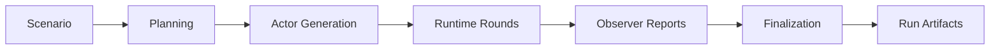

<h1 align="center">Simula</h1>

<p align="center">
  
  
  
  
</p>

`simula` is an agent-based virtual simulation system. It turns a scenario into a structured
virtual world, runs staged actor interactions, streams live graph events, and writes inspectable
run artifacts.

[Documentation](./docs/README.md) · [Workflow Docs](./docs/workflows/README.md) · [Sample Scenarios](./senario.samples/README.md)

## What Simula Is

`simula` models a scenario as a temporary world populated by actors. Each actor has explicit
identity, state, intent, memory, relationships, and available actions. The system advances the
world through focused rounds instead of producing one opaque narrative in a single pass.

The current implementation is a Bun monorepo with:

| Package | Responsibility |
| --- | --- |
| `apps/server` | Bun API server, run storage, settings persistence, sample loading, SSE streaming |
| `apps/web` | Vite React app for scenario creation, settings, live simulation, replay, and report export |
| `packages/core` | scenario parsing, settings validation, LangGraph workflow, reporting, and file storage |
| `packages/shared` | shared API, event, scenario, run, graph, and simulation types |

## Core Concepts

| Concept | Meaning |
| --- | --- |
| Scenario | The source brief plus frontmatter controls that define cast size, round count, and runtime options. |
| Actor | A stateful participant with a role, goal, intent, memory, relationships, and action catalog. |
| Round | One focused advancement of the world through selected actor actions and observer output. |
| Event stream | Append-only `events.jsonl` data used for replay, timeline state, and inspection. |
| Graph timeline | `graph.timeline.json`, derived during execution for visual replay. |
| Report | Final Markdown projection of the completed simulation state. |

## How A Simulation Works



- Planning interprets the scenario, builds a cast outline, major events, and runtime direction.
- Actor generation turns planned cast slots into actor cards and per-visibility actions.
- Runtime advances the world through actor messages, interactions, context updates, and round reports.
- Finalization renders the completed state into `report.md`.

## Quick Start

```bash
bun install
bun run dev:server
bun run dev:web
```

The server listens on `http://localhost:3001` by default. The web app uses the Vite dev server and
proxies `/api` to the server.

You can also run both dev servers with:

```bash
bun run dev
```

## Settings

Model settings resolve from:

1. built-in defaults
2. `env.toml` at the repository root, or `SIMULA_ENV_TOML_PATH`
3. `settings.json` at the repository root, or `SIMULA_SETTINGS_PATH`
4. values saved through the web settings dialog

The server masks saved API keys when returning settings to the client. A masked value sent back as
`********` keeps the existing secret.

Supported providers are:

- `openai`
- `anthropic`
- `gemini`
- `ollama`
- `lmstudio`
- `vllm`
- `litellm`

Supported model roles are:

- `storyBuilder`
- `planner`
- `generator`
- `coordinator`
- `actor`
- `observer`
- `repair`

## Scenario Frontmatter

Scenario files must start with a flat frontmatter block.

```text
---
num_cast: 6
allow_additional_cast: true
actions_per_type: 3
max_round: 8
fast_mode: false
actor_context_token_budget: 2000
---
Scenario body starts here.
```

`num_cast` is required. The other controls are optional:

| Key | Default | Meaning |
| --- | --- | --- |
| `allow_additional_cast` | `true` | Allow the planner to include more than `num_cast` actors. |
| `actions_per_type` | `3` | Number of generated actions for each visibility type. |
| `max_round` | `8` | Number of actor activity rounds to run. |
| `fast_mode` | `false` | Run dependency-safe actor and observer work in parallel. |
| `actor_context_token_budget` | role default | Token budget for actor-facing context compression. |

Sample scenario seeds live in [`senario.samples/`](./senario.samples/README.md).

## Run Artifacts

The default live run root is `runs/`. Override it with `SIMULA_DATA_DIR`.

```text
runs/
  <run_id>/
    manifest.json
    scenario.json
    events.jsonl
    state.json
    report.md
    graph.timeline.json
```

`events.jsonl` records model messages, metrics, actor readiness, interactions, actor messages,
round completion, graph deltas, report deltas, and terminal run events.

`state.json` is the final structured simulation state. `report.md` is the human-readable report.
`graph.timeline.json` powers replay and visual inspection in the web app.

The committed [`output.samples/`](./output.samples/) directories are reference outputs from earlier
sample runs. They are kept for inspection and are separate from current live runs.

## API Surface

The server exposes a small local API:

| Route | Purpose |
| --- | --- |
| `GET /api/settings` / `PUT /api/settings` | Read and save masked role settings. |
| `POST /api/story-builder/draft` | Draft a scenario from chat messages. |
| `GET /api/scenarios/samples` | List bundled scenario samples. |
| `GET /api/scenarios/samples/:name` | Read one sample scenario. |
| `GET /api/runs` / `POST /api/runs` | List runs or create a run from a scenario. |
| `GET /api/runs/:id` | Read run manifest, state, timeline, and events. |
| `POST /api/runs/:id/start` | Start execution for a created run. |
| `GET /api/runs/:id/events` | Stream Server-Sent Events for the run. |
| `GET /api/runs/:id/report` | Read the Markdown report. |
| `GET /api/runs/:id/export?kind=json|jsonl|md` | Export state, events, or report. |

## Validation

Use Bun for package management, scripts, tests, and builds:

```bash
bun test
bun run typecheck
bun run lint
bun run build
```

Browser workflow checks use Playwright:

```bash
bun run test:e2e
```

## Documentation Map

| Document | Focus |
| --- | --- |
| [`docs/README.md`](./docs/README.md) | documentation map and reading paths |
| [`docs/architecture.md`](./docs/architecture.md) | system boundaries, app/server/core split, and persistence |
| [`docs/contracts.md`](./docs/contracts.md) | scenario, settings, run, event, state, and export contracts |
| [`docs/llm.md`](./docs/llm.md) | model roles, providers, validation, retries, and metrics |
| [`docs/analysis.md`](./docs/analysis.md) | current inspection artifacts and reference sample outputs |
| [`docs/configuration.md`](./docs/configuration.md) | local settings, environment variables, and provider defaults |
| [`docs/operations.md`](./docs/operations.md) | local execution, artifacts, samples, and validation |
| [`docs/workflows/README.md`](./docs/workflows/README.md) | workflow hub and stage handoffs |
