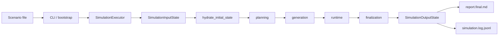

# simula

`simula` is a scenario-to-report simulation engine built on LangGraph. It takes one scenario
file, hydrates a compact public input into a richer workflow state, runs a staged multi-agent
simulation, and writes one inspectable run directory that includes the final Markdown report,
`simulation.log.jsonl`, and derived analysis artifacts.

[Documentation](./docs/README.md) · [Workflow Docs](./docs/workflows/README.md) · [Sample Scenarios](./senario.samples/README.md)


## What It Does

Most simulation prototypes collapse setup, actor generation, runtime pacing, and reporting into
one opaque loop. `simula` keeps them separate.

- Planning turns raw scenario text into one compact analysis bundle and one execution-plan bundle.
- Generation turns the cast roster into actor cards through explicit slot-by-slot generation.
- Runtime loops through directed rounds instead of free-running until token exhaustion.
- Finalization turns the finished state into a report bundle and a JSONL log.

The result is easier to inspect, test, and evolve than a single prompt chain.

The integrated analysis pipeline also exposes benchmark-friendly network metrics so saved runs can be compared on
participation spread, action diversity, path depth, concentration, community structure, and
cumulative growth.

Cross-layer helpers are kept out of the application and domain packages where possible.
Shared logging and JSONL runtime-output helpers now live under `simula.shared.*`.

## Why This Design

- Small public API, rich internal state: the root graph accepts `SimulationInputState`, then
  hydrates it once into `SimulationWorkflowState`.
- Required-only structured outputs: active LLM contracts do not rely on optional fields.
- Narrow prompt projections: each role receives only the data required for its task.
- Durable artifacts: runtime state, final report data, and JSONL output are explicit products.

## Quick Start

```bash
uv sync
cp env.sample.toml env.toml
# UPDATE YOUR ENV.TOML
uv run simula --scenario-file ./senario.samples/03_startup_boardroom_crisis.md
```

For detailed local workflow logs:

```bash
uv run simula --scenario-file ./senario.samples/03_startup_boardroom_crisis.md --log-level DEBUG
```

Repeat the same scenario three times:

```bash
uv run simula --scenario-file ./senario.samples/03_startup_boardroom_crisis.md --trials 3
```

Allow intra-run graph parallelism for one run:

```bash
uv run simula --scenario-file ./senario.samples/03_startup_boardroom_crisis.md --parallel
```

Outputs land in:

```text
output/
  <run_id>/
    manifest.json
    report.final.md
    summary.overview.md
    simulation.log.jsonl
    data/
    summaries/
    assets/
```

Run ids follow:

```text
YYYYMMDD.001.<actor-model-id>.<scenario-file-stem>
```

For example:

```text
20260418.001.qwen3-8b.03-startup-boardroom-crisis
```

The integrated analysis artifacts land in the same run directory:

```text
output/
  <run_id>/
    data/llm_calls.csv
    data/performance.summary.csv
    summaries/token_usage.summary.md
    summaries/network.summary.md
    assets/network.graph.png
    assets/network.growth.mp4
```

## One End-to-End Flow



This is the only flow described by the current documentation set.

## Workflow Stages

| Stage | Active path | Output |
| --- | --- | --- |
| `planning` | `build_planning_analysis -> build_execution_plan -> finalize_plan` | compact execution plan |
| `generation` | `prepare_actor_slots -> generate_actor_slot -> finalize_generated_actors` | actor cards |
| `runtime` | `initialize_runtime_state -> prepare_round -> plan_round -> actor proposal stage -> resolve_round` | adopted activities, observer reports, stop state |
| `finalization` | `resolve_timeline_anchor -> build_report_artifacts -> section writers -> render_and_persist_final_report` | final report payloads and markdown |

By default the shipped workflow runs serial graph variants for planning, generation, runtime, and
finalization. `--parallel` switches one run onto the parallel graph variants, which re-enable the
explicit fan-out and multi-branch paths inside the workflow.

## Outputs

`report.final.md` contains:

- simulation conclusion
- actor results table
- timeline
- actor dynamics
- major events

`simulation.log.jsonl` records:

- simulation start
- raw LLM calls with prompt and merged raw response text
- finalized plan
- finalized actors
- round focus selection
- round time advancement
- background updates
- adopted actions
- observer reports
- final report
- LLM usage summary

## Configuration

Settings resolve in this order:

1. built-in defaults
2. `env.toml`
3. environment variables
4. CLI overrides

Common runtime controls:

- `runtime.max_rounds`
- `runtime.max_actor_calls_per_step`
- `runtime.max_focus_slices_per_step`
- `runtime.max_recipients_per_message`
- `runtime.enable_checkpointing`
- `runtime.rng_seed`
- `--max-rounds` for CLI round-cap override
- `--trials` for sequential repeated runs
- `--parallel` for intra-run graph parallelism
- `--log-level` for CLI-visible logging verbosity

`--parallel` changes only one run's internal graph behavior. Trials stay sequential even when the
flag is enabled.

| Area | Default run | `--parallel` run |
| --- | --- | --- |
| trials | sequential | sequential |
| planning cast chunks | serial queue | parallel fan-out |
| generation actor slots | serial queue | parallel fan-out |
| runtime actor proposals | serial queue | parallel fan-out |
| coordinator nodes | serial staged calls | serial staged calls |
| finalization sections | serial section writers | parallel branch writers |

Coordinator logic still issues its own LLM stages sequentially. The current parallel switch only
re-enables explicit graph fan-out and multi-branch execution points.

Scenario files must declare YAML frontmatter. The active authoring controls are:

- `num_cast`
  - required positive integer
  - sets the requested cast count for planning and generation
- `allow_additional_cast`
  - optional boolean
  - defaults to `true`
  - `false`: require exactly `num_cast` cast entries
  - `true`: require at least `num_cast` cast entries

## Sample Scenarios

The repository includes scenario seeds in [`senario.samples/`](./senario.samples/README.md):

- `01_consumer_marketing_launch.md`
- `02_wargame_iran_us.md`
- `03_startup_boardroom_crisis.md`
- `04_city_hall_disaster_response.md`
- `05_korean_enterprise_promo_approval_conflict.md`
- `06_new_technology_internal_conflict.md`

## Documentation Map

| Document | Focus |
| --- | --- |
| [`docs/README.md`](./docs/README.md) | documentation map and reading order |
| [`docs/architecture.md`](./docs/architecture.md) | layers, execution path, and runtime boundaries |
| [`docs/contracts.md`](./docs/contracts.md) | public state surfaces, internal state groups, and artifacts |
| [`docs/llm.md`](./docs/llm.md) | role routing, prompt projections, and structured-output policy |
| [`docs/analysis.md`](./docs/analysis.md) | integrated analysis pipeline and output artifact layout |
| [`docs/workflows/README.md`](./docs/workflows/README.md) | workflow hub and stage handoffs |
| [`docs/operations.md`](./docs/operations.md) | local execution, validation, and maintenance |

## Development

Validate changes with:

```bash
uv run pytest -q
uv run ty check src
uv run ruff check src tests
uv run ruff clean
```
