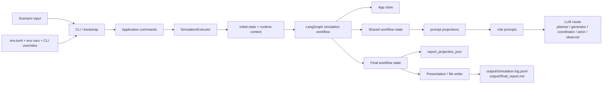
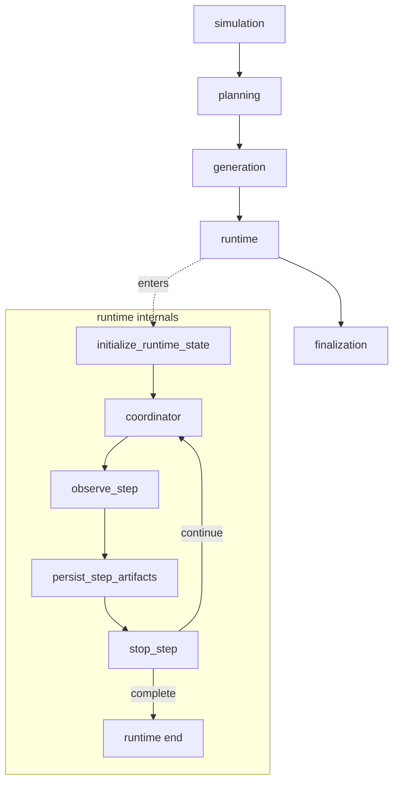

<div align="center">
  <h1>simula</h1>
  <p><strong>State-driven multi-agent simulation built on LangGraph.</strong></p>
  <p>
    simula turns one scenario into a planning pass, an actor registry, a runtime
    adjudication loop, observer summaries, and a final markdown report.
  </p>
  <p>
    <a href="./docs/README.md">Documentation</a>
    ·
    <a href="./docs/workflows/README.md">Workflow Docs</a>
    ·
    <a href="./senario.samples/README.md">Sample Scenarios</a>
  </p>
  <p>
    
    
    
    
  </p>
</div>

## What This Is

`simula` is a scenario-to-report simulation engine for multi-actor situations such as
boardroom conflicts, public crises, political rumor cascades, or relationship-heavy
social games.

The current compiled workflow is organized around five distinct LLM-facing roles:

- `planner`
- `generator`
- `coordinator`
- `actor`
- `observer`

The project is opinionated about state:

- planning produces structured execution inputs instead of loose prose
- runtime keeps visible activities, background updates, focus history, intent snapshots,
  and simulation time as explicit state channels
- finalization rebuilds a report projection instead of dumping raw logs directly

The LLM-facing nodes do not read the full workflow state directly. Generation,
coordinator, actor, and observer prompts now receive compact prompt projections derived
from rich workflow state, while finalization uses a separate report projection for
report-writing tasks.

## Why It Exists

Most LLM simulations collapse planning, action generation, pacing, and summarization into
one undifferentiated loop. `simula` deliberately splits them apart so each phase has a
clear contract:

- planning interprets the scenario and defines the execution frame
- generation turns the cast roster into runnable actor cards
- runtime chooses who matters now, adjudicates actions, advances time, and tracks momentum
- finalization assembles a report that is readable by humans and stable enough for tooling

## How It Works

### System Blueprint



### Workflow Blueprint



### Stage Map

| Stage | Primary owner | What it produces |
| --- | --- | --- |
| Planning | `planner` | interpretation, situation bundle, runtime progression plan, action catalog, coordination frame, cast roster, persisted `plan` |
| Generation | `generator` | actor registry from compact interpretation, situation, action-catalog, and coordination-frame views |
| Runtime | `coordinator`, `actor`, `observer` | compressed candidate/focus decisions, compact actor prompt inputs, compact observer inputs, adopted activities, intent history, simulation clock, stop signals |
| Finalization | `observer` + finalization assembly nodes | final report JSON, report projection JSON, markdown report state |

### Core Runtime Terms

| Term | Meaning |
| --- | --- |
| `action catalog` | scenario-wide list of allowed action types that actors choose from |
| `coordination frame` | planner-produced rules that guide runtime focus and background motion |
| `focus slice` | the actor cluster that the coordinator decides to follow directly in one step |
| `prompt projection` | compact prompt-facing view derived from rich workflow state for one role or node |
| `visible action context` | compact action digest set shown to one actor instead of the full visible history |
| `unread backlog digest` | summary of unread actions omitted from the compact actor context window |
| `background update` | structured digest for deferred actors that were not called directly |
| `observer report` | per-step summary with `momentum`, `atmosphere`, and `world_state_summary` |
| `report projection` | finalization-only report-writing structure, separate from prompt projections |

## Run It

### Quick Start

```bash
uv sync
cp env.sample.toml env.toml
uv run simula --scenario-file ./senario.samples/03_startup_boardroom_crisis.md
```

### Common CLI Patterns

```bash
# Override max steps
uv run simula \
  --scenario-file ./senario.samples/03_startup_boardroom_crisis.md \
  --max-steps 16

# Run the same scenario three times
uv run simula \
  --scenario-file ./senario.samples/03_startup_boardroom_crisis.md \
  --trials 3

# Run trials in parallel
uv run simula \
  --scenario-file ./senario.samples/03_startup_boardroom_crisis.md \
  --trials 3 \
  --parallel
```

### Configuration Notes

- `env.toml` is optional. If it exists, it is loaded automatically.
- effective precedence is: CLI overrides -> environment variables -> `env.toml` -> defaults
- the fixed-time settings `time_unit` and `time_step_size` are intentionally not supported
- the coordinator is a first-class role in config and can have its own model settings

## Output Artifacts

The workflow itself produces structured state. After the graph returns, the presentation
layer writes the file artifacts for a run.

```text
output/
  <run_id>/
    final_report.md
    simulation.log.jsonl
```

When SQLite-backed multi-run execution is used, each trial also gets its own database file
under `data/db/trial-runs/`.

## Sample Scenarios

The repository ships with scenario seeds in [`senario.samples/`](./senario.samples/README.md):

- `01_i-am-solo_31_2026-04-10.md`
- `02_wargame_iran_us.md`
- `03_startup_boardroom_crisis.md`
- `04_city_hall_disaster_response.md`
- `05_campus_election_scandal.md`
- `06_fantasy_court_intrigue.md`

These samples are designed to start near a meaningful decision point and end near a clear
judgment, settlement, collapse, or final choice.

## Read More

| Document | When to read it |
| --- | --- |
| [`docs/README.md`](./docs/README.md) | Start here for the full documentation map |
| [`docs/architecture.md`](./docs/architecture.md) | Understand layers, execution path, and system boundaries |
| [`docs/workflows/README.md`](./docs/workflows/README.md) | See how the graph is split into subgraphs |
| [`docs/workflows/runtime.md`](./docs/workflows/runtime.md) | Debug the runtime loop and stop conditions |
| [`docs/workflows/coordinator.md`](./docs/workflows/coordinator.md) | Inspect focus planning, actor task payloads, and adjudication responsibilities |
| [`docs/contracts.md`](./docs/contracts.md) | Check state channels, config fields, and output contracts |
| [`docs/llm.md`](./docs/llm.md) | Review role responsibilities, model routing, and compact prompt inputs |
| [`docs/operations.md`](./docs/operations.md) | Run the project locally and validate the environment |
