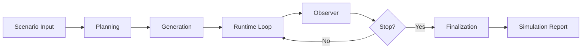

# simula

<div align="center">
  <h3>상태 중심 다중 행위자 시뮬레이션 엔진</h3>
  <p>시나리오 해석, action catalog 생성, actor 생성, step 실행, intent 추적, observer 요약, 최종 보고서를 하나의 그래프 런타임에서 처리합니다.</p>
</div>

## 핵심 기능

- 역할 분리형 시뮬레이션
  - Planner
  - Generator
  - Coordinator
  - Actor
  - Observer
- 동적 시간축 실행
  - step별 시간 경과 추론
  - 혼합 단위(`minute`, `hour`, `day`, `week`)
  - 누적 simulation clock
- 상태 중심 런타임
  - action feed
  - actor intent state
  - observer report
  - world state
- 상부 보고용 출력
  - 행위자 별 최종 결과
  - 절대시각 타임라인
  - 주요 사건 요약

## 시스템 흐름



## 현재 구현 핵심

<table>
  <thead>
    <tr>
      <th>단계</th>
      <th>설명</th>
      <th>주요 산출물</th>
    </tr>
  </thead>
  <tbody>
    <tr>
      <td>Planning</td>
      <td>시나리오 해석, progression plan 결정, visibility/pressure 정리, action catalog 생성, cast roster 생성</td>
      <td>interpretation, situation bundle, progression plan, action catalog, cast roster</td>
    </tr>
    <tr>
      <td>Generation</td>
      <td>interpretation + situation + action catalog + cast를 actor 카드로 구체화</td>
      <td>actor registry</td>
    </tr>
    <tr>
      <td>Runtime</td>
      <td>coordinator가 focus slice를 고르고, 선택된 actor만 호출한 뒤 action 채택, background digest, step 시간 경과, observer 요약, 조기 종료 판단을 이어간다</td>
      <td>actions, focus history, background updates, intent history, step time history, observer reports, stagnation counter</td>
    </tr>
    <tr>
      <td>Finalization</td>
      <td>projection 정리, 절대시각 보정, 보고서 조립</td>
      <td>simulation.log.jsonl, final_report.md</td>
    </tr>
  </tbody>
</table>

## Runtime 동작 메모

- runtime은 매 step마다 전체 actor를 전부 호출하지 않는다.
- coordinator가 focus candidate pool을 압축하고, 그 안에서 직접 추적할 focus slice를 최대 3개까지 고른다.
- 직접 호출되는 actor 수는 step당 최대 6명으로 제한된다.
- 후보 압축은 baseline attention tier, unseen inbox, 최근 intent 변화, background pressure, quiet bonus, 최근 focus penalty, run seed를 함께 사용한다.
- actor는 자유 발화를 제안하는 것이 아니라, planner가 만든 `action catalog` 안에서 action 하나를 고른다.
- `발화`는 action의 한 종류이거나 optional 결과이며, 모든 action이 발화를 요구하지는 않는다.
- 직접 호출되지 않은 actor는 background update digest로만 반영된다.
- runtime은 actor별 현재 intent snapshot과 step별 intent history를 함께 유지한다.
- runtime은 고정 step 간격을 쓰지 않고, coordinator가 step마다 실제 경과 시간을 함께 정리한다.
- 한 step은 반드시 최소 `30분` 이상 진행된다.
- 경과 시간은 분 단위 canonical 값으로 저장하고, 표시 시에는 `minute/hour/day/week` 라벨로 복원한다.
- 시나리오는 가능하면 `시작 시점`부터 `최종 판정 이벤트`까지를 짧고 선명하게 적고, 세부 스크립트보다 전환점과 종료 조건을 우선해서 입력하는 편이 좋다.
- `momentum`과 `atmosphere`는 현재 observer 요약 메타데이터이면서, coordinator selection과 actor prompt 톤을 조정하는 입력으로도 쓰인다.
- 종료 조건은 `max_steps` 도달 또는 `low momentum` 정체 단계 3회 누적이다.
- actor proposal 파싱 실패는 기본 대기 행동으로 대체될 수 있다.
- finalization의 관계 분석은 별도 관계 그래프 상태가 아니라 activity 로그 projection에서 사후 추론한다.

## 최종 보고서 파이프라인

- 요약 JSON 집계
- simulation log 조립
- timeline anchor 결정
- report projection 생성
- 본문 섹션 fan-out
  - 시뮬레이션 타임라인
  - 행위자 역학 관계
  - 주요 사건과 결과
- 후행 섹션 생성
  - 행위자 별 최종 결과
  - 시뮬레이션 결론

## 강화 후보

- `relationship_edges`, `open_threads`, `incident_state` 같은 구조화 상태를 runtime에 추가
- `risk_tolerance`, `initiative_bias`, `disclosure_bias`, `loyalty_bias` 같은 actor 내부 성향 확장
- thread 우선순위, 기억 감쇠, 관계 드리프트 기반 actor 선택
- scenario/pressure point와 연결된 incident family 풀
- intent effect를 더 정교하게 world state에 반영
- `rng_seed` CLI override와 trial 간 seed 전략 확장

## 빠른 시작

```bash
uv sync
cp env.sample.toml env.toml
uv run simula --scenario-file ./senario.samples/03_startup_boardroom_crisis.md
```

### 최대 step 수 지정

```bash
uv run simula \
  --scenario-file ./senario.samples/03_startup_boardroom_crisis.md \
  --max-steps 16
```

### 반복 실행

```bash
uv run simula \
  --scenario-file ./senario.samples/03_startup_boardroom_crisis.md \
  --trials 3
```

### 병렬 반복 실행

```bash
uv run simula \
  --scenario-file ./senario.samples/03_startup_boardroom_crisis.md \
  --trials 3 \
  --parallel
```

## 운영/설정 핵심

- 동적 시간축
  - planner가 scenario별 progression plan을 만든다
  - runtime이 step마다 실제 경과 시간을 따로 추론한다
  - 설정에서는 `max_steps`만 직접 지정한다
- 재현 가능한 runtime seed
  - `SIM_RNG_SEED`
  - 또는 `env.toml`의 `[env].rng_seed`
- 지원 provider
  - `openai`
  - `anthropic`
  - `google`
  - `bedrock`
  - `ollama`
  - `vllm`
- runtime은 `max_steps` 또는 저속 정체 누적 시 종료됩니다.
- 출력 산출물은 run별 디렉터리에 저장됩니다.

<details>
  <summary>잘 맞는 문제 유형</summary>

- 연애 및 관계 재편
- 외교와 워게임
- 재난 대응과 운영 의사결정
- 조직 정치와 이사회 갈등
- 선거, 루머, 파벌 경쟁

</details>
