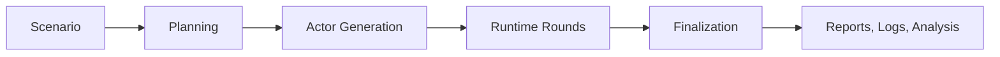

<h1 align="center">Simula</h1>

<p align="center">
  
  
  
</p>

`simula` is an agent-based virtual simulation system. It turns a scenario into a structured
virtual world, runs that world through staged actor interactions, and produces inspectable reports,
event logs, and analysis artifacts.

[Documentation](./docs/README.md) · [Workflow Docs](./docs/workflows/README.md) · [Sample Scenarios](./senario.samples/README.md)

## What Simula Is

`simula` models a scenario as a temporary world populated by actors. Each actor has explicit
identity, state, intent, memory, relationships, and available actions. The system advances the
world through focused simulation rounds instead of producing one opaque narrative in a single pass.

The output is not just a final story. A run leaves a durable trace that shows what was planned,
which actors existed, what happened round by round, how events changed, and how the final report was
derived.

## Core Concepts

| Concept | Meaning |
| --- | --- |
| Scenario | The source brief that defines the situation, constraints, cast size, and initial pressure. |
| Actor | A stateful participant with a role, private goal, voice, intent, memory, and relationships. |
| World state | The current shared situation, including recent actions, unresolved tensions, and event progress. |
| Event memory | The planned and emergent event track used to decide what must still happen before the run can end. |
| Interaction | A directed action, reaction, message, decision, or pressure between actors or against the world. |
| Round | One focused advancement of the world, usually centered on a selected event and a relevant actor subset. |
| Report | The final explanation of the run outcome, actor dynamics, timeline, and major events. |
| Analysis | Derived metrics and visuals for comparing participation, action diversity, relationship structure, and growth. |

## How A Simulation Works



The workflow is intentionally staged.

- Planning interprets the scenario, identifies the cast outline, defines major events, and builds an execution plan.
- Actor generation turns planned cast slots into concrete actor cards with runtime-useful traits.
- Runtime advances the world through selected events, actor actions, intent updates, and event-memory changes.
- Finalization turns the completed trace into a report and analysis-ready artifacts.

This structure keeps the simulation inspectable. Each stage has one responsibility, and later
stages consume explicit outputs from earlier stages.

## Outputs And Inspectability

Each run is expected to produce one run directory with durable artifacts:

```text
output/
  <run_id>/
    manifest.json
    report.final.md
    summary.overview.md
    simulation.log.jsonl
    data/
    summaries/
    assets/
```

`simulation.log.jsonl` is the main event stream. It records model calls, finalized plans,
finalized actors, round selections, adopted actions, observer summaries, event-memory updates, and
final report metadata.

`report.final.md` is the main human-readable report. It explains the simulation conclusion, actor
outcomes, timeline, actor dynamics, and major events.

The integrated analysis artifacts expose run-level metrics such as participation spread, action
diversity, path depth, concentration, community structure, and cumulative growth. Committed sample
runs live under [`output.samples/`](./output.samples/) for inspection.

## Project Direction

`simula` is being shaped around a small set of stable product ideas:

- virtual worlds are driven by stateful actors, not one-pass text generation
- actor identity, intent, memory, and relationships should be explicit state
- simulation behavior should be inspectable through durable logs and structured artifacts
- reports should be projections of the completed trace, not unrelated summaries
- implementation details should stay behind stable concepts and data contracts

The current documentation therefore focuses on concepts, workflow behavior, and artifacts instead
of language-specific setup or framework mechanics.

## Current Implementation

The current rebuild is a TypeScript web app:

- `apps/web`: Vite React SPA with Tailwind CSS v4, shadcn/ui, TanStack Query, Zustand, and React Flow.
- `apps/server`: Bun API server with file-backed runs and SSE event streaming.
- `packages/core`: scenario parsing, settings validation, LangGraph workflow, reporting, and file storage.
- `packages/shared`: shared API and simulation types.

Development commands:

```bash
bun install
bun run dev:server
bun run dev:web
```

Validation commands:

```bash
bun test
bun run typecheck
bun run lint
bun run build
```

## Documentation Map

| Document | Focus |
| --- | --- |
| [`docs/README.md`](./docs/README.md) | documentation map and reading paths |
| [`docs/architecture.md`](./docs/architecture.md) | system boundaries and staged architecture |
| [`docs/contracts.md`](./docs/contracts.md) | scenario, actor, event, report, and artifact contracts |
| [`docs/llm.md`](./docs/llm.md) | model roles, structured responses, validation, and observability |
| [`docs/analysis.md`](./docs/analysis.md) | analysis source data, metrics, and artifact layout |
| [`docs/configuration.md`](./docs/configuration.md) | language-neutral configuration concepts |
| [`docs/operations.md`](./docs/operations.md) | scenario controls, run artifacts, and maintenance expectations |
| [`docs/workflows/README.md`](./docs/workflows/README.md) | workflow hub and stage handoffs |
