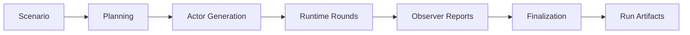

<h1 align="center">Simula</h1>

<p align="center">
  
  
  
  
</p>

`simula` is an agent-based virtual simulation system. It turns a scenario into a structured
virtual world, runs staged actor interactions, streams live graph events, and writes inspectable
run artifacts.

[Documentation](./docs/README.md) · [Workflow Docs](./docs/workflows/README.md) · [Sample Scenarios](./senario.samples/README.md)

## What Simula Is

`simula` models a scenario as a temporary world populated by actors. Each actor has explicit
identity, state, intent, memory, relationships, and available actions. The system advances the
world through focused rounds instead of producing one opaque narrative in a single pass.

Production source is organized by runtime and responsibility:

| Source | Responsibility |
| --- | --- |
| `server.ts`, `src/app` | One Next.js host for pages, API, SSE and WebSocket |
| `src/backend/api`, `runtime` | HTTP adapters, run lifecycle and event publication |
| `src/backend/integrations`, `storage` | Model providers, temporary run artifacts and sample loading |
| `src/backend/core/simulation`, `scenario`, `settings`, `story-builder`, `prompts` | Simulation workflows, domain parsing, configuration rules and prompt construction |
| `src/ui` | Pages, components, hooks, stores, presentation models, browser API and storage |
| `src/shared` | Shared API, event, scenario, run, graph and simulation types |

Bun workspace commands and tests remain in `apps/*` and `packages/*`.
See [architecture](./docs/architecture.md) for placement and dependency rules.

## Core Concepts

| Concept | Meaning |
| --- | --- |
| Scenario | The source brief plus frontmatter controls that define cast size, round count, and runtime options. |
| Actor | A stateful participant with a role, goal, intent, memory, relationships, and action catalog. |
| Round | One focused advancement of the world through selected actor actions and observer output. |
| Event stream | Append-only `events.jsonl` data used for replay, timeline state, and inspection. |
| Graph timeline | `graph.timeline.json`, derived during execution for visual replay. |
| Report | Final Markdown projection of the completed simulation state. |

## How A Simulation Works


```mermaid
flowchart LR
    Scenario["Scenario"] --> Planning["Planning"]
    Planning --> Actors["Actor Generation"]
    Actors --> Runtime["Runtime Rounds"]
    Runtime --> Observer["Observer Reports"]
    Observer --> Finalization["Finalization"]
    Finalization --> Artifacts["Run Artifacts"]
```

- Planning interprets the scenario, defines major events and runtime direction, then creates a code-to-action catalog one validated JSON action at a time.
- Actor generation turns planned cast slots into actor cards and attaches the Planner-owned action definitions.
- Runtime advances the world through actor messages, interactions, context updates, and round reports.
- Finalization renders the completed state into `report.md`.

## Quick Start

```bash
bun install
bun run dev
```

The single server listens on `https://localhost:3001` by default. Pages and `/api` share its origin.
Development certificates are generated
outside the repository in `~/.config/simula/certs`; trust the certificate in the browser before
using persistent storage. For a remote VDI, set both `SIMULA_TLS_CERT_FILE` and
`SIMULA_TLS_KEY_FILE` to files for a certificate trusted by that client.

On macOS, trust the generated local certificate in the user login keychain if the browser
reports it as untrusted:

```bash
security add-trusted-cert -d -r trustRoot -k ~/Library/Keychains/login.keychain-db ~/.config/simula/certs/localhost.pem
```

## Build and Start

```bash
bun run build
bun run start
```

`build` checks TypeScript and builds Next.js with Webpack. `start` runs the Next custom server
with Node.js and serves the built pages, API, SSE and WebSocket on one origin. Set `PORT` to
change the port. Production startup requires `.next`, installed production dependencies, and
the source files used by the custom server. Terminate TLS at the deployment proxy, or set both
`SIMULA_TLS_CERT_FILE` and `SIMULA_TLS_KEY_FILE` for direct HTTPS serving.

## Settings

Model settings begin with built-in defaults and are saved in browser SQLite. Provider keys and
authorization headers are encrypted there with a passphrase-derived Web Crypto key. Unlock them
once per browser session. The server receives decrypted settings only for active work and keeps
them in process memory. A forgotten passphrase requires resetting and re-entering secrets; other
browser records remain available.

Supported providers are:

- `openai`
- `anthropic`
- `gemini`
- `ollama`
- `lmstudio`
- `vllm`
- `litellm`

Supported model roles are:

- `storyBuilder`
- `planner`
- `generator`
- `coordinator`
- `actor`
- `observer`
- `repair`

## Scenario Frontmatter

Scenario files must start with a flat frontmatter block.

```text
---
num_cast: 6
allow_additional_cast: true
actions_per_type: 3
max_round: 8
fast_mode: false
output_length: short
---
Scenario body starts here.
```

`num_cast` is required. The other controls are optional:

| Key | Default | Meaning |
| --- | --- | --- |
| `allow_additional_cast` | `true` | Allow the planner to include more than `num_cast` actors. |
| `actions_per_type` | `3` | Number of generated actions for each visibility type. |
| `max_round` | `8` | Number of actor activity rounds to run. |
| `fast_mode` | `false` | Run dependency-safe actor work in parallel. |
| `output_length` | `short` | LLM response length and actor memory compression length: `short`, `medium`, or `long`. |

Sample scenario seeds live in [`senario.samples/`](./senario.samples/README.md).

## Run Artifacts

Run history is stored in the current browser profile's SQLite WASM database. Uploaded source
files are stored in OPFS. The server uses a temporary directory while the owning tab is connected;
it does not create new durable `runs/` history. Closing the tab cancels active work after a
30-second reconnection grace period. Use the landing page's backup actions to move data between
browser profiles or machines. Older server `runs/` files remain untouched and are not listed in
the new browser history.
Uploaded originals remain in OPFS after submission so an interrupted scenario build can submit
the same source through a new temporary document set.

```text
browser SQLite / temporary server workspace
  <run_id>/
    manifest.json
    scenario.json
    events.jsonl
    state.json
    report.md
    graph.timeline.json
```

The temporary `events.jsonl` records model messages, metrics, actor readiness, interactions, actor messages,
round completion, graph deltas, report deltas, and terminal run events.

Browser SQLite retains the final structured state and report, plus indexed per-run events and
graph frames. It marks work lost to a server restart as interrupted rather than completed.

The browser report keeps run-level metric cards above three tabs: Analysis Overview,
Relationships, and Conversations. Analysis Overview contains the full commentary and is the
default tab. Relationships show the heatmap above the network and replay. Conversations use a
horizontally scrollable round board and the shared message history. Completed, failed, canceled,
and interrupted runs
open this report from history; available partial results and failures remain visible. New runs
generate evidence-based commentary using the configured observer model. Existing reports can
use Generate / retry commentary without replaying the simulation. Successful items are preserved
and only failed items and affected parent conclusions are regenerated. Exports
(JSON, JSONL, Markdown) share one menu.
`graph.timeline.json` powers replay and visual inspection in the web app.

The committed [`output.samples/`](./output.samples/) directories are reference outputs from earlier
sample runs. They are kept for inspection and are separate from current live runs.

## API Surface

The server exposes a small local API:

| Route | Purpose |
| --- | --- |
| `GET /api/settings` / `PUT /api/settings` | Read and save masked role settings. |
| `POST /api/story-builder/draft` | Draft a scenario from chat messages. |
| `GET /api/scenarios/samples` | List bundled scenario samples. |
| `GET /api/scenarios/samples/:name` | Read one sample scenario. |
| `GET /api/runs` / `POST /api/runs` | List runs or create a run from a scenario. |
| `GET /api/runs/:id` | Read run manifest, state, timeline, and events. |
| `POST /api/runs/:id/start` | Start execution for a created run. |
| `GET /api/runs/:id/events` | Stream Server-Sent Events for the run. |
| `POST /api/runs/:id/ack` | Confirm a browser-saved stream cursor or terminal event count and release confirmed transfer records. |
| `GET /api/runs/:id/report` | Read the Markdown report. |
| `GET /api/runs/:id/export?kind=json|jsonl|md` | Export state, events, or report. |

## Validation

Use Bun for package management, scripts, tests, and builds:

```bash
bun test
bun run typecheck
bun run lint
bun run build
```

Browser workflow checks use Playwright:

```bash
bun run test:e2e
```

## Documentation Map

| Document | Focus |
| --- | --- |
| [`docs/README.md`](./docs/README.md) | documentation map and reading paths |
| [`docs/architecture.md`](./docs/architecture.md) | system boundaries, app/server/core split, and persistence |
| [`docs/contracts.md`](./docs/contracts.md) | scenario, settings, run, event, state, and export contracts |
| [`docs/llm.md`](./docs/llm.md) | model roles, providers, validation, retries, and metrics |
| [`docs/analysis.md`](./docs/analysis.md) | current inspection artifacts and reference sample outputs |
| [`docs/configuration.md`](./docs/configuration.md) | local settings, environment variables, and provider defaults |
| [`docs/operations.md`](./docs/operations.md) | local execution, artifacts, samples, and validation |
| [`docs/workflows/README.md`](./docs/workflows/README.md) | workflow hub and stage handoffs |
