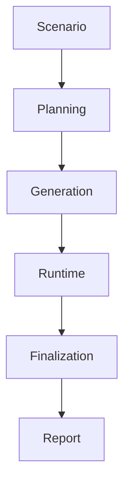

# 시스템 개요

`simula`는 시나리오 입력을 planning, generation, runtime, finalization 단계로 분해해 다중 행위자 시뮬레이션을 수행하는 시스템이다.

## 구성 요소

- 입력
  - 시나리오 텍스트
  - 선택적 `max_steps` override
  - 선택적 반복 실행 옵션
- 내부 실행
  - Planning
  - Generation
  - Runtime
  - Finalization
- 출력
  - simulation log
  - 최종 보고서

## 설계 방향

- 역할 분리
- 상태 중심 실행
- 구조화 출력 우선
- 보고서 중심 최종 산출
- 문서는 `현재 구현`과 `강화 후보`를 구분해 기록

## 문서 구성

- architecture
  - 레이어와 그래프 흐름, 현재 runtime 정책
- contracts
  - 상태, 출력, 저장 계약과 observer 신호 의미
- llm
  - 역할별 LLM 규칙과 현재 실패 처리 정책
- operations
  - 실행, seed, 디버깅 포인트
- timeline
  - 동적 시간 진행, 사건 분기, 조기 종료
