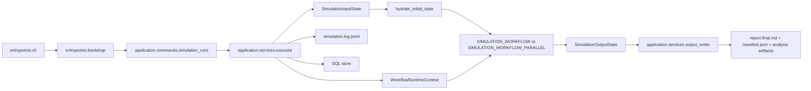

# Architecture

`simula` is a layered application centered on one LangGraph workflow. The workflow owns simulation
state transitions. The surrounding application is responsible for:

- turning CLI input into a compact graph input
- supplying services through runtime context
- persisting SQL-backed artifacts
- streaming JSONL runtime events
- writing human-facing output artifacts after the graph completes

## Layers

| Layer | Responsibility | Representative modules |
| --- | --- | --- |
| Entry | CLI parsing and process bootstrap | `simula.entrypoints.*` |
| Common | cross-layer logging and runtime-output helpers | `simula.shared.*` |
| Application | commands, workflow execution, presentation, output writing, analysis orchestration | `simula.application.*` |
| Domain | typed contracts, event memory, activity/runtime/reporting/scenario rules | `simula.domain.*` |
| Infrastructure | config loading, provider adapters, storage engines, checkpointers | `simula.infrastructure.*` |

## Execution Path

The executor is the boundary that combines graph execution, output streaming, storage, and
integrated output writing.

## LangGraph Boundary

The root graph has distinct public input, internal state, and public output schemas:

- `input_schema=SimulationInputState`
- `state_schema=SimulationWorkflowState`
- `output_schema=SimulationOutputState`
- `context_schema=WorkflowRuntimeContext`

This keeps the public API narrow while allowing the workflow to carry stage-specific state.

The shipped default is the serial root workflow. When CLI `--parallel` is enabled, the executor
switches to the parallel root workflow variant instead of changing trial execution.

## Internal State

The graph accepts a compact input and expands it once in `hydrate_initial_state`.

This keeps CLI input small while giving later stages a consistent state shape.

## Runtime Context

Service dependencies stay out of the graph state and are carried through `WorkflowRuntimeContext`.

The current context includes:

- `settings`
- `store`
- `llms`
- `logger`
- `llm_usage_tracker`
- `run_jsonl_appender`
- `parallel_graph_calls`

This keeps simulation data separate from database handles, provider clients, and loggers.

## Stream Surface

The executor runs the graph with:

- `app.astream(...)`
- `stream_mode=["custom", "values"]`
- `version="v2"`

The stream responsibilities are separated:

- `custom` parts carry stable domain events that are appended to `simulation.log.jsonl`
- `values` parts carry state snapshots, with the last snapshot treated as the final graph output

This keeps the stream surface small and predictable.

## Persistence Split

There are two persistence paths.

### SQL-backed runtime store

The application store persists:

- run records
- the finalized plan
- finalized actors
- per-round adopted activities and observer reports
- the structured final report

### File outputs

File output is separate from the SQL store:

- `simula.shared.io.RunJsonlAppender` writes `simulation.log.jsonl` incrementally during execution
- the integrated output writer uses that JSONL file to build `report.final.md`, `manifest.json`,
  and analysis artifacts inside the same run directory

The runtime output root is still configured by `storage.output_dir`. Separately, the repository may
keep committed example runs under `output.samples/` for inspection and documentation.

This keeps append-heavy event logging separate from relational storage and keeps markdown rendering
out of the nodes that manage simulation state.

## Prompt and Report Boundaries

The workflow uses different data shapes for different stages.

- internal workflow state is used for node-to-node coordination
- model calls use compact stage-specific inputs
- `report_projection_json` is a finalization artifact used for report writing

## Domain Package Shape

The domain layer is organized by responsibility:

- `simula.domain.contracts` contains typed contracts
- `simula.domain.event_memory` contains event-memory lifecycle, matching, and update rules
- `simula.domain.activity` contains canonical action and feed rules
- `simula.domain.runtime` contains runtime action, runtime policy, and coordinator policy
- `simula.domain.reporting` contains durable event builders and final-report helpers
- `simula.domain.scenario` contains scenario controls and shared time utilities

## Related Docs

- state and artifact contracts: [`contracts.md`](./contracts.md)
- settings and storage configuration: [`configuration.md`](./configuration.md)
- role routing and parsing policy: [`llm.md`](./llm.md)
- stage-level workflow details: [`workflows/README.md`](./workflows/README.md)
