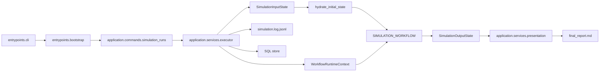

# Architecture

## Purpose

`simula` is a layered application centered on one compiled LangGraph workflow. The workflow owns
simulation state transitions. The surrounding application is responsible for:

- turning CLI input into a compact graph input
- supplying services through runtime context
- persisting SQL-backed artifacts
- streaming JSONL runtime events
- writing human-facing files after the graph completes

## Layers

| Layer | Responsibility | Representative modules |
| --- | --- | --- |
| Entry | CLI parsing and process bootstrap | `simula.entrypoints.*` |
| Application | commands, workflow execution, presentation, analysis orchestration | `simula.application.*` |
| Domain | typed contracts, reducers, runtime policy, reporting, event builders | `simula.domain.*` |
| Infrastructure | config loading, provider adapters, storage engines, checkpointers | `simula.infrastructure.*` |

## Execution Path

The executor is the boundary that combines graph execution, output streaming, storage, and final
presentation.

## LangGraph Boundary

The root graph follows the current LangGraph pattern of distinct public input, internal state, and
public output schemas:

- `input_schema=SimulationInputState`
- `state_schema=SimulationWorkflowState`
- `output_schema=SimulationOutputState`
- `context_schema=WorkflowRuntimeContext`

This keeps the public API narrow while allowing the internal workflow state to stay fully hydrated
and required-only.

## Hydrated Internal State

The graph accepts a compact input and expands it exactly once in `hydrate_initial_state`.

Why this exists:

- CLI callers should not construct dozens of internal scratch fields manually.
- downstream nodes should be able to assume required keys already exist.
- runtime-only fields such as `checkpoint_enabled`, `event_memory_history`, and report section
  buffers belong in internal state, not in the public graph input.

## Runtime Context

Service dependencies stay out of the graph state and are carried through `WorkflowRuntimeContext`.

The current context includes:

- `settings`
- `store`
- `llms`
- `logger`
- `llm_usage_tracker`
- `run_jsonl_appender`

That split matters because LangGraph state should model simulation data, not database handles,
provider clients, or loggers.

## Stream Surface

The executor runs the graph with:

- `app.astream(...)`
- `stream_mode=["custom", "values"]`
- `version="v2"`

The stream responsibilities are separated:

- `custom` parts carry stable domain events that are appended to `simulation.log.jsonl`
- `values` parts carry state snapshots, with the last snapshot treated as the final graph output

This matches the LangGraph guidance of exposing a narrow stream surface instead of leaking the full
internal state by default.

## Persistence Split

There are two persistence paths on purpose.

### SQL-backed runtime store

The application store persists:

- run records
- the finalized plan
- finalized actors
- per-round adopted activities and observer reports
- the structured final report

### File outputs

File output is separate from the SQL store:

- `RunJsonlAppender` writes `simulation.log.jsonl` incrementally during execution
- the presentation layer writes `final_report.md` after the workflow completes

This keeps append-heavy event logging separate from relational storage and keeps markdown rendering
out of the graph nodes that manage simulation state.

## Prompt and Report Boundaries

The workflow uses several progressively narrower data shapes.

- rich internal workflow state is used for node-to-node coordination
- compact prompt projections are built for LLM-facing nodes
- `report_projection_json` is a durable finalization artifact built only for report writing

The same raw state is therefore not reused blindly across planning, runtime, and final reporting.

## Related Docs

- state and artifact contracts: [`contracts.md`](./contracts.md)
- settings and storage configuration: [`configuration.md`](./configuration.md)
- role routing and parsing policy: [`llm.md`](./llm.md)
- stage-level workflow details: [`workflows/README.md`](./workflows/README.md)
