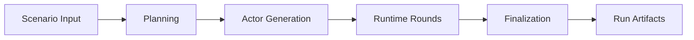

# Architecture

`simula` is organized around one staged simulation pipeline. The pipeline turns a scenario into a
world model, expands that world into actors and events, advances the world through rounds, and
projects the completed trace into reports and analysis artifacts.

## System Boundaries

| Boundary | Responsibility |
| --- | --- |
| Input boundary | Accept scenario text, scenario controls, run identity, and runtime limits. |
| Domain boundary | Define actors, plans, events, activities, memory, reporting data, and validation rules. |
| Workflow boundary | Coordinate stage order and pass explicit state from one stage to the next. |
| Model boundary | Request structured planning, actor, runtime, and report data from configured model roles. |
| Persistence boundary | Store durable run records, event streams, reports, and analysis-ready artifacts. |
| Presentation boundary | Render final human-readable reports and summaries from structured data. |

These boundaries keep simulation concepts separate from transport, storage, and rendering details.

## Stage Architecture

Each stage owns one product-level concern:

- Planning defines what the run is about, who participates, which events matter, and how progress
  should be recognized.
- Actor generation turns planned cast entries into stateful actor cards.
- Runtime advances the world through selected events, actor actions, intent updates, memory updates,
  and stop decisions.
- Finalization converts the completed trace into a structured report, rendered markdown, and
  analysis inputs.

## State Flow

The pipeline separates public input, internal workflow state, and public output.

- Public input stays compact: scenario text, scenario controls, run id, round ceiling, and seed.
- Internal state carries stage-specific data such as plan, actors, event memory, round history,
  intent history, world summary, and report buffers.
- Public output stays compact: run id, final report, rendered report, event log reference, usage
  summary, stop reason, and explicit errors.

Service dependencies such as storage, model clients, logging, and output writing stay outside the
simulation state. That keeps the world model serializable and easier to inspect.

## Persistence Model

`simula` keeps two durable paths:

- Structured storage records the run, finalized plan, actor registry, adopted activities, observer
  reports, and final report payload.
- File artifacts record the event stream, rendered report, manifest, summaries, tables, and visual
  analysis outputs.

`simulation.log.jsonl` is the append-only event stream. It is the source artifact for derived
analysis, while `report.final.md` is the primary human-readable run result.

## Design Direction

The architecture favors explicit state over hidden context.

- Actor state, intent, and memory are first-class data.
- Event progress is tracked through event memory rather than inferred only from prose.
- Runtime decisions are written into durable logs.
- Final reports are projections of the completed trace.
- Implementation details are allowed to change while the product concepts and artifact contracts
  remain understandable.

## Related Docs

- data and artifact contracts: [`contracts.md`](./contracts.md)
- model-backed behavior: [`llm.md`](./llm.md)
- stage-level workflows: [`workflows/README.md`](./workflows/README.md)
- analysis artifacts: [`analysis.md`](./analysis.md)
