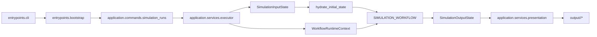

# Architecture

## Purpose

`simula` is a layered application centered on one compiled LangGraph workflow. The workflow owns
simulation state transitions. Everything else around it exists to supply context, persist
artifacts, and expose a clean operator interface.

## Layers

| Layer | Responsibility | Representative modules |
| --- | --- | --- |
| Entry | CLI parsing and process bootstrap | `simula.entrypoints.*` |
| Application | command handling, workflow execution, presentation | `simula.application.*` |
| Domain | contracts, policy, report builders, pure reducers | `simula.domain.*` |
| Infrastructure | config loading, LLM routing, storage backends | `simula.infrastructure.*` |

## Execution Path

## Runtime Context

The graph does not carry service dependencies inside state. Nodes read shared execution context
through `WorkflowRuntimeContext`.

- `settings`
- `store`
- `llms`
- `logger`

That keeps workflow state focused on simulation data, not infrastructure handles.

## State Surfaces

The root graph exposes three distinct state surfaces.

| Surface | Purpose |
| --- | --- |
| `SimulationInputState` | compact public input accepted by the root graph |
| `SimulationWorkflowState` | hydrated internal state used between nodes |
| `SimulationOutputState` | compact public output returned by the root graph |

The hydration boundary exists because the planning node needs fully initialized runtime channels,
but operators should not need to pass the entire internal state shape by hand.

## Graph Composition

The root path is linear at the stage level:

1. `hydrate_initial_state`
2. `planning`
3. `generation`
4. `runtime`
5. `finalization`

The runtime stage itself contains the loop. The other stages are straight-line subgraphs.

## System Boundaries

### Workflow state vs. file output

The workflow returns structured report data such as `final_report` and
`final_report_markdown`. The executor reads the append-driven `simulation.log.jsonl` artifact
back into `simulation_log_jsonl`, and the presentation layer turns those outputs into files.

### Rich state vs. prompt projections

LLM-facing nodes do not consume the full workflow state. They receive compact JSON projections
assembled for their role.

### Prompt projections vs. report projection

Planning, generation, and runtime use transient prompt projections. Finalization additionally
builds a persistent `report_projection_json` artifact for report writing.

## Related Docs

- contracts: [`contracts.md`](./contracts.md)
- model routing and structured outputs: [`llm.md`](./llm.md)
- workflow hub: [`workflows/README.md`](./workflows/README.md)
- local operations: [`operations.md`](./operations.md)
