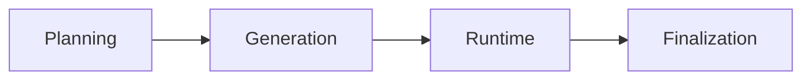
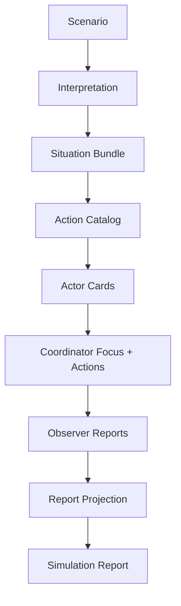

# 아키텍처

## 레이어 구조

| 레이어 | 책임 | 대표 산출 |
| --- | --- | --- |
| Entry | CLI 요청과 실행 orchestration | 실행 입력 |
| Application | graph 구성과 상태 전이 | workflow state |
| Domain | 순수 규칙, 계약, 집계 로직 | 구조화 모델 |
| Infrastructure | LLM, 설정, 저장소 | 외부 연결 |

## 그래프 구조

## 현재 구현

### Planning

- 시나리오 핵심 전제 해석
- progression plan 결정
- 공개/비공개 맥락 정리
- scenario 전역 action catalog 생성
- cast roster 생성

### Generation

- cast roster를 actor 카드로 변환
- interpretation, situation, action catalog, coordination frame을 함께 참고한다
- 실행용 actor registry 확정

### Runtime

- coordinator가 focus candidate pool을 압축
- coordinator가 focus slice를 최대 3개, 직접 actor 호출을 최대 6명까지 고른다
- 선택된 actor만 step별 action proposal fan-out
- coordinator가 adopted action, background update, intent 갱신, step 시간 경과를 확정한다
- observer는 adopted action과 background update를 바탕으로 summary만 생성한다
- `max_steps` 또는 저속 정체 누적 시 종료

### Finalization

- 최종 요약 JSON 생성
- simulation log 정리
- 절대시각 anchor 결정
- report projection 생성
- 보고서 본문 fan-out
- 후행 요약 섹션 조립

## 데이터 흐름

## 설계 포인트

- raw action과 해석 결과를 분리한다.
- 상태는 다음 단계가 직접 읽을 수 있는 수준으로 유지한다.
- finalization은 로그를 그대로 출력하지 않고 projection을 다시 조립한다.
- observer의 `momentum`은 현재 속도 신호, `atmosphere`는 국면 톤 신호로 취급한다.
- coordinator는 전체 actor를 그대로 호출하지 않고 focus slice와 background digest를 분리한다.
- runtime은 `world_state_summary`, 직전 observer 신호, filtered action options, 현재 intent snapshot, 현재 `simulation_clock`을 actor prompt에 다시 공급한다.

## 현재 한계

- `relationship_edges`나 `open_threads` 같은 구조화 관계 상태는 아직 없다.
- finalization의 관계 분석은 action 로그와 intent history에서 사후 추론한다.
- planning이 만든 모든 해석 필드가 runtime 상태 모델로 유지되지는 않는다.
- actor proposal parsing 실패는 일부 경로에서 기본값 대체로 흘러간다.
- background update는 아직 별도 world state 엔진 없이 요약 입력으로만 사용한다.

## 강화 후보

- 관계 그래프 상태와 incident 상태를 runtime 핵심 상태로 승격
- actor latent trait와 memory decay 기반 선택 정책 확장
- 사건 풀 기반 stochastic branching
