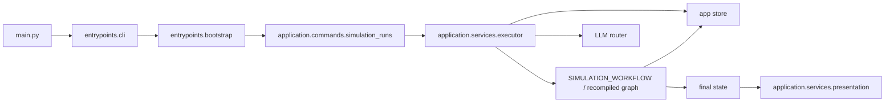

# Architecture

## Purpose

`simula` is organized as a layered application around a compiled LangGraph workflow. The
graph is the core execution engine, but it is not the whole system: CLI parsing, settings
loading, storage, model routing, and output writing are owned by different layers.

## Layer Boundaries

| Layer | Responsibility | Representative modules |
| --- | --- | --- |
| Entry | parse CLI arguments, bootstrap execution, print results | `main.py`, `simula.entrypoints.cli`, `simula.entrypoints.bootstrap` |
| Application | assemble workflows, run commands, orchestrate runtime services | `simula.application.commands`, `simula.application.services`, `simula.application.workflow` |
| Domain | pure contracts and policy functions | `simula.domain.*` |
| Infrastructure | config loading, provider routing, storage backends | `simula.infrastructure.config`, `simula.infrastructure.llm`, `simula.infrastructure.storage` |

## Execution Path

## Shared Runtime Context

The workflow executes with a shared `WorkflowRuntimeContext` that carries:

- `settings`
- `store`
- `llms`
- `logger`

This keeps graph nodes thin. Nodes read and write workflow state, while external concerns
stay in the runtime context instead of being threaded through every state channel.

## Graph-of-Graphs Model

The root simulation workflow is a sequential composition of four subgraphs:

- planning
- generation
- runtime
- finalization

Each subgraph owns a distinct part of the lifecycle, but they all share the same
`SimulationWorkflowState` object. The root assembly is documented in
[`workflows/simulation.md`](./workflows/simulation.md), and each subgraph has its own
document under [`workflows/`](./workflows/README.md).

## System Boundaries That Matter

### Workflow State vs. File Outputs

The workflow produces structured state fields such as:

- `final_report`
- `simulation_log_jsonl`
- `report_projection_json`
- `final_report_markdown`

Actual files in `output/<run_id>/` are written later by the presentation layer, not by the
graph itself.

### Graph Persistence vs. Human-Facing Reports

Runtime and finalization nodes persist structured artifacts to the app store. Human-readable
report files are derived from the final state after the run completes.

### Runtime Summary vs. Runtime Adjudication

The current compiled runtime splits responsibilities on purpose:

- `coordinator` selects focus, summarizes deferred actors, adopts actions, updates intent,
  and advances time
- `observer` summarizes what happened in the step, updates `world_state_summary`, and
  provides stop-signal inputs such as `momentum`

## Related Docs

- workflow composition: [`workflows/README.md`](./workflows/README.md)
- config and state contracts: [`contracts.md`](./contracts.md)
- role and model routing details: [`llm.md`](./llm.md)
- local execution details: [`operations.md`](./operations.md)
