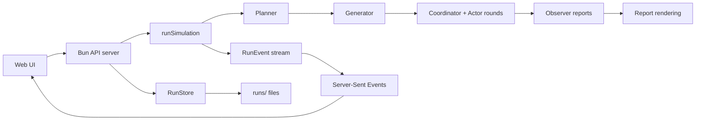

# Architecture

`simula` is a Bun monorepo with one local API server, one React client, shared TypeScript types,
and a core package that owns simulation logic.

## Package Boundaries

| Package | Responsibility |
| --- | --- |
| `apps/server` | HTTP API, settings persistence, sample loading, run lifecycle, SSE streaming |
| `apps/web` | scenario entry, settings UI, live simulation display, replay, report export |
| `packages/core` | scenario parsing, settings validation, LangGraph workflow, report rendering, file storage |
| `packages/shared` | shared request/response, run, scenario, graph, event, and simulation types |

The server and web app stay thin. Simulation rules, state transitions, validation, and persistence
helpers live in plain TypeScript modules under `packages/core` and `packages/shared`.

## Execution Path



## Server Boundary

The server owns transport and process-level state:

- route dispatch under `/api`
- CORS headers
- `settings.json` and `env.toml` loading
- masked secret retention on settings saves
- run start deduplication through an in-memory running-run set
- Server-Sent Events subscription management

The server does not own simulation rules. It delegates those to `packages/core`.

## Core Boundary

`packages/core` owns:

- scenario frontmatter parsing and normalization
- role-based settings defaults, sanitization, and validation
- LangGraph stage orchestration
- actor context handling
- graph timeline frame construction
- run file storage through `RunStore`
- final report rendering

The workflow state is serializable and can be written to `state.json`.

## Persistence Model

The default live root is `runs/`, controlled by `SIMULA_DATA_DIR`.

Each run directory contains:

```text
runs/<run_id>/
  manifest.json
  scenario.json
  events.jsonl
  state.json
  report.md
  graph.timeline.json
```

`events.jsonl` is the durable event stream. `graph.timeline.json` is built from event frames for
replay. `state.json` stores the completed simulation state. `report.md` stores the rendered final
report.

## Presentation Boundary

The React app consumes the server API and SSE stream. It composes:

- scenario creation and sample loading
- role settings editing
- live activity and actor panels
- Sigma-based relationship graph display
- replay controls backed by `graph.timeline.json`
- Markdown report rendering and export

The UI does not implement simulation rules directly.

## Related Docs

- contracts: [`contracts.md`](./contracts.md)
- configuration: [`configuration.md`](./configuration.md)
- workflow stages: [`workflows/README.md`](./workflows/README.md)
