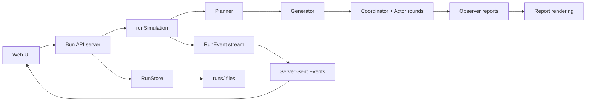

# Architecture

`simula` runs a Bun backend and a React browser client with shared serializable contracts.
Production source lives under `src/backend`, `src/ui`, and `src/shared`. Workspace names under
`apps/*` and `packages/*` remain command, configuration, and test locations.

## Responsibility Boundaries

| Boundary | Owns | Must not own |
| --- | --- | --- |
| `backend/api` | HTTP request/response handling, settings-to-provider request coordination, SSE transport | Actor decisions, simulation state transitions |
| `backend/runtime` | Execution lifecycle, cancellation, persistence and event publication coordination | HTTP responses, React state, provider protocols |
| `backend/integrations` | External model API translation, invocation, discovery, usage | Settings file loading, HTTP route dispatch, UI behavior |
| `backend/storage` | Settings and run artifact I/O, samples, storage caches | HTTP response construction, provider selection, presentation policy |
| `backend/core/simulation` | Actor behavior, accepted interactions, stages, timeline derivation, reports | HTTP transport, browser rendering, filesystem access |
| `backend/core/settings`, `backend/core/scenario` | Domain parsing, normalization, defaults, validation | HTTP responses, UI form state, file access |
| `shared` | Serializable shared types and API/event contracts | Runtime orchestration, platform I/O, provider clients, React |
| `ui/app`, `ui/pages` | Composition, navigation, user workflow orchestration | Authoritative simulation rules, filesystem access |
| `ui/components` | Reusable and feature-specific rendering and interactions | Backend rules, provider credentials, imports from pages or app |
| `ui/hooks`, `ui/stores` | Browser lifecycle, subscriptions, UI state and projections | JSX composition, server authority |
| `ui/models`, `ui/types` | Presentation transformations and browser contracts | Component/page imports, HTTP or storage I/O |
| `ui/api`, `ui/storage`, `ui/i18n` | Browser transport/downloads, browser persistence, translation data | React page composition, authoritative simulation state |


Backend flow is `api → runtime → simulation/integrations/storage`. Simulation workflows invoke
model integrations; pure transformations do not perform I/O. Storage uses domain parsers and timeline
builders. Provider discovery receives resolved settings from its API controller.

Frontend composition is `app/pages → components/hooks/stores/models`. The API client owns HTTP
calls, hooks own React subscription lifecycles, storage owns browser persistence, and models own
presentation calculations. Shared browser types live in `src/ui/types`; component-only types stay
local. Browser code imports cross-runtime contracts from `src/shared` and never imports backend code.

## Source Map

```text
src/
├─ backend/
│  ├─ index.ts          # Bun composition root
│  ├─ config.ts         # Environment and runtime paths
│  ├─ api/              # HTTP routes, controllers, responses, SSE transport
│  ├─ runtime/          # Run execution, continuation, event persistence/publication
│  ├─ integrations/llm/ # Provider construction, invocation, model discovery, usage
│  ├─ storage/          # Settings files and bundled scenario loading
│  │  └─ runs/          # Run artifacts and timeline persistence
│  └─ core/             # Simulation and application domain logic
│     ├─ simulation/
│     │  ├─ workflow/   # Top-level graph, shared state, stages and finalization
│     │  ├─ actors/     # Shared actor memory, interactions and visible text
│     │  ├─ events/     # World event injection and execution telemetry
│     │  ├─ planning/   # Plan digest projections
│     │  ├─ outputs/    # Report and graph timeline derivation
│     │  └─ roles/      # Planner, generator, coordinator, actor, observer
│     │     └─ generator/cards/ # Per-actor card generation workflow
│     ├─ scenario/      # Scenario parsing and normalization
│     ├─ settings/      # Defaults, validation and sanitization
│     ├─ story-builder/ # Scenario drafting workflow
│     └─ prompts/       # Shared prompt and language construction
├─ shared/              # Cross-runtime domain types and API/event contracts
└─ ui/
   ├─ app/              # Application composition and view orchestration
   ├─ pages/            # Start and report page composition
   ├─ components/       # UI grouped by scenario, settings, graph, activity, etc.
   │  └─ ui/            # Existing shadcn primitives
   ├─ hooks/            # React lifecycle and subscription hooks
   ├─ stores/           # Cross-cutting Zustand state and event projections
   ├─ types/            # Shared browser-only type contracts
   ├─ models/           # Presentation calculations and form-state transformations
   ├─ api/              # HTTP client and export download operations
   ├─ storage/          # Browser language preference and provider-model cache
   ├─ i18n/             # Dictionaries and pure locale resolution
   └─ lib/              # Existing class-name utility
```


The root `src/backend/index.ts` and `src/ui/main.tsx` are the runtime entry points. The app uses
existing view state and lazy loading; `pages/` does not introduce a router. Feature-specific components
remain grouped under `components/`, including local graph renderer helpers.

## Simulation Core Modules

Use each actual graph as the primary module boundary. Keep its construction in `graph.ts` and
state types, LangGraph annotations, initialization, and state helpers in `state.ts`. Nodes and
prompts remain in the same graph folder. A graph state module must not import its graph builder.

| Module | Responsibility |
| --- | --- |
| `workflow/graph.ts` | Top-level simulation graph and execution entry point. |
| `workflow/state.ts` | Shared workflow schema, initial simulation state, and role-trace updates. |
| `workflow/stages.ts`, `workflow/finalization.ts` | Stage invocation and final report node. |
| `roles/planner/`, `roles/generator/`, `roles/coordinator/` | Role graphs sharing the existing workflow schema; local state helpers remain with each role. |
| `roles/actor/graph.ts`, `roles/actor/state.ts` | Actor graph and its own annotation, initial trace, and decision state. |
| `roles/generator/cards/graph.ts`, `roles/generator/cards/state.ts` | Per-actor card graph and its annotation, initialization, and card state. |
| `roles/observer/` | Observer operations, state helpers, and prompts; no independent graph. |
| `roles/shared/step-node.ts` | Shared role-step node construction; not a graph builder. |
| `roles/shared/node.ts`, `state.ts`, `types.ts` | Shared model execution, role-state helpers, and contracts. |
| `actors/memory.ts` | Shared visible-context behavior and model-assisted memory compression, separated as functions. |
| `actors/interactions.ts`, `actors/visible-text.ts` | Shared actor decision and interaction helpers. |
| `events/`, `planning/`, `outputs/` | Shared event handling, plan digests, and report/timeline projections. |

Planner, generator, and coordinator use the same workflow state. They import its canonical
`workflow/state.ts` declaration rather than copying it into each role. Actor and card graphs have
their own schemas and keep those declarations beside their builders. Memory compression is a
function call, not a graph, so it remains with the memory behavior used by multiple roles.

Pure transformations remain independently callable and testable even when their file also contains
orchestration helpers. Event injection and output derivation remain free of model calls and file I/O.
Core never imports HTTP handlers or storage; the existing LLM integration supplies model calls.

## Execution Path


```mermaid
flowchart LR
    UI["Web UI"] --> API["Bun API server"]
    API --> Store["RunStore"]
    API --> Core["runSimulation"]
    Core --> Planning["Planner"]
    Planning --> Generation["Generator"]
    Generation --> Runtime["Coordinator + Actor rounds"]
    Runtime --> Observer["Observer reports"]
    Observer --> Finalization["Report rendering"]
    Core --> Events["RunEvent stream"]
    Store --> Files["runs/<run_id> files"]
    Events --> SSE["Server-Sent Events"]
    SSE --> UI
```

## Persistence Model

The default live root is `runs/`, controlled by `SIMULA_DATA_DIR`.

Each run directory contains:

```text
runs/<run_id>/
  manifest.json
  scenario.json
  events.jsonl
  state.json
  report.md
  graph.timeline.json
```

`events.jsonl` is the durable event stream. `graph.timeline.json` is built from event frames for
replay. `state.json` stores the completed simulation state. `report.md` stores the rendered final
report.

## Presentation Boundary

The React app consumes the server API and SSE stream. It composes:

- scenario creation and sample loading
- role settings editing
- round-grouped actor history cards beside the relationship graph (60:40 on desktop)
- Sigma-based relationship graph display
- replay controls backed by `graph.timeline.json`
- Markdown report rendering and export

The UI does not implement simulation rules directly.

Frontend naming and helper placement are documented in [the web guide](../apps/web/README.md#naming-and-local-helpers).

## Related Docs

- contracts: [`contracts.md`](./contracts.md)
- configuration: [`configuration.md`](./configuration.md)
- workflow stages: [`workflows/README.md`](./workflows/README.md)
