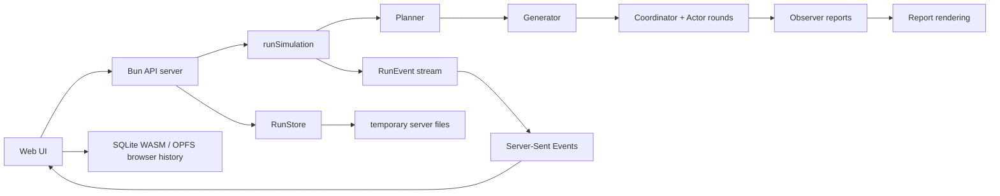

# Architecture

`simula` runs a Bun backend and a React browser client with shared serializable contracts.
Production source lives under `src/backend`, `src/ui`, and `src/shared`. Workspace names under
`apps/*` and `packages/*` remain command, configuration, and test locations.

## Responsibility Boundaries

| Boundary | Owns | Must not own |
| --- | --- | --- |
| `backend/api` | HTTP request/response handling, settings-to-provider request coordination, SSE transport | Actor decisions, simulation state transitions |
| `backend/runtime` | Execution lifecycle, cancellation, persistence and event publication coordination | HTTP responses, React state, provider protocols |
| `backend/integrations` | External model API translation, invocation, discovery, usage | Settings file loading, HTTP route dispatch, UI behavior |
| `backend/storage` | Temporary run and generation artifacts, bundled samples | Browser-owned durable records, HTTP responses, provider selection |
| `backend/core/simulation` | Actor behavior, accepted interactions, stages, timeline derivation, reports | HTTP transport, browser rendering, filesystem access |
| `backend/core/settings`, `backend/core/scenario` | Domain parsing, normalization, defaults, validation | HTTP responses, UI form state, file access |
| `shared` | Serializable shared types and API/event contracts | Runtime orchestration, platform I/O, provider clients, React |
| `ui/shell`, `ui/pages` | Browser startup, composition, navigation, user workflow orchestration | Authoritative simulation rules, filesystem access |
| `ui/components` | Reusable and feature-specific rendering and interactions | Backend rules, provider credentials, imports from pages or app |
| `ui/hooks`, `ui/stores` | Browser lifecycle, subscriptions, UI state and projections | JSX composition, server authority |
| `ui/models`, `ui/types` | Presentation transformations and browser contracts | Component/page imports, HTTP or storage I/O |
| `ui/api-client`, `ui/browser-storage`, `ui/i18n` | Outbound transport/downloads, browser persistence, translation data | React page composition, authoritative simulation state |


Backend flow is `api → runtime → simulation/integrations/storage`. Simulation workflows invoke
model integrations; pure transformations do not perform I/O. Storage uses domain parsers and timeline
builders. Provider discovery receives resolved settings from its API controller.

Frontend composition is `shell/pages → components/hooks/stores/models`. The API client owns HTTP
calls, hooks own React subscription lifecycles, browser storage owns persistence, and models own
presentation calculations. Shared browser types live in `src/ui/types`; component-only types stay
local. Browser code imports cross-runtime contracts from `src/shared` and never imports backend code.

## Source Map

`backend/core/documents` owns bounded TXT/MD decoding and CSV row/column evidence.
The CSV parser records every row in coverage and aggregate statistics, while its
detailed evidence samples the first and last rows when the file is large. PDF.js
and LibreOffice remain I/O adapters under `backend/integrations/documents`;
`backend/runtime/documents.ts` coordinates their jobs and persisted status.
Each admitted PDF-page vision call is recorded under its document artifact with
the page number; provider failures retain unknown incurred usage. Analytical
accounting reads these document records once as shared source preparation after
checking the confirmed document-set revision.
DOCX, DOC, and PPTX use the same converted-PDF page text and image path as PDF.
The extracted text is source evidence; the VLM's page-level explanation is separate
visual evidence. No Office shape or coordinate adapter participates in ingestion.
The pure source-number check is shared by the PDF visual adapter and ScenarioBuilder
evidence reduction. ScenarioBuilder requests one short claim per source block and
compares its numbers with that block's text before acceptance. For a visual PDF block,
matching extracted page text is authoritative when present. Code assigns source IDs,
keeps accepted claims and groups at most three summaries per reduction node. A finite
index choice selects up to four claims when a frontier contains more. The model writes
only short claim, overview and gap text, not a digest JSON object or source references.
This is a bounded numeric consistency check, not a proof of factual entailment.
Participant and rule checks receive the accepted cast's origin and authority. User
names/traits are locked constraints; generated identities are scenario assumptions.
Their absence from a document is not itself a source contradiction.
Each shared ScenarioBuilder rule task requests one short text sentence and code wraps
it in the existing `entries` artifact. Facet text is stored as a scenario assumption.
The conversion is checked during generation and on cached reuse; no alternate
persisted rule authority was added.
The bounded generation executor presents task-local short evidence aliases in model
context, then accepts one text field or finite choice at a time. Code assigns canonical
source references and assembles stored artifacts; model-authored citation lists and
stage-sized JSON are not required. Accepted artifacts and API references retain exact
IDs. Citation-shaped parenthesized task aliases are removed from accepted prose;
ordinary source terms outside citation syntax remain intact. Membership and
visibility checks apply to the assembled result.

The document-grounded `backend/core/scenario-builder` graph owns evidence reduction,
situation facets, participants, rules, participant-scoped source access, and
deterministic reviewable scenario assembly. Its source-access
tasks classify each bounded grounded claim independently after participants and information
rules exist. The model returns `0`, `?`, or listed participant numbers; code resolves them
to stable IDs and assembles the stored JSON artifact. The accepted claim text and citations are copied by code; the model only
selects public, named-participant or unresolved audiences. Identifiers, citations and
recipients are checked before a task is accepted. Unresolved access and exact restricted
claims copied into public situation/facet prose block confirmation, with targeted repair
of the affected unit. The required `sourceFacts` field makes older stored scenario drafts
without this contract unreadable until regenerated. Per-world StoryBuilder and actor context consume the grants; semantic paraphrase leakage
remains a separate quality concern.
Participant personality, authority and immediate goal are separate bounded text tasks.
User-provided personality is not regenerated; code assembles the confirmed identity,
locked flags and accepted fields into the stored participant record.
When no cast is entered, a finite choice selects two to six participants; one name or
role title is generated for each slot and code assembles the roster. A duplicate or
sentence-like name retries its own slot.

Its state contains IDs and accepted task references rather than source bodies or secrets.
Runtime injects model/artifact I/O, owns cancellation, and checks source revisions.
`backend/storage/scenario-builder` persists manifests and fingerprinted accepted tasks.
Shared scenario, world preparation, simulation and report execution claim process-scoped per-job
ownership before model work. Document storage captures source revisions before
scenario work begins. Shared contracts live in
`shared/scenario-builder.ts`; the browser must not import runtime classes.

`storage/generation/execution-lease.ts` now keeps execution ownership and cancellation in
one Bun process. Round approvals and Multiverse commands are also process-scoped. The server
creates a process-specific temporary workspace for model work and cannot resume it after a
restart. Browser SQLite WASM in a dedicated Worker owns durable scenarios, settings, drafts,
run events, graph frames, reports, and analysis results. Uploaded source bytes live in OPFS.
The active browser session owns its server artifacts through an HTTP-only cookie, and a
WebSocket allows a 30-second reconnection grace period. Expired sessions cancel work
and remove temporary artifacts after active writers stop. Browser history records lost active
work as interrupted. There is no supported multi-server execution contract.

The unified ScenarioBuilder modal is lazy-loaded from the home view. Its centered, wide dialog uses one scroll surface and keeps its workflow state mounted while closed. It accepts uploaded
files, a situation description, or both. With no file, the browser creates an explicitly
named user-situation text source so the same extraction and scenario graph can run; the
presentation labels that source as user input instead of exposing the internal filename.
Completed Markdown/text scenarios use a separate second landing action and retain their
direct preview path. API response schemas live in `shared/documents-schema.ts` and
`shared/scenario-builder-schema.ts`; domain normalization, reference membership, and
generation language policy remain in core. The browser subscribes to selected-task
field previews, not raw partial JSON or provider internals. The completed review
fetches a cited evidence block only when selected. The document API requires the
scenario's source-set revision for that exact-ID read and serves the retained extraction,
even after the current set changes. An uncaptured revision returns 409; it never falls
back to current evidence.
Extracted text and VLM page interpretation carry distinct method labels; a visual
interpretation is not represented as a full OCR transcript.

`storage/documents/source-revisions.ts` publishes a revision directory atomically under
`documents/:setId/revisions/:revision`. It contains the selected set manifest, hard links
to evidence files and bounded copies of document call logs. Evidence writes replace files
by rename, so the links preserve old bytes; append-only call logs require copies. Capture
runs under the existing set mutation lock, is idempotent, and rejects unready or uncaptured
obsolete inputs. Original uploads remain immutable under their existing document IDs.
Reading a revision does not capture it or invoke models. Multi-process write fencing and
retention/deletion policies remain separate requirements.

`backend/core/story-builder/world` independently prepares a starting scene, per-person
positions/concerns, an agenda, and information-flow guidance from a confirmed specification.
Its LangGraph holds only task references. `backend/core/generation` owns bounded
plain-text and finite-choice task execution; runtime injects artifact and model I/O.
`runtime/generation` owns their scoped progress snapshots and subscriptions.

World preparation is persisted by `storage/worlds`, supervised by `runtime/worlds`,
and exposed through `/api/worlds`. Handoff validates source/profile identity, projects
public simulation text, and creates a deterministic world run atomically. Preparation and
handoff claim the same world lease, so a concurrent launch returns a conflict until the
current operation ends. RunStore publishes the staged run directory inside that lease's
short transaction, then WorldStore publishes the run link under the same ownership.
If the process stops between these publications, a retry adopts the existing deterministic
run; it does not create another run or copy preparation usage twice. A canceled/displaced
handoff cannot publish its staged run, and an unlinked prepared story stays retryable.
The synchronous related-artifact publication callback exists only to cover this real
cross-directory boundary. No transaction spans model work or asynchronous staging I/O.
Generator
initializes prepared actors directly, retaining shared names, personalities, authority,
and goals. Initial private concerns seed only the owning actor's private working context.

Ordinary run IDs include a UUID; simultaneous same-name creation cannot overwrite a run.
Run creation publishes a complete directory atomically, and fixed world-run IDs reuse
identical input without reappending preparation metrics. Controllers reserve local starts
before settings I/O. Execution claims process-local ownership and rereads the stored status
before model work, so stale controller input cannot restart completed/history-bearing runs.
Simulation and legacy commentary share one run lease. RunStore requires it for events,
timeline, state, Markdown and manifests; the event broadcaster publishes accepted events
only after persistence. The model integration rechecks its runtime-supplied ownership
contract after waiting for capacity and before contacting a provider.

`storage/runs/round-approvals.ts` retains the bounded round gate in process memory.
The coordinator opens a gate only when a completed round awaits continuation; final rounds
do not open one. Future-round requests are rejected and consumed approvals remain idempotent.
`runtime/round-continuation.ts` wakes local waiters and disposes cancellation listeners.
Neither the gate nor a partially completed model call survives a server restart.

Actor graph channels now contain only the current trace and accepted decision.
`roles/actor/context.ts` projects the actor's visible memory once per turn through the
existing memory rules and retains only profile/action fields used by that decision. It
also carries the owner's initial private concern from `privateGoal` into the thought
request after a replaceable prose summary omits it.
Peer entries contain public profile fields and ID/label mappings, not private goals,
memory summaries, relationships or full histories. Original scenario bodies, provider
settings and full actor objects do not enter these graph channels. Runtime settings and
the per-turn context are explicit graph-construction dependencies, isolated per invocation.
The original histories remain with the simulation owner; this projection does not delete
accepted memory or change the existing prompt truncation policy.

Accepted interaction records keep thought, intent and expectation for the author and
reporting. Actor memory projection grants recipients and public observers only the
accepted visible content; private intent and expectation are appended only to the
source actor's own entry. Private/group interactions stay within their target set,
and solitary actions stay with their author. Decision context, recent-memory views
and compression consume this same projection, preventing metadata from becoming peer
knowledge. This does not retroactively sanitize previously persisted memory summaries
or implement the complete initial source-access policy.

An injected event may carry `visibleToActorIds`; an absent audience means public. The
coordinator rejects empty, duplicate or foreign explicit audiences before publishing.
Event details reach only named actors through memory and decision projection, including
the pre-round cue and fallback interaction text. `participantIds` remains an analytical
participant field, not an access grant. Planner's `roles/planner/events` module assigns
explicit recipients after Generator establishes the actual roster and before Coordinator
can inject an event. One short indexed-choice task per event uses confirmed information rules and
source grants, with three bounded output-validation attempts. Unresolved audiences fail;
there is no public fallback. Fast Mode allows independent requests through admission,
while accepted snapshots are persisted serially and all siblings settle before failure
returns. Stored explicit audiences are checked against the roster and reused without calls.
This module reuse is not durable root-graph resume or a user-facing retry endpoint.

World StoryBuilder carries each confirmed participant's exact permitted source facts
through assembly and the prepared-actor handoff. The public opening's setting, summary
and optional assumption are separate short text tasks. Public starting positions and
private concerns are also separate text tasks; code assembles their stored artifacts
and source references. Public work reads only public facts, while private work reads
only the owner's grant. Participant task references identify the owner and both
artifacts; unchanged task fingerprints reuse accepted text units.

The world access module rejects unknown/unresolved grants, modified handoff grants,
public premises citing restricted-only evidence, and copied restricted text before
public generation. Exact-copy checks also cover public assumptions. This conservative
citation gate can reject a public field with an unnecessarily private citation; correct
that confirmed premise or its citation instead of silently granting access. Uncited or
misattributed paraphrases in upstream confirmed prose remain outside this deterministic
guard and need the remaining ScenarioBuilder/Planner information-policy work.

Actor context also owns a retained-memory ledger: source-quoted commitments, decisions,
authority changes, constraints and unresolved matters, plus a processed-history cursor.
`actors/retain-memory.ts` consumes only newly accepted actor-visible entries. The
coordinator groups identical interaction content for permitted readers and proposes
additions once per group. `memory-closure-groups.ts` shares closure work only for identical
known record sets and current evidence, using task-local aliases mapped back to reader IDs.
It never unions different private ledgers. The author processes its distinct private
context separately. Groups
commit only after each reader's earlier accepted entries. `memory-records.ts` checks exact quotes,
active-record references and capacity before a pure state transition. Omitted records
stay active. Closed records keep their later source quote. Speaker identity is retained
so identical wording by different participants is not merged. These are records of
statements, not independently verified facts or calibrated model judgments.
After three incomplete model updates for one visible entry, the memory owner emits a
warning and advances that entry with no additions or closures. The accepted visible
history and earlier ledger records remain intact. Transport failures, cancellation,
cursor mismatches and capacity violations still surface as errors.

Active records enter decision context outside the lossy recent-history/summary limits.
The coordinator ingests final-round interactions too, and memory work obeys fast mode.
It uses the runtime-supplied `saveState` callback before and after retained-memory work
to preserve accepted interactions and updated ledgers in the existing fenced run state.
No parallel persistence authority is introduced. These snapshots support inspection of
partial results; they are not restartable graph checkpoints or mid-round resume.

Sequential actor rounds select each actor from the latest accepted snapshot so later
actors receive visible earlier interactions. Fast mode retains one shared starting
snapshot and deterministic commit ordering. The previous sequential path incorrectly
passed the original actor object alongside the newer roster, hiding prior same-round
speech from that actor's own memory projection.

Per-actor card graphs likewise retain only partial card fields and retry counts in their
channels. Assigned identity, roster snapshot, planner digest and language are explicit
context; provider settings and the event emitter remain runtime dependencies. Field
nodes retain sequential role/background/personality/preference generation and replace
provisional streams per retry. Completion requires all generated fields and keeps the
assigned name; it no longer invents missing personality/background/preference defaults.

The top-level simulation and planner/generator/coordinator workflows still carry
full state/settings. Their broader durable-reference and mid-run checkpoint migration
is outside the functional PoC unless a demonstrated blocker requires it. Analytical report accounting now
aggregates recorded model calls across the shared scenario and worlds; document VLM
calls and target-provider cost qualification remain separate open work.

### Model admission and execution scope

The composition root constructs one `runtime/model-admission.ts` owner and injects it
into scenario/world jobs, run execution, report regeneration, and text StoryBuilder
requests. Each endpoint/model pool has a call limit; waiting work rotates across owner
IDs, preserves per-owner ordering, and has bounded queue size and admission time.
Idle pools are removed. A permit is released on success, provider failure, or cancellation.

`integrations/llm/execution-context.ts` defines the narrow admission contract and carries
the runtime-supplied owner and abort signal through `AsyncLocalStorage.run`. Only the
invocation boundary consumes this context. It contains no provider registry, storage
access, or mutable globally configured scheduler. This keeps lifecycle dependencies out
of serializable LangGraph state while retaining one quota across nested role graphs.
Direct integration tests may invoke without a runtime scope; production entry points
bind one explicitly. Controlled HTTP tests verify propagation through LangGraph.

Queue wait is recorded separately from provider TTFT/duration. New builder tasks expose
waiting/running status transitions. Closing a run's SSE subscription only detaches its
reader. Explicit cancellation aborts queued and active model calls through the run's
continuation owner; finishing a scope also aborts leftover descendant work.

Scenario, world, and analytical text/choice tasks share one three-attempt ledger for
invalid content and transient transport failures. Core task execution owns attempts
and retry status; the LLM adapter classifies provider/network errors and waits after
invocation has released its admission permit. Retry-After hints are bounded to 30
seconds, and a canceled or expired scope interrupts the wait before another call.

This is per-process admission, not distributed scheduling or guaranteed server-side
inference cancellation. Fifty independent controlled graphs can reach the HTTP adapter
when capacity is 50. Batch execution now supervises 1–50 worlds; analytical backend
generation exists, while its UI integration and durable mid-round recovery remain outstanding.

### Multiverse execution ownership

`runtime/multiverse/jobs.ts` owns batch lifecycle, deadlines, and scoped world commands.
`world-execution.ts` reuses world preparation and the simulation lifecycle independently
for every persisted world ID. The confirmed ScenarioBuilder artifact is shared once;
StoryBuilder starts independently in each world. One world's failure cannot discard the
accepted work or final run artifacts of another world. Active execution resolves model
settings once for its worlds. Browser settings do not automatically restart an interrupted batch.

`storage/multiverse/batch-store.ts` atomically creates a manifest with stable ordered
world slots. Batch execution claims process-scoped ownership before reading settings
or starting world work. Every progress write requires that owner and performs a bounded
read/reduce/atomic file replacement. A second server process is not supported. World/run artifacts
carry `batchId`; ordinary run-start and preparation mutation endpoints cannot take over
batch execution. Completed runs and interrupted simulation histories are not overwritten
when retrying unfinished preparation within one process. A server restart interrupts
unfinished worlds. Local cancellation and deadlines abort
descendant preparation, model admission, simulation and manual round waits immediately.
Child workflows retain their own process-scoped ownership and receive a parent abort signal and
ownership check before model work and accepted result publication. Parent and child
artifact commits are not a distributed atomic transaction.

`storage/multiverse/world-commands.ts` accepts world-specific automatic mode, exact-round
approval and cancellation under the active uncanceled batch generation. Command acceptance
checks the bounded manifest while holding the same write reservation used for progress
updates. An ordered inbox preserves mode toggles rather than replacing them with only the
last value. A per-world receipt deduplicates the latest manual approval and cancellation.
The inbox holds at most 200 commands, with 50 slots reserved for one cancellation per
world; a full progress queue rejects more progress commands without disabling cancellation.

`runtime/multiverse/controls.ts` serially applies and acknowledges accepted commands.
Local API requests wake it directly. Repeated mode application does not restart an existing countdown.
An approval whose round already advanced is acknowledged without advancing a later round.
The consumer stops with its batch; storage failures interrupt supervision rather than
silently discarding commands. Old-generation inbox entries are not applied by a successor.
This preserves commands across a receiving-process disconnect while the execution remains
active; it does not recover an interrupted round or countdown. Restartable checkpoints
and cross-process model capacity accounting remain separate obligations.

`runtime/multiverse/rounds.ts` owns per-world approval and countdown state. Automatic
progression waits five seconds for its first three approvals, then proceeds immediately.
Disabling it cancels a pending countdown and resets the streak. Manual approval requires
the exact waiting round. The server advances unselected worlds without mounting browser
dialogs. Batch execution defers per-world long commentary to later aggregate analysis.
Run finalization releases the timeline cache after flushing its durable artifacts.

The browser polls compact batch summaries while the panel is visible, subscribes to
only the selected world's preparation detail, and mounts a simulation/history renderer
only when opened. Shared world-control fields serve both launch paths. Browser-owned
round dialogs are suppressed for runs whose manifest identifies a batch owner.

```text
server.ts               # One Next, API, SSE and WebSocket listener
src/
├─ app/              # Next.js page routes and layout
├─ backend/
│  ├─ config.ts         # Environment and runtime paths
│  ├─ api/              # Function-grouped HTTP controllers and transport adapters
│  ├─ runtime/          # Run execution, continuation, event persistence/publication
│  ├─ integrations/llm/ # Provider construction, invocation, model discovery, usage
│  ├─ storage/          # Active temporary artifacts and bundled samples
│  │  └─ runs/          # Active run artifacts and timeline publication
│  └─ core/             # Simulation and application domain logic
│     ├─ simulation/
│     │  ├─ workflow/   # Top-level graph, shared state, stages and finalization
│     │  ├─ actors/     # Shared actor memory, interactions and visible text
│     │  ├─ events/     # World event injection and execution telemetry
│     │  ├─ planning/   # Plan digest projections
│     │  ├─ outputs/    # Report and graph timeline derivation
│     │  └─ roles/      # Planner, generator, coordinator, actor, observer
│     │     └─ generator/cards/ # Per-actor card generation workflow
│     ├─ scenario/      # Scenario parsing and normalization
│     ├─ settings/      # Defaults, validation and sanitization
│     ├─ story-builder/ # Scenario drafting workflow
│     └─ prompts/       # Shared prompt and language construction
├─ shared/              # Cross-runtime domain types and API/event contracts
└─ ui/
   ├─ shell/            # Browser startup, application composition and view orchestration
   ├─ animation/        # Motion timing/presets, presence, visibility and CSS feedback policy
   ├─ pages/            # Start, report and browser-level page composition
   ├─ components/       # UI grouped by scenario, settings, graph, activity, etc.
   │  └─ ui/            # Existing shadcn primitives
   ├─ hooks/            # React lifecycle and subscription hooks
   ├─ stores/           # Cross-cutting Zustand state and event projections
   ├─ types/            # Shared browser-only type contracts
   ├─ models/           # Presentation calculations and form-state transformations
   ├─ api-client/       # Outbound HTTP requests and export downloads
   ├─ browser-storage/  # SQLite WASM, OPFS, sessions and preferences
   ├─ i18n/             # Dictionaries and pure locale resolution
   └─ lib/              # Existing class-name utility
```


`server.ts` composes one Next.js handler with the existing API, SSE, WebSocket and backend runtime.
Next owns URL routes in `src/app`; the browser application and its OPFS startup remain under
`src/ui/shell` behind a client component. Feature-specific components remain grouped under
`src/ui/components`, including local graph renderer helpers. The API controllers are grouped by
function while LangGraph modules retain their current owners in `src/backend/core`.
Shared Motion features, timing, presence and interaction presets, reduced-motion handling, and
native CSS feedback policy live in `src/ui/animation`. Components select those effects while
owning their rendered content and accessibility. Graph canvas interpolation remains with its renderer.

## Simulation Core Modules

Use each actual graph as the primary module boundary. Keep its construction in `graph.ts` and
state types, LangGraph annotations, initialization, and state helpers in `state.ts`. Nodes and
prompts remain in the same graph folder. A graph state module must not import its graph builder.

| Module | Responsibility |
| --- | --- |
| `workflow/graph.ts` | Top-level simulation graph and execution entry point. |
| `workflow/state.ts` | Shared workflow schema, initial simulation state, and role-trace updates. |
| `workflow/stages.ts`, `workflow/finalization.ts` | Stage invocation and final report node. |
| `roles/planner/`, `roles/generator/`, `roles/coordinator/` | Role graphs sharing the existing workflow schema; local state helpers remain with each role. |
| `roles/actor/graph.ts`, `roles/actor/state.ts` | Actor graph and its own annotation, initial trace, and decision state. |
| `roles/generator/cards/graph.ts`, `roles/generator/cards/state.ts` | Per-actor card graph and its annotation, initialization, and card state. |
| `roles/observer/` | Observer operations, state helpers, and prompts; no independent graph. |
| `roles/shared/step-node.ts` | Shared role-step node construction; not a graph builder. |
| `roles/shared/node.ts`, `state.ts`, `types.ts` | Shared model execution, role-state helpers, and contracts. |
| `actors/memory.ts` | Shared visible-context behavior and model-assisted memory compression, separated as functions. |
| `actors/interactions.ts`, `actors/visible-text.ts` | Shared actor decision and interaction helpers. |
| `events/`, `planning/`, `outputs/` | Shared event handling, plan digests, and report/timeline projections. |

Planner, generator, and coordinator use the same workflow state. They import its canonical
`workflow/state.ts` declaration rather than copying it into each role. Actor and card graphs have
their own schemas and keep those declarations beside their builders. Memory compression is a
function call, not a graph, so it remains with the memory behavior used by multiple roles.

Pure transformations remain independently callable and testable even when their file also contains
orchestration helpers. Event injection and output derivation remain free of model calls and file I/O.
Core never imports HTTP handlers or storage; the existing LLM integration supplies model calls.

## Execution Path


```mermaid
flowchart LR
    UI["Web UI"] --> API["Bun API server"]
    API --> Store["RunStore"]
    API --> Core["runSimulation"]
    Core --> Planning["Planner"]
    Planning --> Generation["Generator"]
    Generation --> Runtime["Coordinator + Actor rounds"]
    Runtime --> Observer["Observer reports"]
    Observer --> Finalization["Report rendering"]
    Core --> Events["RunEvent stream"]
    Store --> Files["temporary server files"]
    Events --> SSE["Server-Sent Events"]
    SSE --> UI
    UI --> SQLite["SQLite WASM / OPFS browser history"]
```

## Persistence Model

The server's active workspace is created under the OS temporary directory. It is removed on
graceful shutdown and each expired browser session's resources are removed after cancellation.
The browser profile's OPFS-backed SQLite database is the durable source. The single-tab Web
Lock prevents concurrent database connections. The application shows an explicit storage error
if OPFS cannot be opened; it does not switch silently to an in-memory database.

Each run directory contains:

```text
<temporary server workspace>/<run_id>/
  manifest.json
  scenario.json
  events.jsonl
  state.json
  report.md
  graph.timeline.json
```

The temporary `events.jsonl` remains available for active simulation calculations. A separate
process-local SSE queue retains only events that the browser has not confirmed in SQLite. The
browser commits event batches before acknowledging their absolute byte cursor; the queue then
releases that prefix without changing reconnect positions. After a terminal snapshot and event
count confirmation, the server also clears the temporary JSONL log once its readers and writers
have stopped. Later server reads expose only any new temporary suffix; the browser merges it with
saved history. Browser storage also retains run state, graph frames, report text, and analysis records.
The browser can export a ZIP backup of SQLite records and OPFS uploads for manual transfer.
Schema version 2 adds upload MIME type and modification time to the attachment catalog.
Version 3 separates run state and reports from the run index, and adds foreign keys to run
events and graph frames. The SQLite Worker applies versioned migrations transactionally.
Browser repositories use Drizzle ORM through that Worker for ordinary reads and writes. Each
query lives in an operation-named file under its data area's directory; a transaction that
commits one domain change, such as a final run detail, remains one operation module.
schema migration, portable backup import/export, and connection pragmas retain direct SQL
because they operate on database structure or dynamic table sets. An uploaded original
remains in OPFS under its document-set owner after server submission. If the server loses
that set or build, the browser can resubmit the retained source through a new set and build.

Run SSE reads `events.jsonl` through `storage/runs/event-log.ts`, retaining at most one
bounded incomplete record plus its read chunk. Each SSE ID is the run identity and byte
offset immediately after a complete JSONL record. A reconnect uses `Last-Event-ID`; a
visibility resume or detected gap uses `?after=`. Cursors must match the requested run,
lie within its file, and end at a newline boundary. Files are append-only for that run;
incomplete final appends wait for completion, while malformed committed records fail.
The transport envelope validates known kind, run scope and timestamp type; complete
legacy event-payload schema validation remains separate work.

The stream registers local wakeups before reading history. All delivery still comes
from the log, so a local notification is only a wakeup, never a competing source of
events. Other-process appends are observed with a 500 ms wait at EOF. Local appends wake
immediately. Pull-based backpressure bounds read-ahead to the 64 KiB stream queue plus
one event (maximum 8 MiB); slow readers cannot create an unbounded publisher queue.
Comments provide a 15-second idle heartbeat. Disconnect/abort closes the reader, timer
and listener without canceling execution. Terminal manifests with no active execution
drain remaining records, then publish `stream.end`. Unreadable stored history publishes
`stream.error`, stopping futile automatic retries and showing a localized message.

The browser preserves native transient-error reconnect, skips duplicate byte positions,
checks continuity against each UTF-8 record length and requests replay from the last
accepted cursor on a gap. Frame batching bounds pending event count and bytes. Hidden
tabs detach and reconnect when visible; ended streams remain closed. This restores
accepted run events across local processes sharing storage, not provisional board/task
drafts, general multi-server routing, or compact simulation checkpoints.

## Presentation Boundary

The React app consumes the server API and SSE stream. It composes:

- scenario creation and sample loading
- role settings editing
- round-grouped actor history cards beside the relationship graph (60:40 on desktop)
- Sigma-based relationship graph display
- replay controls backed by `graph.timeline.json`
- Markdown report rendering and export

The UI does not implement simulation rules directly.

Frontend naming and helper placement are documented in [the web guide](../apps/web/README.md#naming-and-local-helpers).

## Related Docs

- contracts: [`contracts.md`](./contracts.md)
- configuration: [`configuration.md`](./configuration.md)
- workflow stages: [`workflows/README.md`](./workflows/README.md)


## Planner-owned action catalog

`roles/planner/actions` owns a separate `planner.actionCatalog` stage after the planner digest and
major events have been applied. Purpose-named prompts request the label, use condition and attempted
effect as three short text fields. `field.ts` owns streaming, telemetry and bounded retries for one
field; `catalog.ts` owns label identity and program-assigned codes; `node.ts` assembles an action only
after all three fields are accepted. A failed field does not regenerate accepted siblings. This is
one workflow stage with focused functions, not an additional nested graph.

The plan is the owner of the code-to-definition map. Generator actor assembly references its
values rather than synthesizing per-actor template names. Actor decisions use the existing exact
choice and repair path. Scope and expected effect are resolved by code; the Actor still generates
its own context-dependent thought, intent, target, and message.

### Report workspace

The report page is a single-page analytical workspace. Its metric overview remains above
explicit generation commands, the live stage/task/output surface, and the completed board.
The selected run can switch to its parent Multiverse analysis when batch ownership exists.
Reading a saved analysis never generates it. Subject discovery supplies version freshness;
errors and unavailable source status remain visible without discarding persisted results.

`components/report/analysis` owns reading dialogs, source excerpts, accepted SWOT geometry,
board layout, and live output composition. `use-analytical-report` owns query/mutation
lifecycle; `api/analytical-report` validates HTTP contracts. Common generation streaming
and its reducer now live in `hooks/use-generation-stream.ts` and `models/generation`.
Scenario-specific stage mapping stays under `models/scenario-builder`.

At most three live task output columns mount per stage page. Only those columns receive
detailed subscriptions. Named plain-text previews are provisional; completed Markdown is
rendered through the existing sanitizer in an opened detail. Readers retain scroll control.
Four accepted SWOT score tasks can reveal the chart before final prose completes; missing
values remain unknown and never form a fabricated polygon. Chart loading fades locally
only while visible, and reduced-motion/hidden-page preferences suppress recurring work.

Read-only dialogs occupy 86vw by 86svh on desktop and 96vw by 94svh on mobile. Radix owns
focus trapping, Escape handling, and return focus. Heavy relationship and conversation
modules are lazy-loaded and mounted only when their record entry is opened. Existing
commentary remains readable as a stored record; the analytical generation button uses the
new report API. Consolidation of legacy automatic commentary production remains pending.

Relationship inspection retains the heatmap above the network, replay cursor, and
on-demand WebGL renderer. Conversation inspection retains the round carousel, message
cards, archive-mode virtual history, and actor/message detail. Actor search, edge selection,
collapsible filters, and top-level report tabs are absent.

The four on-screen metric cards combine the selected run's calls and the selected
analytical report's calls, with that scope displayed explicitly. After completion,
a separate bounded card reads recorded shared preparation, each world's work, final
analysis, and overall usage without counting shared calls per world. Portable analysis
export version 2 contains the same projection. Provider usage
unavailable remains unavailable. Run exports remain available. Analytical export
reads one accepted report snapshot, its scoped references, and recorded call metrics.
Core computes a content digest and validates the portable JSON
contract; the API bounds its transfer and makes no model calls. The browser can render a
localized Markdown reading file from that validated JSON, escaping source/model text as
literal content. An incomplete report preserves explicit failed sections and missing
inputs. Source freshness is resolved independently of the stored accepted result.

### Evidence-first report commentary

`outputs/commentary/evidence.ts` prepares bounded packets using the scenario, planner digest,
network totals, existing observer summaries, and every round's interactions. Long text fields are
shortened explicitly; interactions are partitioned into groups of eight rather than dropping
middle history. Global actor/event context is bounded, with omissions disclosed and packet-local
participants supplied separately.

`outputs/commentary/workflow.ts` reduces a tree bottom-up. A frontier completes before its
parents begin, with at most two in-flight observer requests. Groups of up to four detailed items
produce detailed conclusions, followed by an overall conclusion (at least two synthesis levels).
Each node requests a summary, a finite finding count, individual findings, and a
conclusion as separate complete responses. Code assigns the supplied evidence IDs
and assembles the node. Accepted fields survive a later field failure and are reused
when that node is retried with unchanged evidence.

Each node gets three attempts with validation feedback. Provider outages stop further fan-out;
invalid leaves remain marked unavailable and parents acknowledge missing support. Previously
validated siblings are reused, while retried children invalidate their ancestors. Runtime saves
checkpoint states during finalization and manual generation. Commentary failure does not erase
simulation results. Cancellation aborts active model calls and waits for the current bounded
batch to settle before releasing ownership. The existing run lock prevents overlapping
execution or commentary jobs.

Stored commentary is available from a read-only record dialog. Relationship and conversation
inspection have separate record entry points without top-level tabs.
All report disclosures are expanded sections. Heatmap precedes the network and replay; the report
has no edge selector. Actor search is removed from the shared graph renderer in all views.

### Analytical report workflow and discovery

`core/simulation/outputs/analysis` owns evidence reduction, a common evaluation perspective,
independent analytical branch graphs, world trajectory classification, and final synthesis.
The common perspective accepts focus, objective, horizon and boundary as separate
short text tasks; code assembles it with scenario references before branches begin.
Material assessment can progress independently of slower world summaries. Each branch
accepts bounded findings, optionally selects a SWOT score, and writes its detail as
plain text before the root assembles the conclusion. Code attaches the accepted
findings summary and reference IDs to that detail. Shared graph state contains task references; evidence bodies
and final sections remain in accepted artifacts. The single-page report consumes this API;
legacy commentary is retained only for existing record inspection and the still-active
legacy finalization path.
Evidence reduction uses short text units; code retains their source or observation IDs.
Empty internal findings lists are omitted from the next model packet so they cannot be
mistaken for an absence of recorded observations. `analysis/conclusion.ts` independently
writes source and simulated-world summaries and paragraphs, then writes implications from
their accepted results and bounded section abstracts. The model emits six plain-text
fields with a shared 2,048-token completion allowance. Code supplies references and
uses the implications summary as the integrated takeaway, without asking a model to
rewrite the entire conclusion. Failed units preserve accepted siblings for retry.
Unresolved scope issues leave a partial report instead of a validated overall conclusion.
The workflow checks completion, references and access boundaries; it does not use routine
model re-review as proof of factual accuracy.
Accepted findings derive their provenance categories from persisted evidence references,
not model-supplied category labels. Those categories accompany bounded findings into
score/detail and final synthesis inputs and appear beside findings in the report and
portable Markdown. Older saved findings without this optional field remain readable;
absence of a label does not imply a source claim.
World references explicitly identify simulated interactions and event pressures rather
than document claims. Recorded rounds enter the reduction frontier before actor
definitions, while the terminal reason is interpretation rather than an observed action.
Proposed trajectory labels enter the final distribution only when
at least one world was assigned; unclassified worlds remain counted separately. The
conclusion may cite accepted perspective references as well as section references.

`core/generation` and `shared/generation.ts` own bounded task execution and shared progress
contracts across builders and reports. Runtime injects artifact I/O, model invocation,
abort signals, and admission. Only selected task previews reach detailed subscriptions.
Terminal status eviction preserves an active draft when other tasks finish; subscriber
failure cannot prevent terminal cleanup.

`runtime/analysis` resolves terminal run/batch inputs against captured source revisions
and checks simulation input fingerprints before and after generation. It owns call/deadline limits, cancellation, and ready/partial status.
A competing runtime can read persisted active ownership and request cancellation without
starting another report execution. The current owner alone can publish manifests, task
results and citations. Common terminal-failure publication handles cancellation races and
drops writes from displaced owners; a failed retry preserves previously accepted prose.
`storage/analysis` persists manifests, accepted tasks, scoped evidence, and report-call
metrics. `shared/analytical-report.ts` is distinct from the existing numeric analysis API
in `shared/analysis`; neither barrel replaces the other's public contract.

Subject discovery reads one hashed subject pointer and its canonical report manifest.
Creation publishes the pointer after the manifest and serializes same-subject updates
within this process. Repeating creation repairs interrupted publication using the original
timestamp; an older idempotent request cannot promote itself above a newer report. The
pointer is a lookup projection, not a duplicate report. Its update uses process-local
serialization; cross-process subject-index coordination is not supported. Freshness compares input fingerprints and whether the latest document set
has advanced beyond the retained revision; an older source remains usable for its original
worlds but makes their report outdated. Document usage is read from the same captured
revision, excluding later re-extraction calls. Unavailable
sources preserve the stored report and are never reported as current. Reads do not call
models, regenerate missing sections, or mutate report artifacts.

A partial report's accepted body remains readable during and after an unsuccessful retry.
Live task previews are separate from that body. Runtime replaces the accepted report only
when a new assembly succeeds; failure changes execution status without erasing previously
accepted prose. This preservation does not constitute durable mid-task graph recovery.
