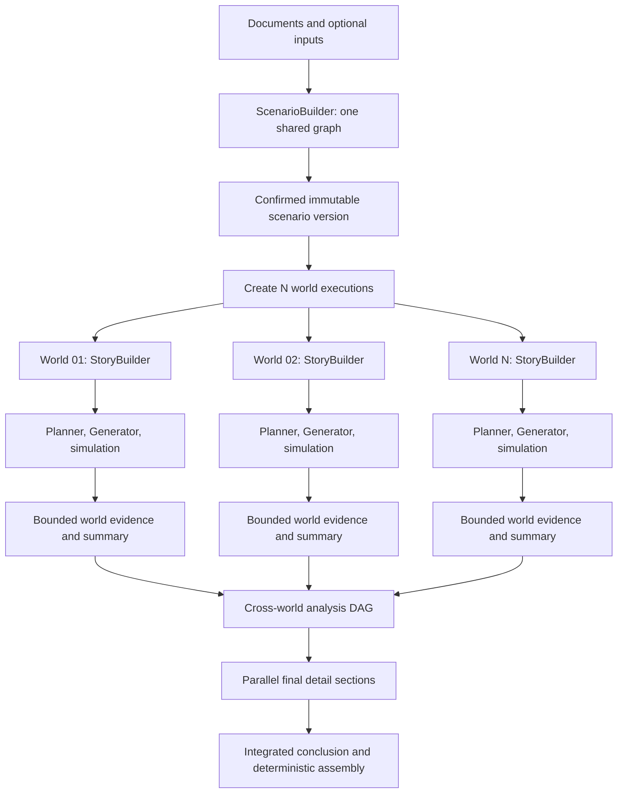

# System Advancement Detailed Requirements

> Role: historical detailed design reference, not a PoC implementation checklist.
> The current PoC plan supersedes earlier model-authored JSON contracts and hardening gates.
> Consult details only when needed for a feature in the active plan; do not restore deferred scope.
> Current completion, remaining work, test order and model selection are owned by
> [System-Adv.md](../System-Adv.md). Historical execution results belong to
> [the work ledger](./system-adv-progress.md).
> Original section numbers are retained so existing design discussions remain traceable.

This file preserves the detailed product requirements, graph contracts, UI layouts,
acceptance cases and worked examples from the original plan. A section describing a
required behavior does not imply that behavior is implemented. Proposed numeric budgets
remain design suggestions unless the current implementation or active plan identifies
an adopted bound. Current real-model qualification uses Ornith-1.5-35B-A3B; older
Gemma or retired converter observations are not the present test policy.

Read the relevant contract while implementing a work item from the active plan. Do not
use this reference as a competing backlog or infer release readiness from its diagrams.

## 4. Product terminology and UI language

| Internal concept | Korean UI | English UI |
| --- | --- | --- |
| Document-grounded entry | 자료로 시나리오 만들기 | Create a scenario from documents |
| Document extraction | 자료를 읽고 있습니다 | Reading documents |
| Context construction | 상황을 구성하고 있습니다 | Building the situation |
| Shared participant construction | 등장인물을 구성하고 있습니다 | Building the participants |
| Scenario assembly | 시나리오를 정리하고 있습니다 | Preparing the scenario |
| StoryBuilder work | 스토리를 구체화하고 있습니다 | Developing the story |
| Report evidence stage | 근거 정리 | Evidence review |
| Report analysis stage | 관점별 분석 | Analysis |
| Report synthesis stage | 종합 평가 | Overall assessment |
| Parallel-world option | Multiverse | Multiverse |
| World count | 세계 수 | Number of worlds |
| Provider admission wait | 호출 대기 | Waiting for model capacity |
| Provisional output | 작성 중인 내용 | Draft in progress |
| Incomplete analysis | 일부 분석 미완료 | Analysis partially complete |

All interface copy belongs to the existing English/Korean dictionaries. Examples here
describe intended meaning; final localized messages must be complete messages with
consistent interpolation keys.

The user sees outputs, evidence, and execution progress. Internal chain-of-thought or
provider reasoning traces are not the progress narrative.

## 5. User input and confirmation behavior

### 5.1 Upload form

```text
자료로 시나리오 만들기

┌ 자료 ───────────────────────────────────────────────────┐
│ 파일을 놓거나 선택하세요                               │
│ 사업계획.pdf    분기실적.xlsx    제품소개.pptx             │
│ 파일별 읽기 상태 · 제거                                 │
└─────────────────────────────────────────────────────────┘

어떤 상황을 살펴보고 싶나요? · 선택
┌─────────────────────────────────────────────────────────┐
│ 다음 분기 투자 검토 회의를 준비하고 싶습니다.            │
└─────────────────────────────────────────────────────────┘

상황 · 선택
[자동] [회의] [발표·질의응답] [협상] [검토·심사]

등장인물 · 선택
이름 또는 호칭            성격·행동 특성 · 선택
[CTO                ]     [기술적 근거를 중시함      ] [삭제]
[재무담당자         ]     [                          ] [삭제]
[+ 인물 추가]

빠른 모드 [ON]       Multiverse [ON]       세계 수 [50]

                                      [시나리오 생성]
```

### 5.2 Input rules

- One or more supported documents are required for the document-grounded entry.
- Existing text-only scenario creation remains a valid separate entry path.
- Situation description, preset, and participant list are optional.
- A retained participant row requires a non-empty name or role title.
- An entirely blank added row can be removed or ignored; a personality without an
  identity must produce an actionable field error.
- Names such as CTO, procurement lead, or finance representative are valid identities.
- Normalize surrounding whitespace and detect ambiguous duplicate display names.
- Assign stable internal participant IDs independently of display labels.
- Explicit user traits are locked constraints, not suggestions to silently rewrite.
- An omitted personality is generated once in shared scenario construction.
- Requested cast count cannot be smaller than the number of specified participants.
- Additional participants follow the existing additional-cast option and must be
  distinguishable from the original shared cast.
- A situation preset is a controlled prompt input, not a separate simulation engine.
- Auto selection proposes a situation supported by the materials; business documents
  do not unconditionally imply a presentation.
- Presentation means a presentation/Q&A/decision situation in this scope. Generating
  a downloadable presentation deck is not part of this request.

### 5.3 Scenario review gate

Present the shared scenario, participants, material assumptions, unresolved evidence,
world count, and configured execution budget before starting worlds.

Use one clear scenario confirmation step. Do not require confirmation after every
small model task. Editing the confirmed scenario creates a new immutable version.

The confirmed version is the sole parent specification for all worlds in that batch.

## 6. Document processing architecture

### 6.1 Processing sequence

```text
Upload boundary
    → file identity and format checks
    → original artifact persistence
    → PDF normalization when required by the chosen converter topology
    → bounded page-image rendering
    → selectable PDF text extraction, paired to each rendered page
    → page-scoped VLM interpretation using the image and extracted text together
    → normalized evidence blocks
    → source-linked claim ledger
```

The normalized PDF path treats one page as one task. Render its image, extract its
selectable text, then ask the VLM to preserve the page's material facts,
names, numbers, units, trends, relationships, and decisions. The VLM task is semantic
analysis rather than OCR or verbatim transcription. Store the exact extracted text
separately so summarization never replaces source evidence. A scanned page may have
no selectable text; its image still reaches the VLM. Record any converter OCR as a
separate processing method and cost where the converter performs it.

For native XLSX, CSV, TXT, and MD evidence, retain structural extraction and honest
locators. XLSX original cell values and formulas remain authoritative when Office
conversion recalculates a workbook. DOCX, DOC, and PPTX use text extracted from
their normalized PDF pages, each paired with that page's image. Do not require
original Office paragraph, shape, or coordinate extraction for this feature.

### 6.2 Format-specific behavior

| Format | Primary extraction | Visual path | Source locator |
| --- | --- | --- | --- |
| PDF | Selectable page text | Corresponding rendered page | PDF page number |
| DOCX | Text from converted PDF pages | Corresponding rendered page | Converted PDF page number |
| DOC | Text from converted PDF pages | Corresponding rendered page | Converted PDF page number |
| PPTX | Text from converted PDF pages | Corresponding rendered page | Converted PDF page number |
| XLSX | Sheet/table regions, cell values, formulas, units | Charts and visual emphasis | Sheet name and cell range |
| CSV | Columns, rows, types, aggregates, anomalies | Normally unnecessary | Row range and column identifiers |
| TXT | Decoded text and logical sections | Normally unnecessary | Line or character range |
| MD | Markdown sections, tables, text | Embedded visual content only when available through supported local artifacts | Heading path and line range |

The parser must report locator precision honestly. An Office page number identifies
the normalized PDF page, not an original paragraph, slide shape, or coordinate.

### 6.3 Tables, charts, and quantitative content

- Preserve units, time periods, column headers, missing values, and sign conventions.
- Preserve a spreadsheet formula separately from its cached result.
- A missing or stale cached result is not an invitation for the model to invent a value.
- Explicit recalculation, if introduced, must be recorded as a derived transformation.
- Compute sums, counts, distributions, and cross-world frequencies in deterministic code.
- For large tables, expose a schema, relevant aggregates, selected records, and coverage
  metadata; keep the original table available for follow-up retrieval.
- A number read visually from a chart remains a visual estimate unless corroborated by
  structured values.
- Distinguish a source claim from a calculation derived from source values.

### 6.4 VLM task boundaries

For normalized PDFs, use exactly one page per VLM task. Pair its rendered image with
that page's extracted PDF text and source ID in one multimodal call. Bound image bytes,
pixel area, page count, prompt text, output tokens, and model time independently.
When page text exceeds the prompt budget, retain all exact text in source evidence,
make the VLM excerpt explicit, and avoid claiming the VLM saw omitted text.

The response should be compact, source-language semantic points that cover as much
material page content as the budget permits, including chart meaning, diagrams,
table meaning, and visual relationships. It must distinguish exact parsed values
from visual estimates and identify uncertainty or disagreement. It is an explanation
of the page, not complete OCR or a replacement for extracted text.

When Fast Mode is off, execute page tasks serially. When it is on, run independent
pages in parallel up to the shared `settings.concurrency` allowance (1–50), while
the common endpoint/model admission pool also limits VLM and other model calls.
Merge accepted page results in page order regardless of completion order. Cancellation
stops queued and active work; a failed page remains a named coverage gap rather than
silently becoming text-only success.

If visual interpretation and extracted text disagree, prioritize extracted text.
Keep selectable text as page-linked source evidence; a contradictory visual number
must not replace it or become an accepted visual claim. When a PDF page has no
selectable text, interpret its rendered image directly. For spreadsheets, original
cell values and stored formula results take precedence over any value recalculated
by Office-to-PDF conversion. A visual-only estimate remains explicitly visual.

Do not silently switch to text-only processing and report full visual coverage when a
configured model endpoint rejects image input.

### 6.5 Extraction coverage and failures

Each document records total known pages/regions, processed regions, skipped regions,
failed regions, and the extraction method. A completion percentage describes measured
processing coverage, not a claim that all meaning was understood.

Encrypted, corrupt, unsupported, or partially readable documents receive file-specific
errors. Preserve successful files. Require usable supporting evidence before declaring
a document-grounded scenario ready.

For a critical missing source, block dependent generation. For non-critical gaps, allow
an explicitly incomplete scenario after the review gate exposes those gaps.

### 6.6 Resource and trust boundary

Document converters run outside the Bun request loop. Apply bounded input bytes,
expanded archive bytes, page counts, image sizes, process time, and concurrency.

Use controlled temporary directories, generated storage identifiers, and argument arrays
when invoking converters. Disable macro execution and unsolicited external resource
fetching. Uploaded document instructions are data, not tool or workflow authority.

Do not put original documents, credentials, or image payloads into unrestricted logs or
general event streams. These are implementation requirements of accepting complex files,
not extra user-facing approval screens.

## 7. Dependency candidates and deployment decision

### 7.1 Research baseline

The following repository metadata was checked during planning on 2026-09-23. Star
counts are approximate and are not quality guarantees. Pin adopted versions after a
format-quality and deployment test; do not install moving `latest` versions in production.

| Candidate | Observed stars | Observed license | Intended role | Assessment |
| --- | ---: | --- | --- | --- |
| Docling | 67,613 | MIT for code; model licenses separate | Structured multi-format extraction | Compared, then removed from the active path |
| Unstructured | 15,468 | Apache-2.0 | Alternative multi-format extraction | Evaluated, not adopted into the current stack |
| PDF.js | 53,919 | Apache-2.0 | Primary PDF text extraction and page rendering | Server-side PDF adapter |
| Mammoth.js | 6,308 | BSD-2-Clause | DOCX text/HTML extraction in a Node-oriented alternative | Does not replace the complete format pipeline |
| Papa Parse | 13,573 | MIT | Streaming CSV processing | Consider when native document parsing is insufficient for large tables |
| ExcelJS | 15,482 | MIT | Explicit workbook/cell access | Evaluate maintenance and cached-formula behavior before adoption |
| LibreOffice core mirror | 4,390 | Verify official distribution terms | Office-to-PDF conversion | External runtime tool, not a browser dependency |

Observed release references include Docling `2.129.0`, Unstructured `0.27.8`, PDF.js
`6.3.289`, and Papa Parse `5.7.0`. ExcelJS's observed latest GitHub release was `4.4.0`
from 2023; its popularity does not establish current maintenance suitability. GitHub
release listings and package-registry versions must not be assumed identical.

Docling's reviewed `2.129.0` format documentation includes PDF, DOCX, PPTX, XLSX,
CSV, and legacy DOC via LibreOffice. TXT/MD can use bounded native text handling
without starting the heavier conversion path.

### 7.2 Adopted extraction path

Use PDF.js in `backend/integrations/documents` to extract each PDF page's selectable
text and render that same page. Send the page text and corresponding image together
in one VLM call; when no selectable text exists, send an explicit empty-text marker
with the image. LibreOffice is used only to convert DOCX, DOC, PPTX, and XLSX to
PDF before this same page pipeline, not to interpret image-only PDF text. CSV uses
bounded row/column parsing with source row locators and explicit sampling for large
inputs; TXT and MD use bounded native decoding.
For DOCX, DOC, and PPTX, stop at text extracted from each converted PDF page plus
the corresponding rendered page image. The VLM describes page meaning rather than
performing complete OCR. Original Office geometry and element coordinates are not
part of the document ingestion acceptance criteria.
Docling is removed from active extraction, dependencies, and accepted evidence-method
values. PDF.js rendering uses a pinned N-API canvas package with prebuilt macOS,
Linux, and Windows binaries; deployment
must verify the target platform's binary before enabling document processing.

The small synthetic converter comparison is recorded in
[`docs/document-converter-comparison.md`](./document-converter-comparison.md).
The comparison found that PDF.js preserved `Costs 80` from a selectable PDF where
Docling previously returned `Costs 0`. An image-only PDF has no extracted text, so
its rendered image is supplied to the VLM. LibreOffice can recalculate an XLSX
formula whose original cached value was absent; original workbook cell evidence
therefore remains authoritative over its rendered PDF page.

Keep application orchestration and model-provider ownership in Bun/TypeScript.

Route semantic VLM calls through the existing LLM integration so credentials, retries,
usage accounting, cancellation, and provider configuration have one owner.

### 7.3 Open deployment question

The current deployment path runs PDF.js and the pinned canvas binary in Bun and
uses LibreOffice as a server-side process for Office documents. The target VDI/server
must still be checked for the matching canvas binary, LibreOffice availability,
conversion limits, and the configured vision-capable model endpoint. DOC support
depends on that LibreOffice conversion path; PDF and native text inputs do not.

### 7.4 Source references

- [PDF.js API](https://mozilla.github.io/pdf.js/api/)
- [N-API Canvas repository](https://github.com/Brooooooklyn/canvas)
- [Unstructured repository](https://github.com/Unstructured-IO/unstructured)
- [PDF.js repository](https://github.com/mozilla/pdf.js)
- [Mammoth.js repository](https://github.com/mwilliamson/mammoth.js)
- [Papa Parse repository](https://github.com/mholt/PapaParse)
- [ExcelJS repository](https://github.com/exceljs/exceljs)
- [LibreOffice command-line parameters](https://help.libreoffice.org/latest/en-US/text/shared/guide/start_parameters.html)

All newly adopted top-level library candidates must meet the requested popularity
criterion. Transitive packages still require normal dependency review; the threshold is
not a claim that every transitive package independently has 2,000 stars.

The counts and versions above are the recorded research baseline, not a floating
dependency policy. Recheck the selected repository, exact release, license files, and
official supported-format documentation at adoption. Do not infer a supported VDI
installation or actual image understanding merely from a format being listed.

## 8. Canonical artifacts and evidence lineage

### 8.1 Artifact ownership

| Artifact | Owns | Must not contain |
| --- | --- | --- |
| Document set | Original file references and extraction coverage | Provider credentials |
| Evidence block | Extracted content, source locator, method, version | Unsupported claims presented as source facts |
| Claim ledger | Source claims, derived calculations, contradictions, uncertainty | Unlabeled scenario inventions |
| Scenario specification | Shared purpose, cast constraints, fixed facts, assumptions, allowed variation, end conditions | Predetermined simulation outcome |
| World story | A concrete initial scene and per-actor starting information | Future dialogue or a scripted conclusion |
| World history | Accepted decisions, interactions, state changes, and terminal reason | Rejected drafts treated as accepted actions |
| Analysis node | Findings, supporting references, coverage, and validation state | References to inaccessible or unrelated sources |
| Report section | Validated explanatory prose and chart references | An independent competing copy of numeric aggregates |

### 8.2 Evidence categories

Use explicit categories such as `source_claim`, `derived_measurement`, `user_constraint`,
`scenario_assumption`, `simulation_observation`, and `analytical_interpretation`.

Stable IDs are program-owned. A model selects allowed references; it does not invent
document IDs, participant IDs, run IDs, task IDs, or cell addresses.

Reference membership validation proves that an ID is allowed. It does not prove that
the cited material entails the generated claim. Targeted consistency checks and visible
source excerpts remain necessary, particularly for consequential conclusions.

### 8.3 Version and fingerprint rules

Fingerprint a task from its actual inputs: source versions, relevant evidence, scenario
version, prompt version, schema version, model configuration revision, and intentional
world variation. Retrying an unchanged task may reuse its validated result.

Do not reuse stochastic world-specific generation across different worlds just because
the shared source is identical. Deterministic extraction is reusable; independent world
realization is not a shared cache entry.

Changing a child result invalidates dependent ancestors. A successful sibling with an
unchanged fingerprint remains valid.

## 9. End-to-end graph composition



Real graph boundaries are shared scenario construction, world StoryBuilder, world
simulation, and report generation. Multiverse runtime supervises independent world
executions and the final join. It must not repeatedly checkpoint all child histories in
one giant parent graph state.

Use `graph.ts` for edges and graph construction, `state.ts` for graph-specific state,
and cohesive nodes/prompts alongside them. A parser or formatter is not a new graph.

## 10. ScenarioBuilder node specification

### 10.1 Shared generation frontiers

```text
Document extraction A ─ A1 / A2 / A3 interpretation ─ document A digest ─┐
Document extraction B ─ B1 / B2 interpretation ───── document B digest ─┤
Document extraction C ─ table / image interpretation ─ C digest ───────┘
                                  ↓
                     Topic buckets and conflict ledger
                                  ↓
        Goals / decisions     Resources / constraints     Stakeholders / tensions
                  └────────────────┼──────────────────┘
                           Shared situation gate
                                  ↓
        Participant A/B/C       Information / channels       Decision / end rules
                  └────────────────┼──────────────────┘
        Fact checks          Participant consistency         Executability checks
                  └────────────────┼──────────────────┘
                         Assemble and confirm specification
```

### 10.2 Node contracts

| ID | Unit | Required inputs | Output to confirm | Execution relationship |
| --- | --- | --- | --- | --- |
| SB-01 | File extraction | Original artifact and extraction options | Structured blocks and coverage | Files can run independently |
| SB-02 | Visual/semantic block interpretation | One bounded block or image region | Small claim records with source refs | Blocks run independently after their extraction |
| SB-03 | Document digest | Validated claims for that document | Short overview, issues, source references | Starts when that document's required blocks are terminal |
| SB-04 | Topic assignment | Document claims/digests and user goal | Relevant evidence buckets and unmatched items | Classify in bounded batches; merge IDs in code |
| SB-05 | Context facets | Relevant topic evidence | Goals, constraints, stakeholder tensions | Facets run in parallel |
| SB-06 | Shared situation | Required facet results | Decision under study, scope, starting constraints | Depends on required facets and conflict decisions |
| SB-07 | Participant construction | Shared situation and locked inputs | Shared participant definitions | Different participants run in parallel |
| SB-08 | Information/channel design | Shared situation and participant IDs | Common/private information and communication surfaces | Independent pieces can run with SB-09 |
| SB-09 | Decision/end rules | Shared situation and relevant constraints | Allowed decisions and observable end conditions | Parallel with ready information tasks |
| SB-10 | Cross-checks | Proposed specification and supporting evidence | Targeted issues with affected IDs | Fact, cast, and executability checks run in parallel |
| SB-11 | Assembly | Validated artifacts and unresolved-gap status | Immutable scenario specification | Deterministic assembly; no full-document rewrite call |

### 10.3 Confirmation gates

Gate A: each extracted claim has a source location or an explicit statement that its
location precision is limited.

Gate B: the shared situation identifies the decision, relevant constraints, and scope.
Missing material information is an assumption or an unresolved question, not a fact.

Gate C: participant names and user traits are preserved; authority and information
access are coherent with the situation.

Gate D: termination conditions are observable and compatible with configured controls.

Gate E: the assembled specification has no unresolved blocking contradictions. The
review screen exposes non-blocking gaps and generated assumptions.

### 10.4 Scenario specification contents

The final specification contains:

- Purpose and the decision being explored.
- Situation type and why it fits the inputs.
- Fixed source-supported claims and user constraints.
- Explicit shared assumptions.
- Time horizon, resources, authority, and operational constraints.
- Shared participant identities and personality constraints.
- Information visibility and communication surfaces.
- Allowed action scope, not a prewritten sequence of actions.
- Possible triggers and their conditions, not guaranteed future outcomes.
- Completion conditions and unresolved decision criteria.
- Allowed world-specific concretization fields.
- Evidence coverage and provenance references.

## 11. Shared facts and world variation

The shared specification defines what may vary. This is required for interpretable
Multiverse results.

| Category | World behavior |
| --- | --- |
| Document-specified budget, date, product property | Fixed unless the user explicitly creates a different scenario version |
| User-specified participant identity and personality | Fixed |
| Shared generated personality | Fixed for the batch |
| Common authority and information-access rules | Fixed |
| Permitted opening approach or unresolved initial emphasis | May be concretized and recorded by StoryBuilder |
| Actor decisions and interaction trajectory | Evolve independently within each world |
| Future outcome | Never preassigned by StoryBuilder |

Record realized starting differences in a compact world variation manifest. If starting
conditions differ meaningfully, report those differences and do not present the batch as
strictly identical initial-state trials.

Do not force a rare outcome merely to make the report look diverse. Identical outcomes
across worlds are valid observations. Model seeds can be recorded where supported, but
seed support alone does not guarantee reproducibility or diverse behavior.

## 12. Per-world StoryBuilder node specification

### 12.1 World initialization

Create a distinct world ID and execution state referencing the same confirmed scenario
version. Do not rerun document processing or shared ScenarioBuilder for each world.

Each world begins StoryBuilder independently. A fast world can enter simulation while
another world is still generating its starting state.

### 12.2 Nodes and dependencies

| ID | Unit | Output | Dependency |
| --- | --- | --- | --- |
| WB-01 | Opening scene | Concrete place, moment, immediate pressure | Shared specification |
| WB-02 | Actor starting state | Current position, known facts, immediate concern | Opening scene and that actor's definition |
| WB-03 | First decision agenda | What must be decided and on what basis | Opening scene and shared decision scope |
| WB-04 | Initial information flow | Who contacts whom and through which allowed channel | Opening scene, participant IDs, visibility rules |
| WB-05 | World consistency checks | Issues against fixed facts and allowed variation | Required WB-02/03/04 results |
| WB-06 | World story assembly | Validated initial-world specification | Successful checks and targeted repairs |

WB-02 runs per actor. WB-03 and independent WB-04 tasks can run alongside it. Within
an actor, preserve dependencies such as authority before incentives and relevant
background before pressure response.

### 12.3 Planner and Generator handoff

Planner consumes the world story and shared constraints. Generator completes runtime
actor state using confirmed identities and traits instead of recreating them from prose.

The shared specification owns action scope and constraints. If concrete action catalogs
remain world-specific under the existing Planner, identify their entries with world-local
IDs and retain semantic definitions. Cross-world analysis must compare behavior meaning,
not assume that an identical code such as `PRV01` means the same action in every world.

No world reads another world's generated story, private memory, or simulation history.

## 13. Compact LangGraph state

### 13.1 State is execution memory, not the document archive

Keep the following out of repeatedly checkpointed graph state:

- Original uploaded binaries.
- Base64 images and rendered page payloads.
- Entire extracted documents.
- Complete conversation histories and all previous drafts.
- Long final report sections.
- Provider secrets, instantiated clients, open streams, and callback functions.
- All sibling world states inside a Multiverse parent state.

These belong to artifact storage, runtime dependencies, or disposable preview buffers.

### 13.2 Proposed state projections

| Graph | Compact state contents |
| --- | --- |
| ScenarioBuilder | Build ID, document-set revision, phase, task statuses, artifact refs, unresolved issue IDs, short context digest |
| StoryBuilder | World ID, scenario version, scene ref, participant-result refs, short scene summary, task statuses |
| Simulation | World/run ID, round index, bounded current situation, pending decisions, current actor-state refs, history cursor |
| Report | Report revision, source/world refs, task manifest refs, current frontier status, short synthesis summaries |
| Multiverse supervisor | Batch ID, requested count, world IDs, terminal statuses, aggregate counts, report revision |

Large task manifests may also be persisted with only active IDs and manifest references
in graph state. Moving an unbounded list of references into state is not automatically
compact merely because the referenced bodies are elsewhere.

### 13.3 Durable artifacts and working projections

Persist full accepted histories and actor memories. Load a bounded working projection
for the active task. The projection must preserve unresolved obligations, decisions,
promises, authority changes, and active constraints as structured records.

Free-text summarization is supplementary. It must not silently erase those records.

Core workflows use narrow consumer-owned artifact read/write contracts supplied by
runtime when durable I/O is needed. Core does not import the storage implementation.

### 13.4 Checkpoint ownership

Use one authoritative durable checkpoint path per workflow. Choose the checkpoint
adapter and storage transaction approach during the persistence spike; do not keep
independent graph and application snapshots that can disagree about accepted results.

Checkpoint semantic task transitions and artifact references. Do not checkpoint once
per streamed token. On resume, verify task fingerprints and artifact revisions before
reusing results.

### 13.5 Reducer rules

- Merge task results by stable task ID and revision.
- Replace an earlier attempt rather than appending a second accepted result.
- Independent parallel nodes write disjoint result keys.
- Invalidation propagates only through recorded dependencies.
- Counts are derived from authoritative task status records.
- Reducers perform no clocks, I/O, logging, or model calls.

## 14. Model input and output budgets

### 14.1 Proposed output profiles

| Task | Intended content | Initial output ceiling |
| --- | --- | ---: |
| Exact choice/classification | One code or a tiny object | 64–128 tokens |
| Evidence extraction | 3–6 short records | 384–640 tokens |
| Situation/constraint/actor attribute | 1–3 short statements | 256–512 tokens |
| Scene/world starting specification | Small object or 1–2 medium paragraphs | 512–768 tokens |
| Actor thought/intent/message | Separate short-to-medium units | 128–384 tokens per unit |
| Round/world summary | Short summary plus key changes | 384–640 tokens |
| SWOT item or branch analysis | Medium explanation plus evidence refs | 512–768 tokens |
| Final report detail section | Medium-to-long explanatory section | 1,024–2,048 tokens |

These are starting profiles, not claims that a Korean sentence has a fixed token count.
Ceilings include JSON syntax where the output is structured. A final report can be long
because it contains multiple bounded sections, not because one call is unbounded.

### 14.2 Input budgeting

Each node declares its necessary context rather than receiving the whole graph state.

Start with a proposed working text budget around 2,000–4,000 input tokens for typical
intermediate tasks, adjusted for the model's actual context capacity, task instructions,
required output reserve, and image-token consumption.

Build each packet from:

1. The task instruction and output contract.
2. A short shared context digest.
3. Relevant fixed constraints and participant information.
4. The specific evidence blocks or child summaries needed for this task.
5. Compact validation feedback if this is a retry.

Use a compatible tokenizer when available. Otherwise use a conservative estimate and
calibrate it against returned usage. Image costs need provider-specific accounting.

If a packet exceeds its budget, split by meaning or retrieve a narrower evidence set.
Do not truncate a JSON object, cut away a critical qualification, or retain only the
first pages of a document without recording coverage.

### 14.3 Enforcement layers

- Prompt: specify sentence count, item count, field meaning, and examples where useful.
- Invocation: apply a per-node maximum rather than inheriting a broad role default.
- Schema: bound field lengths, array counts, enums, and valid reference IDs.
- Runtime: enforce response byte limits, timeouts, and cancellation even when a provider
  does not honor its requested output ceiling.

Provider settings still own endpoint/model configuration. Node profiles refine the
per-call budget without mutating shared settings used by concurrent calls.

### 14.4 Truncation and reasoning budgets

An output ending with a length limit is not accepted merely because some fields look
plausible. Retry a smaller unit or request only the missing bounded field.

Avoid blindly increasing the token ceiling after every failure. Preserve valid sibling
artifacts and reconstruct the final object from validated units.

Some model servers count hidden reasoning against the completion budget. Configure
reasoning deliberately per supported provider; simple extraction and code selection
should not consume a long reasoning budget. Unsupported controls must not be assumed
effective. Keep existing reasoning-only response diagnostics actionable.

## 15. Small-model response contracts and recovery

### 15.1 One call, one bounded responsibility

Use small object contracts for facts, actor properties, choices, chart assessments, and
analysis items. Use validated prose sections for final detail where a deeply nested
JSON document would add unnecessary burden.

Program-owned IDs, counts, ordering, and aggregation must not depend on model-generated
identifiers or arithmetic.

Reuse the installed JSON parsing and schema tools. Do not create a competing parser
for each role. Partial parsing is for previews; full validation is required for acceptance.

### 15.2 Prompt construction

Each prompt states:

- The single output unit to produce.
- Relevant scenario constraints and allowed source IDs.
- Locked names/traits that cannot be changed.
- Previously accepted sibling labels when uniqueness matters.
- The small output schema and maximum number of items.
- How to express uncertainty or insufficient evidence.
- The difference between supplied source data and workflow instructions.
- Specific repair feedback from the preceding attempt, if applicable.

Do not request extraction, interpretation, story invention, scoring, and full prose in
one response. Do not copy full previous invalid outputs into every retry if a bounded
error excerpt and the failed field are sufficient.

### 15.2.1 Program-owned context boundaries and prompt files

Every generation purpose owns one file in its workflow's `prompts/` directory. Use
functional filenames (`draft.ts`, `thought.ts`, `action.ts`, `check-source.ts`), without
`Prompt` suffixes. Keep language variants of one purpose together. Family indexes may
map existing steps to builders, but must not contain multiple prompt templates.

The application inserts previous outputs into flat, top-level input blocks according to
meaning: `SOURCE`, `USER_INPUT`, `SCENARIO`, `SIMULATION`, `ACTOR`, `HISTORY`,
`PREVIOUS_RESULT`, `ANALYSIS`, `OPTIONS`, `REVIEW_TARGET`, `PREVIOUS_STATE`,
`CURRENT_STATE`, `INFO`, `CONSTRAINTS`, and `FEEDBACK`. Use only the blocks needed by
the current task. Do not introduce nested XML or ask the model to generate these tags.
Escape embedded markup before composing blocks; keep source identifiers and provenance
in payloads. JSON inside a block remains ordinary serialized data.

Instructions, allowed output formats and generation limits are distinct from context.
A model response must still satisfy its existing small JSON, exact-choice or prose
contract. Source-linked summaries preserve their origin; a simulation outcome must
never become original source evidence merely because it appears in a later summary.

### 15.3 Failure classes

| Failure | Recovery |
| --- | --- |
| Invalid JSON/schema | Retry the same small task with precise feedback |
| Duplicate label | Supply accepted labels; regenerate only the conflicting item |
| Output truncated | Reduce the unit or request missing fields; do not accept a clipped artifact |
| Invalid source reference | Reject the reference and regenerate using allowed IDs |
| Contradictory generated fact | Recheck the exact source/constraint; invalidate affected descendants |
| Missing evidence | Mark unsupported/unknown or block a required gate |
| Rate limit/transient provider failure | Bounded delayed retry, respecting server signals |
| Authentication/configuration failure | Stop affected calls and surface an actionable configuration issue |
| Cancellation | Abort active streams/processes where supported and prevent further admissions |
| Converter failure | Retain other files and retry the failed file/region |

### 15.4 Retry policy proposal

Start new structured tasks with at most three attempts, including the first call. After
repeated shape failures, split the failed task once if the schema permits meaningful
smaller units. Bound both split depth and total attempts; a split is not an infinite
retry escape hatch.

Transport retries and content repairs share an observable total attempt budget. Existing
role-specific retry contracts remain explicit until intentionally revised.

Unsupported content must not be replaced with fabricated business facts or a generic
scenario while displaying a successful document-grounded status.

### 15.5 Action-catalog recovery worked example

The previously observed duplicate-label and wrong-language failures are acceptance
cases for this expansion. A longer retry loop alone is not the proposed solution.

1. Planner defines the permitted action scope and reserves program-owned action IDs.
2. Generate one bounded action object at a time within a uniqueness domain. Include the
   accepted labels, their short meanings, and the remaining action purpose in the prompt.
3. Different independent domains can execute concurrently. Items whose labels must be
   mutually distinct either execute sequentially or undergo a deterministic acceptance
   join that rejects only conflicting candidates before committing them.
4. Parse the completed object with the existing JSON parser and schema. Require separate
   label, condition, and effect fields, with the selected output language applied to
   human-readable values. IDs and JSON keys remain language-neutral.
5. For a duplicate, preserve accepted actions and send the conflicting label plus the
   intended behavioral distinction to a targeted repair task. A different spelling of
   the same action does not automatically establish semantic diversity.
6. For malformed output or prose instead of JSON, repeat the small schema and bounded
   feedback. Never present an invalid draft as a usable action merely to finish the board.
7. If the bounded repair budget is exhausted, retain the partial catalog and expose the
   failed action as retryable. Required catalog entries block the dependent simulation;
   optional entries may be omitted only under an explicit minimum-coverage rule.

Do not silently introduce a generic fallback action whose meaning is unsupported by
the scenario. Optional catalog reduction is a product policy to define and test, not an
implicit catch block. The UI keeps completed cards visible and explains the affected
unit instead of discarding the scenario or navigating to the landing page.

### 15.6 Structured output and visible output are separate contracts

For small-model tasks, prefer a flat object with a few bounded fields over a deeply
nested response. Provide a representative valid example when it improves compliance,
but keep example facts separate from the actual source context.

Streaming exposes the currently readable field of the provisional object. A completed
sentence can be visible before the enclosing JSON object validates; it remains a draft.
Acceptance checks the complete response, source membership, required fields, language,
and relevant semantic constraints. The accepted artifact replaces its draft atomically.

For the final narrative, generate each bounded section as prose using accepted findings
and a fixed outline. Do not require a model to wrap an entire long report, all charts,
and every citation in one large JSON response.

## 16. Frontier scheduling and bounded synthesis trees

### 16.1 DAG versus tree

The complete system is a DAG because multiple analyses reuse the same evidence.
Use trees where child summaries are reduced into parent summaries. Do not force all
analytical views through one lossy universal summary tree.

Buckets group semantically related evidence. Frontiers describe tasks ready to execute.
They solve different problems and are used together.

### 16.2 Ready-task rule

A task is ready when its required dependencies have accepted results for the requested
versions, its input packet is within budget, and its execution has not been canceled.

Run ready tasks when capacity is available. Do not wait for every unrelated task at the
same depth. A document digest can start before another document finishes visual interpretation.

For a parent requiring all children, wait for those children only. A parent that supports
partial evidence may run after failures become terminal, with explicit missing-support
metadata. Required and optional dependency behavior must be declared per task.

### 16.3 Adaptive synthesis fan-in

Proposed initial fan-in: three to five child summaries, subject to input-token limits.

Small inputs skip unnecessary synthesis levels. Large inputs add levels only when
needed to respect the packet budget. A long child can require a smaller fan-in.

Carry evidence references and unresolved issues through every level. Do not repeatedly
paste the original full text into parents.

### 16.4 Fast-mode semantics

- Shared ScenarioBuilder: fast mode enables independent ready tasks concurrently.
- Per-world StoryBuilder: fast mode enables independent participant/agenda/channel tasks.
- Simulation: preserve existing sequential versus shared-snapshot actor semantics.
- Report: fast mode enables independent ready analysis and writing tasks.
- Multiverse: worlds run concurrently when enabled; this is separate from within-world
  fast mode. Fifty worlds can each preserve sequential actor turns.

Turning off fast mode does not collapse an explicitly requested 50-world batch into
one world. It changes eligible concurrency within each world/workflow.

### 16.5 Mapping the frontier policy to LangGraph

LangGraph executes parallel nodes in super-steps. A broad fan-out inside one graph must
not be assumed to provide immediate downstream execution for every branch independently
of slower siblings. `Send` expresses dynamic dispatch; reducers combine state updates.
Neither alone provides the application's global model-capacity policy.

Use a bounded graph for each independently resumable document, world, or analytical
branch when that boundary has a real lifecycle. Runtime admits those graph executions
and publishes accepted results. The owning workflow determines which dependent task
becomes eligible. Avoid placing all documents or 50 worlds into one giant super-step
when their independent progress is required.

Within a small graph, an explicit join is appropriate when every listed input is actually
required. Store one acceptance decision for each task revision. A repeated completion
notification cannot start the same parent twice.

This is an application scheduling contract, not a new general-purpose workflow engine.
Reuse LangGraph's graph, checkpoint, and reducer mechanisms; add only the runtime
coordination needed for independent jobs, admission, and durable ownership. Verify the
installed version's behavior with controlled promises before choosing concrete APIs.

Reference: [LangGraph JavaScript Graph API: execution, Send, and reducers](https://docs.langchain.com/oss/javascript/langgraph/graph-api).

### 16.6 Concrete readiness example

Consider three files: a text document A, a scanned PDF B, and a workbook C.

1. A finishes extraction first. Its evidence tasks and digest may start while B is
   still rendering pages and C is extracting sheets.
2. A and C establish a budget constraint. A source-only budget assessment may start
   once its declared evidence set is complete; it cannot call that assessment exhaustive
   while a required budget-related region in B is still pending.
3. Shared situation assembly waits for the required topic and contradiction checks.
   Optional missing regions are represented as gaps, never silently omitted.
4. Confirmed participant identities let participant tasks run independently. One failed
   personality task retries without recreating accepted participants.
5. In a report, the strengths explanation can start when its findings are accepted.
   The combined radar waits for its required axes; the integrated conclusion waits
   for its declared analyses or an explicit terminal partial-analysis decision.

The acceptance test holds B open with a controlled promise and observes A's digest
starting before B is released. A second test holds one required parent input open and
proves that the parent does not start early. These verify both useful concurrency and
causal correctness without timing-sensitive sleeps.

### 16.7 Parallelization and join inventory

The following table is the implementation checklist for useful parallel work. A row
does not authorize concurrency across a causal dependency or beyond the shared allowance.

| Work family | Independent unit | Required predecessor | Join and acceptance | Failure scope |
| --- | --- | --- | --- | --- |
| Structural extraction | One file | Validated and persisted upload | That file's coverage record | File or failed region |
| Visual interpretation | One selected page/region | Rendered asset and nearby text | Source-linked region result | Region |
| Claim extraction | One bounded source block | Usable parsed/visual content | Validated claim records | Block |
| Document synthesis | One document's bounded subtree | Its own required claims | Digest plus unresolved references | Affected subtree |
| Context construction | Goal, resource, constraint, stakeholder facet | Required evidence buckets | Shared situation gate | Facet and dependent descendants |
| Shared participants | One participant | Accepted situation and locked user input | Cast consistency gate | Participant |
| Information and decision rules | One bounded rule group | Accepted situation and relevant cast IDs | Executable shared specification | Rule group |
| Specification checks | Fact, cast, executability check | Candidate specification | Blocking-issue gate before confirmation | Targeted issue and affected artifact |
| World creation | One world | One confirmed scenario version | Independent world status; no all-world start barrier | World |
| World concretization | Actor start, agenda, information-flow unit | World opening and fixed shared rules | World consistency gate | Unit within that world |
| Round evidence | One committed round/segment | Accepted immutable interactions | Bounded world evidence projection | Segment analysis |
| SWOT | One branch, or bounded finding bucket | Common perspective, rubric, relevant evidence | Validated branch; chart waits for required axes | Branch or finding |
| Source assessment | One document/topic | Relevant source coverage | Material assessment subtree | Topic |
| Scenario assessment | One realism/coverage/assumption question | Relevant scenario and outcome evidence | Scenario assessment subtree | Question |
| Trajectory classification | One world | Canonical shared trajectory vocabulary | Code-owned counts and denominators | World classification |
| Final detail writing | One accepted outline section | Its own required validated analyses | Cross-section consistency and synthesis | Section |

The integrated conclusion is a dependent task. It must not be launched alongside
unfinished required analyses using empty placeholders and later presented as final.
Different ready parent nodes may execute together; a parent never needs to wait for
unrelated parents solely because they share a tree depth.

### 16.8 Bucket construction without losing evidence

Buckets keep semantically related evidence within a small input budget. They do not
replace the source archive and are not free-form summaries with no recoverable origin.

1. Partition long sources at structural boundaries such as headings, slides, table
   regions, or committed rounds. Retain qualifiers needed to interpret each segment.
2. Assign blocks to scenario-relevant topics using bounded classification tasks. Code
   maintains stable bucket IDs and membership; retain unmatched and ambiguous blocks.
3. Allow a block to support multiple topics by reference. Deduplicate by source identity
   when computing counts or assembling one task's context.
4. Split an oversized bucket into bounded child groups. Produce short child findings
   before a parent synthesis; select fan-in using the actual input budget.
5. Carry source IDs, contradictions, missing coverage, and unresolved obligations through
   every reduction. Keep access to the original evidence for targeted verification.
6. Treat membership changes as versioned inputs. Recompute affected findings and parents
   without regenerating an unaffected document, actor, or analytical branch.

For example, twelve accepted findings can form four groups of three, followed by one
parent consuming four short summaries if its budget allows. Four small findings may
need only one parent. Tree depth is an input-size consequence, not a mandatory number
of LLM stages that every small upload must pay for.

### 16.9 Cost and latency expectations

Parallelism can reduce elapsed time while increasing peak memory, active requests, and
provider contention. Additional decomposition can increase total calls and repeated
prompt tokens. Neither a frontier nor a tree is a performance improvement by itself.

For each benchmark, record the number of accepted tasks, attempts, input/output tokens,
queue wait, peak in-flight calls, and end-to-end time. Compare the same sources, model,
scenario, and world count. Preserve causal correctness and source coverage in both runs.

For a batch, count shared extraction and ScenarioBuilder once, each world's StoryBuilder
and simulation once per actual attempt, and cross-world analysis once per report revision.
An early world can finish while others wait; that does not make an incomplete batch a
completed 50-world report.

## 17. Multiverse execution contract

### 17.1 Count selection

Multiverse off means one world. Multiverse on exposes an integer world count. A value
of 50 creates 50 independent world workflows, branching at StoryBuilder.

A starting UI suggestion of five worlds is provisional. Do not hard-code a maximum of
five or ten. Any deployment limit must support the agreed 50-world acceptance case or
explicitly disclose that the deployment cannot satisfy it before execution.

### 17.2 World concurrency versus model concurrency

World count, active workflows, ready model tasks, and in-flight model calls are distinct.

With 50 worlds and a model concurrency allowance of 50, the application must be able
to submit 50 independent ready calls concurrently. The model server may internally
queue or batch them. Do not describe server queueing as actual simultaneous inference.

If configured capacity is eight, retain 50 world workflows but identify which tasks are
waiting for admission. Do not silently cap an explicitly configured 50-call allowance
at the current report implementation's hard-coded concurrency of two.

The same `settings.concurrency` value controls eligible parallel PDF page work. Fast
Mode gates whether that parallelism is used; increasing the allowance must never
parallelize a workflow whose Fast Mode is off or violate causal stage ordering.

### 17.3 Admission control

One runtime owner enforces call capacity per endpoint/model resource pool. Include
StoryBuilder, Planner, Generator, actors, VLM tasks, and report work in the same relevant
capacity accounting; otherwise nested parallelism can exceed the intended limit.

Use fair admission among worlds. A single world's actor tasks must not monopolize all
slots. Cancellation removes queued work promptly. Retry backoff does not hold a slot.

### 17.4 Shared and isolated resources

| Shared | Isolated per world |
| --- | --- |
| Original documents and normalized evidence | Mutable actor state and memory |
| Confirmed scenario version | StoryBuilder outputs and realized opening differences |
| Locked participant identities and traits | Interactions, relationships, current situation |
| Provider configuration revision | Attempt counters, stream IDs, cancellation |
| Analytical definitions and evaluation rubric | Timeline, termination reason, world analysis |

### 17.5 Terminal join

The batch join completes when every requested world is completed, failed, or canceled.
Reports distinguish these outcomes and state their denominators.

After a process interruption, a world may additionally be classified as interrupted
until its durable state can be resumed safely. An interrupted world is neither a
completed sample nor an invitation to overwrite its history. Separate terminal status
from stop reason, including a user stop, a time/call budget stop, and invalid output.

Retrying one world creates or advances its recorded attempt without overwriting the
results of unrelated worlds. A report based on an earlier batch revision becomes stale
when contributing world results change; invalidate only the affected analyses.

### 17.6 Existing round controls

Preserve fixed-mode `maxRound` behavior and opt-in autonomous progression. Autonomous
worlds may exceed the configured round target according to the existing progress rule.

Introduce explicit execution budgets for long-running batches. A budget stop is distinct
from scenario completion, model failure, and user cancellation.

Manual continuation remains a per-world state. A batch-level continue action, if exposed,
must explicitly say it advances all currently waiting worlds; never silently apply a
click on one world to every world.

Automatic progression countdowns should not create 50 modal dialogs. Use one batch
status surface and selected-world detail while maintaining each world's own approval
and countdown state.

Automatic continuation must run under server-owned execution control so an unselected
world does not wait for a browser component to mount. Closing the page disconnects live
viewing; cancellation remains an explicit operation. On reconnect, restore authoritative
world status rather than starting the same world again.

The autonomous progression decision compares bounded previous situation/actions with
current situation/actions and returns exactly `1` or `0`. Paraphrasing, repeating an
unresolved proposal, or increasing the round number is not progress. Invalid output
requires bounded repair; it is never interpreted as permission to continue. With
autonomous progression disabled, the configured maximum round remains authoritative.

## 18. Simulation evidence and information boundaries

Actors receive only information available through their initial visibility, accepted
interactions, and allowed events. Shared document access by the system does not grant
every actor omniscience.

A typical actor path remains:

```text
Select bounded visible context
    → choose action
    → confirm target and intent
    → generate speech/action
    → validate
    → commit interaction
    → update bounded working state
```

Rejected drafts must not become another actor's context. Intermediate thoughts, intentions,
and spoken content retain their distinct roles and existing validation contracts.

Round evidence preparation can occur after a round commits, while later simulation
continues, provided it cannot modify simulation decisions. Historical records remain
immutable inputs to analysis.

## 19. Report analysis contract

### 19.1 Report scope

Keep model performance metrics above the report body. The primary content evaluates
the scenario and its observed simulation outcomes using the uploaded materials.

The report includes:

- Overall conclusion.
- SWOT findings and supporting evidence.
- Trajectory directions and major branching decisions.
- Actor incentives, authority, information differences, and relationships.
- Document quality, contradictions, omissions, and unsupported assumptions.
- Scenario realism, coverage, and sensitivity to assumptions.
- Integrated interpretation and questions requiring further evidence.
- Cross-world common and infrequent developments when Multiverse is enabled.

### 19.2 Define the evaluation perspective first

Before SWOT or scoring, confirm the focal organization/actor/decision, objective, time
horizon, and internal/external boundary. A strength for one participant can be a threat
to another. All parallel SWOT branches receive the same evaluation specification.

### 19.3 Analysis provenance

Each finding identifies whether it comes from a document, a scenario assumption, an
observed action, or a synthesis across worlds. Findings can reference more than one
category but must not merge their epistemic status.

The final report must expose relevant missing evidence and incomplete worlds. It must
not turn model self-confidence into a calibrated probability.

## 20. Report frontiers and node specification

### 20.1 Frontiers

```text
Committed round/segment evidence ───────────────── parallel
                       ↓
World outcome summaries ───────────────────────── parallel
                       ↓
Shared evaluation specification
                       ↓
┌─────────────┬──────────────┬──────────────┬──────────────┐
│ SWOT        │ Trajectories │ Actors/ties  │ Materials    │
│ S / W / O / T              │              │ Scenario     │
└─────────────┴──────────────┴──────────────┴──────────────┘
                       ↓
Validated findings and numeric/chart data
                       ↓
Detailed report sections ───────────────────────── parallel
                       ↓
Integrated conclusion
                       ↓
Deterministic report assembly
```

### 20.2 Nodes

| ID | Unit | Output to confirm | Parallel eligibility |
| --- | --- | --- | --- |
| RP-01 | Round/segment evidence | Accepted decisions, changes, unresolved matters, citations | After that segment commits |
| RP-02 | World summary | Start, branches, outcome, terminal reason | Per terminal world |
| RP-03 | Evaluation specification | Focal perspective and common rubric | Before dependent scoring |
| RP-04 | SWOT branch | Bounded findings for one of S/W/O/T | Four independent branches after common inputs |
| RP-05 | Trajectory analysis | Ordered development and branching evidence | Per world or bounded related group |
| RP-06 | Actor/relationship analysis | Role-specific interpretation tied to accepted records | Independent actor/relationship units |
| RP-07 | Material assessment | Missing, conflicting, weak, or outdated support | Source-only checks can start before simulation ends |
| RP-08 | Scenario assessment | Realism, assumptions, coverage, and outcome limitations | After required scenario and outcome evidence |
| RP-09 | Analysis consistency | Duplicate/conflicting findings and invalid references | Per affected group |
| RP-10 | Chart projection | Validated axes, values, uncertainty, and references | After required findings/rubric validation |
| RP-11 | Final detail section | Medium-to-long prose for one accepted outline item | Independent sections in parallel |
| RP-12 | Integrated conclusion | Cross-section conclusions and remaining uncertainty | After required detail/analysis results |
| RP-13 | Assembly | Ordered report artifact and board metadata | Deterministic; no full-report rewrite |

Source-only assessment and outcome-based assessment are separate outputs. Reuse the
source assessment rather than generating it again for every world.

### 20.3 Avoid unnecessary global barriers

A validated SWOT branch can produce its explanation before unrelated relationship
analysis finishes. The full radar chart waits for all required axis data or an explicit
partial-data state. The integrated conclusion waits for its required analytical inputs.

## 21. SWOT and chart semantics

### 21.1 Findings before scores

Generate short, source-linked SWOT findings first. Review internal/external placement,
perspective, duplication, and contradictions. Then assess chart dimensions under a
shared rubric.

SWOT is principally a qualitative analysis. A four-axis polygon is a secondary summary,
not an objective score of business quality or a probability forecast.

### 21.2 Proposed initial radar rubric

Use a bounded ordinal influence scale, provisionally 0–4:

| Value | Meaning |
| ---: | --- |
| 0 | Supported assessment of negligible influence within the stated scope |
| 1 | Limited influence |
| 2 | Material influence |
| 3 | Strong influence |
| 4 | Decisive influence in the assessed scenario |
| null | Insufficient evidence to assess |

Each axis includes a rationale and evidence references. A high threat value means high
threat influence, not a better outcome. Never use filled area as a combined success score.

The final rubric requires domain-case evaluation. Do not convert unknown values to zero
or introduce decimal precision unsupported by the ordinal assessment.

### 21.3 Deterministic chart projection

The model supplies bounded assessments and explanations. Code validates values, orders
axes, computes any explicitly defined aggregation, and generates visual geometry.

Chart and prose consume the same accepted analysis version. Never parse numbers back
out of prose or independently ask the model to invent a second chart dataset.

If comparing worlds, use the same rubric. Avoid overlaying 50 polygons; show aggregate
distribution or selected-world comparison with the contributing count.

## 22. Multiverse trajectory analysis

### 22.1 Classify developments rather than event titles

Examples of trajectory types include:

- Evidence request → conditions revised → conditional agreement.
- Additional review → responsibility transferred → decision deferred.
- Position conflict → failed negotiation → escalation.
- Scope reduced → operational trial → partial implementation.

These are illustrative categories, not mandatory templates that the simulation must
produce. Preserve causal order and identify the observations supporting a category.

### 22.2 Cross-world DAG

```text
N bounded world summaries
          ↓
Trajectory-type proposals from bounded groups ── parallel
          ↓
Canonical trajectory vocabulary and definitions
          ↓
Classify each world against that vocabulary ───── parallel
          ↓
Code computes counts, denominators, and unmatched cases
          ↓
Common paths / infrequent paths / branch conditions / shared weaknesses
                              parallel
          ↓
Final detail sections and integrated interpretation
```

The vocabulary merge must resolve synonymous labels before counting. Assign canonical
IDs in code. Preserve an unclassified state when a world does not fit.

### 22.3 Counting contract

Use one primary trajectory category per eligible world for a mutually exclusive
headline distribution. Optional secondary tags may overlap and must be labeled as such.

Count worlds, not repeated appearances of the same event inside one world's long run.
State requested, completed, failed, canceled, and unclassified counts separately.

Report `3 of 5 completed worlds` rather than `60% probability in reality`. With few
worlds, use language such as `observed once in this batch` instead of asserting rarity
in the real world.

Different realized initial assumptions must be visible and may require stratified
comparison. Simulation-generated samples do not establish causal effects or calibrated
likelihoods without an appropriate experimental design.

## 23. Final detailed writing

The final detail stage is the only stage designed for medium-to-long prose.

First assemble a bounded outline from accepted analysis. For each section, supply its
purpose, relevant findings, selected evidence, chart data references, and known gaps.

Write independent sections concurrently. Maintain a short shared terminology and fact
sheet so sections use consistent names and quantitative values.

Then write the integrated conclusion from validated analytical summaries and completed
section abstracts. It need not ingest every word of every long section.

The final report is assembled in code. It can be lengthy without requiring a single
long completion or a full-text rewrite after one section fails.

Do not automatically generate 50 long world reports merely to create a compact
Multiverse report. Keep internal world summaries short. If individual-world long detail
is exposed, treat it as a final-detail task with its own status and budget.

## 24. Streaming protocol and provisional output

### 24.1 Task lifecycle

```text
waiting → ready → running → validating → completed
                    │           │
                    └───────────┴→ retrying → running
                                         └→ failed

Any non-terminal task can become canceled.
Downstream work can become blocked or invalidated.
```

Use explicit status variants rather than conflicting booleans. Accepted artifact state
is distinct from the current draft state.

### 24.2 Event identity

Proposed event envelopes include:

- Job/batch ID and optional world ID.
- Graph stage and task ID.
- Attempt ID and stream ID.
- Sequence number within the stream.
- Output field or section ID.
- Event kind: start, delta, replacement/snapshot, validation, commit, failure, cancellation.
- Accepted artifact revision when a commit occurs.

The public event contract has one owner in `shared`. UI and backend validate event scope,
IDs, sequence semantics, and size at their receiving boundaries.

### 24.3 Immediate delivery and bounded rendering

Forward generated output deltas promptly. Do not add a fixed 250ms server delay as the
default merely to reduce UI work. The browser can merge received updates into animation
frames and incrementally update only visible output.

The transport should carry status for all worlds but detailed output only for subscribed
worlds/stages/tasks. Changing selection changes detail subscriptions, not job execution.

### 24.4 Reconnection and retries

Provide a scoped snapshot and an ordered continuation cursor when a subscriber joins.
Establish a consistent snapshot/event boundary so updates cannot be lost between them.

Drop duplicate sequence numbers. Detect gaps and resynchronize instead of guessing.
Ignore stale attempts after a replacement attempt begins. A retry replaces the previous
draft; it does not append a second answer to it.

Persist semantic lifecycle events and accepted artifacts. Use bounded draft snapshots
for reconnects; avoid persisting every token as an independent permanent run event.

### 24.5 Structured output display

Reuse partial JSON parsing to expose named text fields while a response is incomplete.
Keep chart values provisional until full validation. Do not render raw JSON syntax as
the normal user-facing report.

All generated Markdown stays behind the existing sanitization boundary, including
streaming previews and source excerpts.

### 24.6 Public projection of graph streams

Do not forward raw LangGraph state or provider chunks directly to a browser. Select the
approved task fields and attach the application event envelope at the transport boundary.
Graph input/output schemas and private state channels are not a redaction mechanism
for every streaming mode. Internal actor context, runtime dependencies, and credentials
must remain outside the public projection.

Detail subscription controls delivery volume, not permission to inspect another run or
world. Validate the subscription's scope using the same ownership rules as artifact
reads. On cancellation or attempt replacement, discard late deltas from the old attempt.

Reference: [LangGraph graph schemas and streaming visibility](https://docs.langchain.com/oss/javascript/langgraph/graph-api).

## 25. Generation UI: three-row composition

### 25.1 Report layout

```text
실행 제목 · 상태 · 작업 버튼
[평균 TTFT] [평균 소요 시간] [평균 처리량] [누적 토큰]

┌────────────────────────────────────────────────────────────┐
│ ✓ 근거 정리 ───── ● 관점별 분석 ───── ○ 종합 평가          │ Row 1
├──────────────────┬──────────────────┬──────────────────────┤
│ SWOT 분석        │ 전개 흐름 분석   │ 자료·가정 평가       │ Row 2
│ ● 강점 정리 중   │ ✓ 분류 완료      │ ● 근거 대조 중       │
├──────────────────┼──────────────────┼──────────────────────┤
│ 확인된 강점은…   │ 조건부 승인으로  │ 제출 자료에는…       │ Row 3
│ ▍                │ 이어진 배경은…   │ ▍                    │
│ [차트 준비 중]   │ [분기점 요약]    │ [근거 자료]          │
└──────────────────┴──────────────────┴──────────────────────┘
```

Row 1 shows natural stage names, not technical node IDs. Row 2 identifies current tasks,
their status, and useful detail such as source/participant/world scope. Row 3 contains
the corresponding live output.

Three rows does not mean exactly three tasks. Use an aligned grid for the active stage;
when tasks exceed the viewport, provide bounded browsing without mounting every output.

### 25.2 Stage behavior

- Expand the current stage by default.
- Keep prior stages accessible through the timeline without displaying the full board
  of every stage during generation.
- Preserve selection while new output arrives.
- Do not pull the user away from a previous stage they deliberately opened.
- Allow independent scrolling where output columns are height-constrained.
- Resume follow-latest only when the user returns to the bottom.
- On mobile, stack each task header together with its corresponding output.
- Expose pending, running, validating, completed, partial, and failed states through
  text/icon semantics as well as restrained colors.

### 25.3 Scenario generation stages

Use `자료 이해 → 상황 설계 → 인물 구성 → 시나리오 확인` as the proposed visible
shared-builder timeline. Internal parallel nodes can be more granular than these labels.

World StoryBuilder uses scene/participant/starting-state descriptions within the selected
world. Do not show 50 simultaneous dialogs.

### 25.4 Multiverse visibility

Show batch-level counts and a selectable world list. Detailed live text and graph rendering
belong to the selected world. Unselected worlds remain active on the server without
their full histories being duplicated in the browser store.

## 26. Completed report board and detail dialogs

### 26.1 Single-page report

```text
분석 완료                                      [내보내기]
[평균 TTFT] [평균 소요 시간] [평균 처리량] [누적 토큰]

핵심 결론
검토 조건의 차이가 실행 경로에 영향을 주었습니다…

┌ SWOT ──────────┬ 전개 흐름 ─────────┬ 평가 ──────────────┐
│ 강점           │ 주요 전개           │ 자료 평가           │
│ 약점           │ 주요 분기점         │ 시나리오 평가       │
│ 기회           │ 드문 전개           │ 통합 해설           │
│ 위협           │ 인물·관계           │ 추가 검토 항목      │
└────────────────┴─────────────────────┴────────────────────┘
```

Completed cards show a short summary, status, and relevant evidence count. Partial or
failed sections remain visible with a targeted retry action.

Preserve existing conversation history, round summaries, heatmap, network inspection,
and replay through relevant report cards/detail views. Removing top-level tabs does not
authorize deleting those inspection capabilities.

### 26.2 Detail dialog

Proposed desktop size: approximately `86vw × 86svh`, about 74% of viewport area before
practical constraints. Use nearly full-screen presentation on mobile.

Content order:

1. Title, status, and scope.
2. Key explanation.
3. Relevant chart or structured findings.
4. Detailed prose.
5. Supporting materials, simulation references, and limitations.

Use a light dimmed backdrop without expensive blur. Provide internal scrolling, a
meaningful close control, Escape handling, focus trapping, and focus restoration.

This is read-only. Do not add editor toolbars, rich-text editing, or block manipulation.

## 27. Motion and frontend performance

- Keep the existing clean white/cool-neutral design system.
- Use loading outlines or a small localized progress indicator while chart data is pending.
- Do not animate fabricated values or continuously redraw placeholder polygons.
- When validated chart data arrives, use one approximately 200–300ms opacity/transform
  entry transition. Timing is a proposed starting point.
- Stop repeated animation on completion, offscreen views, and hidden pages.
- Honor reduced-motion preferences with immediate or minimal transitions.
- Do not animate layout dimensions during every text delta.
- Render completed Markdown blocks stably; update the active block without repeatedly
  reparsing a growing entire report on every token.
- Reuse existing virtualized history and incremental event projections.
- Load document previews, charts, and heavy renderers only when needed.
- Keep document extraction libraries out of the browser bundle.
- Preserve the recent Markdown/math code-splitting improvement and monitor new chunks.

Prefer existing chart/rendering tools or a focused SVG implementation for the small
radar chart. Add a chart library only if the actual interaction requirements justify its
bundle cost and dependency review.

## 28. Metrics and resource accounting

Keep the current report metrics: average TTFT, average call duration, average token
throughput, cumulative total tokens, and input/reasoning/output breakdown.

For expanded execution, distinguish shared preparation, per-world work, and final report
generation so shared work is not counted once per world. Include retries in incurred
usage and label aggregate scope.

Provider token usage that is absent remains unavailable, not zero. Vision tokens may
be included differently by providers; expose available usage without inventing a
cross-provider breakdown.

Measure extraction time and model admission wait separately from model TTFT. Preserve
the existing metric's definition or explicitly version a changed one.

Task counts and progress denominators can change when evidence is split into additional
units. Prefer completed/total discovered work and named stage state over a fabricated
strictly monotonic percentage.

## 29. Persistence, cancellation, and API boundaries

### 29.1 Proposed durable ownership

Extend the existing storage responsibility with:

- Document sets, original artifacts, rendered regions, and extraction versions.
- Confirmed shared scenario versions.
- Batch manifests and per-world run references.
- Validated builder task outputs and checkpoint references.
- Analysis nodes and final report sections.

Use configured relative storage paths under the existing data root. Do not store
machine-specific absolute paths as portable artifact identifiers.

Original uploads can be shared by reference across worlds. Retention/deletion must not
remove an artifact while active runs or retained reports still reference it.

### 29.2 API operations

Exact route names are implementation proposals, but the API needs operations for:

1. Creating a document set and uploading/removing files.
2. Starting, reading, canceling, and retrying extraction/scenario jobs.
3. Confirming a scenario version.
4. Creating and starting a world batch with a requested count.
5. Reading batch/world status and selected-world detail.
6. Subscribing to scoped task previews and lifecycle events.
7. Reading, retrying, and exporting report artifacts.

Use idempotency for start/retry requests so reconnecting or double-clicking cannot create
duplicate batches or charge duplicate model work unintentionally.

### 29.3 Crash and cancellation behavior

Persist accepted artifacts before publishing their durable completion references. Use
leases or equivalent execution ownership so a restarted worker cannot race an old one
and accept the same task twice.

Propagate cancellation to queued tasks, active provider calls, converter processes, and
stream subscriptions as supported by each adapter. Closing a detail view only closes
its subscription; it does not cancel the underlying task.

A report failure must not erase completed worlds. A failed world must not erase shared
documents or stop unrelated worlds unless the user cancels the batch.

## 30. Source placement and dependency direction

```text
src/backend/
├─ api/
│  └─ document, builder, batch, and report request boundaries
├─ runtime/
│  └─ job ownership, world supervision, model admission, cancellation, publication
├─ integrations/
│  ├─ documents/              # converter/process/service adapters
│  └─ llm/                    # text/image input, provider calls, usage
├─ storage/
│  ├─ documents/              # originals, extraction artifacts, visual regions
│  ├─ scenario-builder/       # shared specification versions and accepted tasks
│  ├─ worlds/                 # independent StoryBuilder artifacts
│  ├─ multiverse/             # batch manifest and stable world slots
│  ├─ analysis/               # report revisions, references, accepted sections
│  └─ runs/                   # simulation histories and timeline artifacts
└─ core/
   ├─ documents/              # normalized evidence and deterministic projections
   ├─ generation/             # bounded task contracts shared by builders/reports
   ├─ scenario-builder/       # graph.ts, state.ts, cohesive nodes/prompts/contracts
   ├─ story-builder/world/    # per-world concretization; parent keeps text-entry flow
   └─ simulation/
      └─ outputs/
         ├─ analysis/         # evidence, analytical DAG, trajectory and detail policy
         └─ commentary/       # existing commentary path until intentional replacement

src/shared/
└─ serializable document, builder, batch, report, and stream contracts

src/ui/
├─ pages/                     # page composition
├─ components/scenario-builder/
├─ components/report/
├─ hooks/                     # subscriptions and lifecycle
├─ stores/                    # selected projections and bounded previews
├─ models/                    # chart, board, and progress projections
├─ api/                       # upload, jobs, and streaming transport
└─ i18n/                      # complete English/Korean UI messages
```

Create directories only when implementing their actual responsibilities. Do not create
empty placeholders, generic task managers, or a plugin framework for hypothetical tools.

Runtime owns process and persistence coordination. Core owns scenario and analysis
policy. Integrations translate external contracts. Shared types contain no platform I/O.
UI consumes the API and never imports backend implementations.

Workspace `apps/*` and `packages/*` remain configuration and test locations under the
current architecture. This plan does not require a standalone published document or
workflow package.

Multiverse lifecycle belongs in `runtime/multiverse`; cross-world analytical policy
belongs with report analysis. Do not create `core/multiverse` solely to mirror the runtime
folder. Common generation contracts belong in `shared/generation.ts`, not under a
single builder's public contract. Consolidate obsolete commentary behavior when the new
report owns its callers; do not retain two independent report authorities permanently.

## 31. Testing and acceptance matrix

### 31.1 Document acceptance

| Case | Required evidence of success |
| --- | --- |
| All eight requested extensions | A representative fixture for each reaches normalized evidence or an explicit supported failure state |
| Korean prose | Text, names, units, and relevant boundaries survive extraction |
| Scanned PDF | The page image reaches semantic visual interpretation; cited locations point to the processed page |
| Tables and charts | Units, values, headers, and visual estimates are distinguishable |
| Legacy DOC | Conversion is reproducible on the selected deployment topology |
| Large CSV/XLSX | Memory and prompt inputs stay bounded; omitted/selected ranges are recorded |
| Corrupt/encrypted/oversized input | File-specific actionable failure, no false completed status |
| Conflicting documents | Contradiction remains visible rather than silently resolved by invention |

### 31.2 Builder acceptance

- Omitted situation and cast input still produce a reviewable scenario.
- Role titles work as participant names.
- Locked names and traits survive StoryBuilder, Planner, and Generator.
- Shared ScenarioBuilder executes once for a 50-world batch.
- StoryBuilder executes independently for every world.
- Future outcomes are not embedded as mandatory story conclusions.
- Input changes invalidate relevant dependent results and preserve unaffected results.
- Missing critical evidence blocks confirmation; non-critical gaps remain explicit.

### 31.3 Model and graph acceptance

- Per-node output ceilings reach the provider adapter without mutating shared settings.
- Malformed, truncated, duplicate, unsupported, and wrong-language outputs follow bounded
  repair paths without discarding accepted siblings.
- No graph checkpoint includes full source binaries, image payloads, credentials, or
  unbounded histories.
- Parent tasks start only when their own required dependencies are ready.
- Independent ready parents do not wait for unrelated slow branches.
- Provisional output never becomes authoritative actor context or chart data.

### 31.4 Multiverse acceptance

- Test 1, 5, and 50 worlds with deterministic model doubles.
- With a configured 50-call allowance, prove that 50 ready independent world calls can
  enter the provider adapter before the controlled provider releases them.
- With a smaller allowance, prove the limit and waiting-state reporting.
- One world's actor state, memory, events, and retries cannot affect another world.
- A failed/canceled world does not prevent the terminal join from completing.
- Manual and automatic continuation remain scoped correctly.
- Resuming a batch does not create duplicate worlds or duplicate accepted outputs.

### 31.5 Report acceptance

- SWOT branches share one evaluation perspective and rubric.
- Chart values are validated and missing values remain missing.
- Numeric counts match source records and batch denominators.
- Common/rare-path claims cite relevant worlds and disclose incomplete samples.
- Material and scenario evaluations distinguish source claims, assumptions, and observations.
- Final detail sections can be regenerated independently.
- Integrated conclusions acknowledge missing required analyses.

### 31.6 Streaming and UI acceptance

- Repeated deltas, reconnects, sequence gaps, and stale attempts do not duplicate text.
- Multiple parallel tasks retain distinct output columns and selected-world scope.
- Completed charts appear once with the intended transition.
- Hidden/inactive views stop unnecessary animation and detailed rendering work.
- The three-row layout remains usable at desktop and 390px mobile width.
- Board cards open keyboard-accessible, read-only dialogs of the intended size.
- Long records remain scrollable without unbounded mounted DOM.
- Existing relationship, conversation, replay, and export workflows remain accessible.

### 31.7 Measurement plan

Record baseline and changed values for extraction wall time, first meaningful output,
model input/output tokens per task, schema acceptance rate, repair rate, process memory,
checkpoint size, active requests, browser memory, mounted output count, and rendering cost.

Use actual target sLM/VLM configurations for a separate controlled evaluation after
deterministic tests. No claim of production model quality follows solely from mock tests.

Run the repository's appropriate checks: `bun test`, `bun run typecheck`, `bun run lint`,
`bun run build`, and `bun run test:e2e`. Add focused tests for changed contracts before
implementation; do not replace behavioral tests with source-shape assertions.

### 31.8 Requirement traceability

| Requirements | Primary specification | Observable acceptance artifact |
| --- | --- | --- |
| REQ-01–03: formats, parsing, vision | Sections 6–7 | Eight-format corpus results, visual-region provenance, and actual VLM evaluation |
| REQ-04–06: optional context, preset, cast | Sections 5, 10–12 | Form workflow tests and locked-name/trait preservation through simulation |
| REQ-07: builder identity and UI language | Sections 4, 25, 30 | Module ownership review and both locale dictionaries |
| REQ-08–09: compact state and bounded prose | Sections 13–15, 23 | Serialized checkpoint sizes and actual per-call input/output budget records |
| REQ-10: parallel frontiers | Sections 16, 20, 22 | Controlled dependency/admission tests, including early branch progress |
| REQ-11–13: shared builder and isolated worlds | Sections 9, 11–12, 17 | One shared build, N distinct world starts, 50-call admission and isolation tests |
| REQ-14: metrics and single-page report | Sections 26, 28 | Shared-cost counting and browser workflow checks |
| REQ-15: SWOT and polygon | Sections 19–21 | Common-rubric fixtures, missing-axis handling, evidence-linked chart values |
| REQ-16: developments and branching | Section 22 | Stable taxonomy, correct world denominators, unclassified-world handling |
| REQ-17: material/scenario evaluation | Sections 19–20, 23 | Separate source, assumption, and outcome references in final sections |
| REQ-18: live streaming | Section 24 | Scoped delivery, replacement, duplicate, reconnect, and cancellation tests |
| REQ-19: three-row generation UI | Section 25 | Desktop/mobile stage, task, and output alignment checks |
| REQ-20: board and read-only detail | Section 26 | Keyboard operation, dialog sizing, scrolling, and preserved inspection workflows |
| REQ-21: chart motion and responsiveness | Section 27 | Entry transition, reduced-motion, hidden-view, and rendering measurements |
| REQ-22: dependency review | Section 7 | Version/license/runtime review and deployment corpus results |

An acceptance artifact records the tested commit, configuration, fixture set, result,
and remaining limitations. A passing mock test cannot stand in for a real parser or
target-model quality check. A benchmark result cannot stand in for causal correctness.

## Appendix A. Artifact and commit contracts

This appendix makes the architecture actionable without prescribing a generic workflow
framework. Field names are illustrative until the corresponding shared schema is adopted.
Extend existing artifacts where possible; do not create a second authoritative manifest.

### A.1 Identity and revision chain

```text
documentSetId + sourceRevision
    └─ documentId + extractionRevision + sourceLocator
         └─ evidenceId + evidenceRevision
              └─ buildId + scenarioVersion
                   └─ batchId
                        ├─ worldId + worldAttempt + runId
                        └─ reportId + inputRevision + reportRevision
                             └─ sectionId + taskFingerprint + acceptedRevision
```

A display name is never an identity. Renaming a file or participant cannot make unrelated
content share mutable state. IDs do not contain server filesystem paths or credentials.

A world references the exact confirmed scenario version, not whichever version is latest.
A report references a fixed batch/world snapshot, not a changing list selected by the UI.
When a newer source or world result is available, keep the old report readable and mark
it outdated; creating a replacement analysis is an explicit generation operation.

### A.2 Minimum task record

| Field group | Contract |
| --- | --- |
| Identity | Execution ID, world scope if applicable, stable task ID, task kind |
| Inputs | Actual dependency IDs/revisions, evidence IDs, prompt/schema/model revisions |
| Budget | Input allowance, output ceiling, response bytes, attempt ceiling, deadline |
| Lifecycle | State, attempt identity, owner generation, start/finish timestamps |
| Acceptance | Validated artifact reference, accepted revision, validation outcome |
| Failure | Stable failure category, retryability, bounded safe explanation |
| Accounting | Distinct invocation IDs and reported usage; no usage inferred from cache hits |

Dependencies must be enumerable. A parent whose real input is hidden in a closure or a
mutable global setting cannot be invalidated reliably. Runtime clients and abort signals
remain outside serialized task records.

Do not record complete prompts by default. Store relevant version references and bounded
safe diagnostics. Diagnostic capture of sensitive source text requires an explicit,
scoped operational policy and retention limit.

### A.3 Acceptance transaction

1. Claim execution ownership for this task and attempt before admitting a model call.
2. Read immutable dependencies and build the bounded input packet.
3. Stream provisional text under this attempt identity.
4. Parse and check the complete response, references, language, and task-specific rules.
5. Check cancellation and ownership again before committing.
6. Persist the validated artifact and its fingerprint atomically.
7. Commit the accepted task revision using the same authoritative ownership decision.
8. Publish the accepted reference, then make dependent tasks eligible.

If a process crashes between artifact persistence and the accepted-reference update,
reconcile the stored artifact rather than automatically making a second billable call.
An orphaned artifact is not accepted simply because a file exists. If acceptance committed
but its notification was lost, reconnecting clients recover it from the authoritative
snapshot. Repeated notifications cannot accept a second output or launch a parent twice.

Durable ownership requires a fencing generation or equivalent compare-and-set condition.
An expired worker must not commit after a replacement worker takes ownership. A local
in-memory lock is useful within one process but does not establish this guarantee.

### A.4 Dependency invalidation example

```text
Budget source revision changes
    → budget evidence and affected context facets become outdated
    → shared scenario needs a new confirmation version
    → existing worlds stay attached to their original version
    → a new batch uses the new version

One threat finding is repaired within a report revision
    → threat assessment, threat detail, radar projection, and conclusion invalidate
    → unrelated accepted strength and material findings remain reusable
```

Use fingerprints of actual selected inputs to determine reuse. Avoid invalidating every
report task merely because an unrelated metric timestamp changed. Conversely, include
meaningful world outcomes, rubric changes, and visibility constraints in their consumers'
fingerprints. Acceptance revision and streaming sequence are different concepts.

### A.5 Retention and portable export

Document deletion cannot leave active jobs reading an absent artifact. Define reference
ownership before exposing retained-file removal. A deletion request either waits for
references to be released or returns a clear dependency conflict; it never silently
mutates an already confirmed scenario's evidence.

Export the accepted report revision, its scope/coverage, section status, chart rubric,
source locators, and limitations. Include available metrics without provider secrets or
machine-local paths. A partial export identifies missing sections. Opening or exporting
an accepted report does not generate new prose or change its version.

## Appendix B. Worked parallel execution plan

### B.1 Shared scenario example

Inputs: one proposal PDF, one budget workbook, one slide deck; optional context asks for
an investment review; CTO and finance representative are locked participant labels.

| Frontier | Ready work | Required join | What must not be generated yet |
| --- | --- | --- | --- |
| Source understanding | Extract each file; interpret its ready visual regions | Each document's required blocks and declared gaps | Final cross-document situation from incomplete critical evidence |
| Evidence reduction | Reduce independent document/topic subtrees | Required topic facts and conflicting claims | A fabricated resolution of contradictory budgets |
| Context construction | Decision scope, resources, constraints, stakeholder concerns | Shared situation and explicit assumptions | Final actor incentives detached from the chosen situation |
| Scenario construction | Per-actor traits, relevant information rules, decision rules when their IDs are available | Coherent cast, authority, visibility, and end rules | Future dialogue or guaranteed outcome |
| Confirmation | Fact, cast, and executability checks | Required checks accepted or blocking issues repaired | World execution before shared scenario confirmation |

A frontier is a set of currently eligible tasks, not a fixed screen or a mandatory
all-tasks barrier. A task may appear under a different UI stage from the task it overlaps
with. The UI groups meaning; the DAG controls causality.

Generate missing traits as observable tendencies: how a participant weighs evidence,
handles uncertainty, exercises authority, reacts to disagreement, and changes position.
Avoid a list of exaggerated personality adjectives. Do not infer a real person's private
psychology from a name or title. User traits constrain the fictional participant; role
responsibility does not predetermine every decision.

### B.2 Fifty worlds with an eight-call allowance

```text
Shared scenario: confirmed once

World 01: opening → actor starts / agenda → checks → simulation → summary
World 02: opening → actor starts / agenda → checks → simulation → summary
...
World 50: opening → actor starts / agenda → checks → simulation → summary

Across all rows: at most eight admitted model calls in the same resource pool.
Queued work retains its owner, cancellation signal, deadline, and visible wait status.
```

Each world progresses when its own dependencies are ready. Do not wait for world 50's
opening before starting world 1's actors. Do not allocate eight private permits to each
world, which would allow 400 calls against an intended allowance of eight.

A simulation round remains causally ordered. In the existing fast-mode shared-snapshot
path, participants may decide against the same accepted starting snapshot; deterministic
commit rules then establish the accepted round. In sequential mode, later participants
may see earlier accepted actions according to visibility. Parallelization must not
silently change these semantics.

### B.3 Report DAG with independent completion

```text
Shared source assessment ──────────────→ material findings → material detail ───┐
Scenario → evaluation perspective ─┐                                          │
                                  ├→ strengths → check → score → detail ──────┤
Committed world summaries ─────────┼→ weaknesses → check → score → detail ─────┤
                                  ├→ opportunities → check → score → detail ──┤
                                  ├→ threats → check → score → detail ────────┤
                                  ├→ actors/relationships → detail ───────────┤
                                  └→ scenario assessment → detail ────────────┤
World summaries → taxonomy → per-world classification → counts → path detail ┤
                                                                             ↓
                                                Cross-section consistency → conclusion
                                                                             ↓
                                                           Deterministic report assembly
```

The diagram abbreviates each branch's evidence dependencies; a branch still receives
its relevant material evidence and common perspective. The chart becomes eligible when
its required accepted scores exist. A long actor analysis does not block chart rendering.
Material assessment does not have to await unrelated world outcomes when its question
concerns the source alone.

The final conclusion uses accepted section abstracts and authoritative counts. If a
required section fails, either block final completion or produce an explicitly partial
conclusion under a declared policy. Never have the conclusion model invent the missing
branch. A complete section and a complete report have separate acceptance states.

### B.4 Bounded synthesis cost example

For 50 accepted short world summaries and a fan-in of four, a reduction might use
13 first-level groups, four second-level groups, and one root. A singleton can pass
through without another model call. Actual group sizes depend on token budgets.

This is an illustrative upper layout of 18 synthesis nodes, not a required call count.
Trajectory classification still needs its own bounded vocabulary and world decisions;
SWOT branches need relevant evidence, not only a lossy root summary. Estimate calls from
the actual DAG and include repair attempts before accepting a run budget.

A global input digest saves repeated text but cannot replace source retrieval. A finding
about a specific budget cell must be able to reach that cell's evidence even after several
summary levels. Preserve contradictory and minority outcomes as explicit references.

## Appendix C. Recovery and invalidation decisions

### C.1 Failure ownership table

| Trigger | Immediate action | Work preserved | User-visible result |
| --- | --- | --- | --- |
| One uploaded file is corrupt | Mark that file failed; continue independent extraction | Other files and accepted evidence | File-specific retry/remove option |
| Vision endpoint rejects images | Fail the visual task with capability explanation | Parsed text and other validated regions | Incomplete visual coverage; dependent gate may block |
| JSON output is a string instead of an object | Repair the same bounded unit with schema feedback | Accepted siblings | Retrying state, replacing the invalid preview |
| Duplicate action label | Supply accepted meanings and regenerate conflicting entry | Existing valid actions | Only the affected action remains pending |
| Repeated language mismatch | Repair the affected field/task within budget | Validated outputs in requested language | Retryable failure, not a false successful card |
| Provider timeout or rate limit | Classify transport failure; bounded backoff then re-admit | Checkpoints and accepted tasks | Waiting/retrying with scope |
| Invalid credentials | Stop new requests using the invalid configuration | Persisted artifacts | Actionable settings error |
| One world fails | Stop that world's descendants | Other worlds and shared scenario | Failed world in batch denominator |
| One report branch fails | Preserve branch failure; continue independent branches | Completed analyses and simulation | Partial board with targeted retry |
| Browser disconnects | Detach subscription | Server execution | Resume from snapshot on reconnect |
| User cancels one world | Revoke queued work, abort active work, fence commits | Other worlds | Only selected world stops |
| Batch deadline expires | Stop unfinished descendants and record reason | Completed worlds and accepted partial work | Budget stop, not scenario completion |
| Server restarts | Reconcile ownership and accepted artifacts | Durable history and accepted outputs | Interrupted/resumable state with honest limits |

### C.2 Repair budgets do not multiply invisibly

Use one logical-task attempt ledger across content repair, transport retry, and any
allowed split. SDK retries must be disabled or accounted for; a visible three-attempt
policy cannot secretly produce fifteen requests through nested retry layers.

Suggested initial policy: three total attempts for one structured content unit. A task
that needs decomposition may create bounded child tasks once, subject to the same job
call/token/time budgets. Persist the split relationship and expose the changed work count.
Do not restart the root graph to repair one accepted branch's neighbor.

For transient transport errors, release the model permit before waiting. Honor a valid
provider retry delay within the remaining deadline; otherwise use bounded exponential
backoff with jitter. Inject timing/randomness for deterministic tests. A configuration
error, invalid source scope, or canceled request is not a transient error.

Missing provider usage after a failed request remains unknown incurred usage, not a
zero-cost request. Cancellation of the client connection does not prove that the remote
server stopped inference; record the outcome the adapter can actually establish.

### C.3 Resume versus restart

Resume continues an execution from its last accepted durable boundary. Restart creates
a new attempt or run with an explicit relationship to the previous one. Neither operation
overwrites an existing history while retaining the same apparent completed identity.

Before enabling mid-round resume, prove that accepted actor decisions cannot be committed
twice and that later actors receive the same intended visible context. Until proven,
resume only supported boundaries and expose an interrupted run for inspection. Do not
advertise full crash recovery based solely on reusable builder task files.

## Appendix D. Small-model and document qualification

### D.1 Model capability record

Record the exact provider, model identifier, server version/configuration where available,
text context size, image support, output-limit behavior, structured-response behavior,
reasoning controls, usage availability, and cancellation behavior. A model family name
or parameter count is insufficient to establish these properties.

Use local LM Studio `ornith-1.5-35b-a3b` as the required default for real-model
qualification. Gemma or another comparison model is used only on an explicit user
request. Keep the general small-model architecture requirement, but do not silently
substitute a different model to obtain a passing result. The active staged test plan
and current evidence are owned by [System-Adv.md](../System-Adv.md#4-verification-and-poc-completion).
Separate deterministic mocks, historical model observations, and current Ornith runs.

### D.2 Compact evaluation corpus

| Case family | What to inspect |
| --- | --- |
| Business review | Exact budget/date preservation, decision scope, realistic authority |
| Meeting and presentation | Different opening and agenda from the same source without invented facts |
| Partial cast | Locked name/title and supplied traits, realistic generated missing traits |
| Korean structured output | Complete object, concise prose, stable identifiers, actionable repair |
| Duplicate action pressure | Distinct behavior, accepted-label injection, successful sibling reuse |
| Ambiguous or conflicting sources | Retained contradiction, justified assumption, honest coverage |
| Scanned/visual source | Actual image invocation, source-linked extraction, visible uncertainty |
| Spreadsheet | Sheet/cell identity, units, formula versus cached value, missing-value handling |
| Long conversation | Preserved commitments, turning points, unresolved issues, bounded checkpoints |
| Uniform worlds | Identical outcomes allowed; no manufactured diversity |
| Incomplete batch | Exact denominators, failed/canceled/interrupted worlds excluded from success claims |
| Unsupported SWOT score | Unknown value stays null; no polished prose masking absent evidence |

For each fixture, define expected invariants and expert-review questions before running
models. Save the fixture version and configuration with aggregate results. Sensitive
operational documents should not become committed test fixtures.

### D.3 Measurements and release decisions

Measure first-attempt structural acceptance, final acceptance within budget, repair
frequency, unsupported-claim rate from manual review, locked-input preservation, evidence
coverage, average/p95 task latency, queue wait, and incurred calls/tokens.

Acceptance thresholds for subjective content quality must be set from the target corpus,
not invented after seeing successful outputs. Hard correctness requirements remain hard:
no cross-world state leakage, no duplicate accepted action, no fabricated source locator,
no zero substituted for unknown usage or score, and no accepted stale attempt.

Benchmark fast mode on and off with the same data/model/budget. Report end-to-end time
and total work as well as peak concurrency. A lower latency result with lost evidence,
changed actor ordering, or unreported failed worlds does not pass.

### D.4 Document-runtime qualification

Qualify native processing and converter/VLM work separately. For each supported format,
include a normal fixture and a relevant hard case: scanned PDF, legacy DOC conversion,
slide chart, spreadsheet formula, large CSV, Korean encoding, or embedded Markdown media.

Record conversion startup time separately from per-document time. Test cancellation,
resource limits, temporary-file cleanup, offline asset availability where needed, and
failure messages on the actual operating environment. Model and OCR weight licenses are
reviewed separately from a parser's code license.

## Appendix E. UI state and interaction contracts

### E.1 Stage, task, and output state

| State | Stage/task presentation | Output interaction |
| --- | --- | --- |
| Not started | Gray indicator and stable label | Show expected task identity; no invented content |
| Waiting for capacity | Neutral indicator plus concise wait status | Previously accepted content remains inspectable |
| Running | Green indicator; restrained pastel emphasis on active unit | Selected live output can be opened immediately |
| Validating | Distinct icon/status | Draft stays visible but is not a completed chart/finding |
| Completed | Blue indicator and task check mark | Read accepted artifact and evidence |
| Retrying | Retry status on the affected unit | Replace prior attempt draft; preserve accepted siblings |
| Partial/failed | Explicit text and restrained warning/error treatment | Show available result and scoped retry |
| Canceled/interrupted | Stopped status with reason | Inspect retained history without implying completion |

Status must remain understandable without color or motion. Repeated pulse/wave effects
are limited to visible active indicators, pause when hidden, and respect reduced motion.
The compact percentage indicator may use the agreed `[ ··· XX% ··· ]` treatment only when
its denominator is meaningful. Otherwise show discovered/completed counts or stage state.
Do not display 100% while required validation or assembly is pending.

### E.2 Live selection and scrolling

The report timeline selects a stage. Within it, task headers align with their output
columns. Selecting a previous task does not cancel active work or force auto-navigation
back to the latest task. Each height-constrained output has its own scroll position.

Preserve the existing scenario-board interaction where useful: selected list on the left
at approximately 40%, readable detail on the right at 60%. The report's three-row live
layout remains its primary composition; do not force an entire multi-stage board into it.

When a reader scrolls up, stop following new text. Resume following only after returning
to the bottom. Do not reset scroll position for every delta, accepted revision, or unrelated
world update. Announce meaningful stage changes accessibly without announcing each token.

### E.3 Completed navigation and charts

Completed cards open the read-only detail dialog. Preserve the clicked card's focus and
scroll position when returning. Source references open the relevant excerpt/location;
run references identify the world and round. Avoid stacks of nested dialogs.

Keep chart loading local to the chart region. Accepted data appears with one lightweight
entry animation; opening a neighboring card must not restart all completed chart effects.
For a missing axis, show the missing assessment explicitly rather than drawing a complete
polygon with a substituted zero. Keep numeric values and their explanation adjacent.

Existing report affordances remain reachable: heatmap above relationship network, replay,
round carousel with arrow controls, and the shared messaging-style conversation history.
Keep removed actor search, edge selection, and collapsible filters removed. The new board
must not reintroduce them incidentally through an older shared component.

### E.4 Reading order versus generation order

Generate evidence and detailed branches before synthesis. Present the completed report
with the overall conclusion first, followed by section findings, detailed explanation,
and supporting references. This resolves the difference between the user's reading order
and the model's dependency order without duplicating generation.
