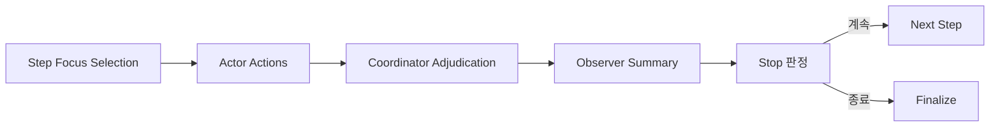

# 시간축 모델

## 기본 필드

| 필드 | 의미 |
| --- | --- |
| `max_steps` | 최대 step 수 |
| `progression_plan` | planner가 정한 허용 시간 단위와 pacing 규칙 |
| `simulation_clock` | 현재 누적 경과 시간 snapshot |
| `step_time_history` | step별 실제 경과 시간 기록 |

## 현재 구현

- 고정 `time_unit + time_step_size`는 사용하지 않는다.
- planner는 `minute`, `hour`, `day`, `week` 중 어떤 단위를 허용할지 `progression_plan`으로 정한다.
- planner의 `time_scope.end`는 가능하면 일시적 소강이 아니라 시나리오의 최종 판정 또는 종료 시점을 가리키도록 해석한다.
- runtime은 매 step마다 coordinator가 adopted action, background update, intent 상태를 함께 보고 실제 경과 시간을 정리한다.
- 한 step은 반드시 최소 `30분` 이상 진행된다.
- 내부 canonical 저장 단위는 `분`이다.
- 표시 라벨은 `30분`, `6시간`, `2일`, `1주 2일`처럼 복원한다.

## step 의미

- `step_index`는 1부터 시작한다.
- 한 step은 고정 간격이 아니라, 그 step에서 실제로 의미 있게 흘렀다고 판단한 시간만큼 진행된다.
- actor는 직접 선택된 경우에만 step당 최대 1개 proposal을 만든다.
- coordinator는 한 step에 focus slice를 최대 3개, 직접 actor 호출을 최대 6명까지 선택한다.
- observer는 step 종료 시점의 국면을 요약한다.
- 직접 선택되지 않은 actor는 background update digest로만 반영된다.

## 종료 구조

## 현재 구현

- `max_steps` 도달 시 종료
- `low momentum` 정체 단계가 3회 누적되면 조기 종료
- focus 후보 압축과 weighted sampling은 `rng_seed` 기반 deterministic roll을 사용한다

## 보고서와의 연결

- finalization은 `step_index * time_step_size`를 쓰지 않는다.
- runtime의 `step_time_history.total_elapsed_minutes`를 절대시각 anchor에 누적해 최종 타임라인을 만든다.
- 최종 타임라인은 `YYYY-MM-DD HH:mm` 형식으로 재구성된다.
- 보고서 타임라인은 raw log가 아니라 projection 기반 결과다.
- projection에는 `endgame_packets`, `final_actor_snapshots`, `final_outcome_clues`가 포함된다.

## 강화 후보

- actor memory decay와 thread priority를 반영한 시간축 압축
- incident family별 시간대 편향
- 관계 그래프 상태 기반 phase 계산
