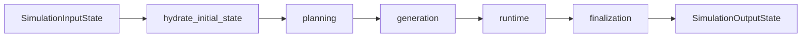

# Workflow Docs

This section documents the workflow stages used by the application.

## Stage Order

## Reading Order

| If you need to understand... | Read |
| --- | --- |
| the root graph boundary | [`simulation.md`](./simulation.md) |
| how scenario text becomes a plan | [`planning.md`](./planning.md) |
| how cast slots become actors | [`generation.md`](./generation.md) |
| how rounds loop and stop | [`runtime.md`](./runtime.md) |
| how the report is assembled | [`finalization.md`](./finalization.md) |

## Cross-Stage Handoffs

| Stage | Consumes | Produces |
| --- | --- | --- |
| simulation root | public input plus runtime context | initialized workflow state |
| planning | scenario text and scenario controls | compact execution plan plus planned round target |
| generation | plan cast roster | finalized actor cards |
| runtime | plan, actors, and accumulated trace | completed runtime trace plus event history |
| finalization | completed runtime trace | final report, report projection, markdown report |

## Notes

- the runtime stage is the only looping stage
- the default workflow uses one planning call, bundled actor generation, scene ticks, and one report call
- `--parallel` only parallelizes large independent chunks such as actor roster chunks
- runtime and finalization do not add LLM fan-out under `--parallel`

Related docs:

- root graph boundary: [`simulation.md`](./simulation.md)
- system architecture: [`../architecture.md`](../architecture.md)
- artifact contracts: [`../contracts.md`](../contracts.md)
