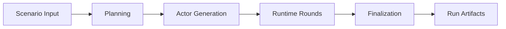

# Workflow Docs

`simula` runs a scenario through four product stages: planning, actor generation, runtime, and
finalization.

## Stage Order

## Reading Order

| If you need to understand... | Read |
| --- | --- |
| the root workflow boundary | [`simulation.md`](./simulation.md) |
| how scenario text becomes an execution plan | [`planning.md`](./planning.md) |
| how cast slots become stateful actors | [`generation.md`](./generation.md) |
| how rounds advance the world | [`runtime.md`](./runtime.md) |
| how the final report is assembled | [`finalization.md`](./finalization.md) |

## Cross-Stage Handoffs

| Stage | Consumes | Produces |
| --- | --- | --- |
| Planning | scenario text and scenario controls | execution plan, cast roster, major events |
| Actor generation | planned cast roster and plan context | finalized actor cards |
| Runtime | plan, actors, event memory, and round limits | completed trace, activities, intent history, stop reason |
| Finalization | completed runtime trace | final report, rendered report, manifest-ready metadata |

## Notes

- Runtime is the only looping stage.
- Each stage consumes explicit data from previous stages.
- Model-backed stages return structured data that is validated before it affects later stages.
- Durable artifacts are written so a run can be inspected after completion.

## Related Docs

- architecture: [`../architecture.md`](../architecture.md)
- contracts: [`../contracts.md`](../contracts.md)
- analysis: [`../analysis.md`](../analysis.md)
