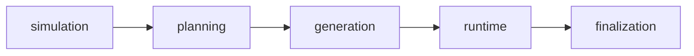

# Workflow Docs

This directory documents the current compiled graph as it exists today.

## Graph-of-Graphs Overview

## Recommended Reading Order

1. [`simulation.md`](./simulation.md)
2. [`planning.md`](./planning.md)
3. [`generation.md`](./generation.md)
4. [`runtime.md`](./runtime.md)
5. [`coordinator.md`](./coordinator.md)
6. [`finalization.md`](./finalization.md)

## Handoff Summary

| Stage | Main inputs | Main outputs |
| --- | --- | --- |
| Planning | `scenario`, `max_steps` | `plan`, `progression_plan`, `action_catalog`, `coordination_frame`, cast roster |
| Generation | `plan.cast_roster`, planning bundle | `actors` |
| Runtime | `plan`, `actors`, runtime settings, RNG seed | `activities`, `observer_reports`, `simulation_clock`, `intent_history`, stop flags |
| Finalization | accumulated runtime state | `final_report`, `simulation_log_jsonl`, `report_projection_json`, `final_report_markdown` |

## Projection Layers

- prompt projections
  - compact role-specific views used in generation and runtime prompts
- report projection
  - finalization-stage report artifact stored in `report_projection_json`

## Documents in This Folder

| Document | Focus |
| --- | --- |
| [`simulation.md`](./simulation.md) | root workflow assembly, executor handoff, and prompt-projection boundary |
| [`planning.md`](./planning.md) | scenario interpretation and plan persistence |
| [`generation.md`](./generation.md) | actor slot fan-out, compact generator inputs, and actor persistence |
| [`runtime.md`](./runtime.md) | runtime loop, stop logic, observer responsibilities, compact observer inputs |
| [`coordinator.md`](./coordinator.md) | focus planning, actor proposal fan-out, actor task payloads, and adjudication |
| [`finalization.md`](./finalization.md) | report payload, report projection, and markdown assembly |
