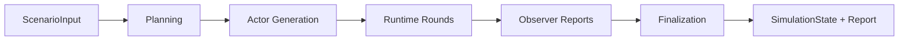

# Workflow Docs

`simula` runs one scenario through planning, actor generation, runtime rounds, observer reporting,
and finalization.

## Stage Order

## Reading Order

| If you need to understand... | Read |
| --- | --- |
| the root run boundary | [`simulation.md`](./simulation.md) |
| how scenario text becomes plan data | [`planning.md`](./planning.md) |
| how cast slots become actor cards | [`generation.md`](./generation.md) |
| how rounds advance the world | [`runtime.md`](./runtime.md) |
| how report Markdown is produced | [`finalization.md`](./finalization.md) |

## Handoffs

| Stage | Consumes | Produces |
| --- | --- | --- |
| Planning | scenario text and controls | scenario digest, action catalog, actor roster, major events |
| Actor generation | plan and roster | actor cards, actions, relationships, initial context |
| Runtime | plan, actors, settings, and current state | interactions, actor messages, round digests, graph events |
| Observer | round digests and interactions | round reports and report deltas |
| Finalization | completed simulation state | `state.json`, `report.md`, terminal run event |

## Notes

- Runtime is the only looping stage.
- `fast_mode` parallelizes dependency-safe actor and observer work.
- Every accepted interaction can create a graph timeline frame.
- Run events are both persisted to `events.jsonl` and streamed to the web app.

## Related Docs

- architecture: [`../architecture.md`](../architecture.md)
- contracts: [`../contracts.md`](../contracts.md)
- operations: [`../operations.md`](../operations.md)
