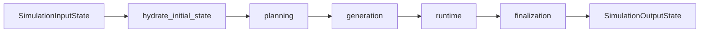

# Workflow Docs

This section documents the active compiled workflow only.

## Stage Order

## Reading Order

| If you need to understand... | Read |
| --- | --- |
| root graph boundaries | [`simulation.md`](./simulation.md) |
| planning shape | [`planning.md`](./planning.md) |
| actor generation | [`generation.md`](./generation.md) |
| runtime loop | [`runtime.md`](./runtime.md) |
| final report writing | [`finalization.md`](./finalization.md) |

## Stage Handoffs

| Stage | Consumes | Produces |
| --- | --- | --- |
| simulation root | public input + runtime context | hydrated workflow state |
| planning | scenario and step budget | compact execution plan |
| generation | cast roster and planning views | actor cards |
| runtime | plan, actors, activity history | completed runtime trace |
| finalization | completed runtime trace | final report artifacts |
