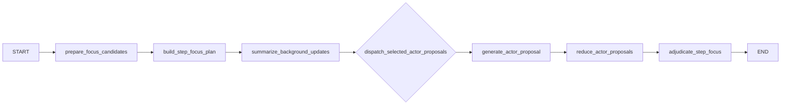

# Coordinator Subgraph

## Purpose

The coordinator subgraph owns the direct step-level execution logic inside runtime. It is
where actor attention is compressed, focus slices are chosen, deferred actors are digested,
and accepted actions are adjudicated into state changes.

## Graph Shape

## Inputs and Outputs

| Input | Meaning |
| --- | --- |
| `actors` | full actor registry |
| `activity_feeds` | per-actor visibility feeds |
| `activities` | canonical activity history |
| `actor_intent_states` | latest intent snapshots |
| `background_updates` | accumulated deferred-actor history |
| `step_focus_history` | prior focus plans |
| `observer_reports` | prior observer summaries |
| runtime settings | focus slice and actor-call limits |

| Output | Meaning |
| --- | --- |
| `focus_candidates` | compressed candidate pool for the next step |
| `step_focus_plan` | selected focus slices |
| `selected_actor_ids` | directly called actors |
| `deferred_actor_ids` | actors handled through background updates |
| `latest_background_updates` | current deferred-actor digest |
| `latest_step_activities` | adopted activities for the current step |
| `actor_intent_states` | updated intent snapshots |
| `simulation_clock` | updated cumulative time |
| `step_time_history` | appended time history |

## Prompt-Facing Flow

The coordinator subgraph is where most runtime prompt projections are built. Rich workflow
state stays in memory, but each LLM call gets a reduced view tailored to its job.

## Node Responsibilities

| Node | Responsibility |
| --- | --- |
| `prepare_focus_candidates` | compute the compressed candidate pool and reset step-local runtime channels |
| `build_step_focus_plan` | choose focus slices and direct actor calls from compact focus-candidate, coordination-frame, and situation views |
| `summarize_background_updates` | create deferred-actor digests from compact deferred-actor, intent, and background-guidance views |
| `generate_actor_proposal` | ask one selected actor for one step proposal using the actor task payload |
| `reduce_actor_proposals` | restore selected-actor order after fan-out |
| `adjudicate_step_focus` | adopt actions, update intents, advance time, update world hint, and append history from compact proposals and compact background updates |

## Compact Inputs by Node

### `build_step_focus_plan`

This node renders the coordinator prompt from:

- compact focus candidate view
- compact coordination-frame view for focus planning
- compact situation view
- truncated previous observer summary

### `summarize_background_updates`

This node renders the background-update prompt from:

- compact deferred actor views
- selected actor IDs
- compact latest actions
- relevant intent subset
- compact background coordination-frame view
- truncated world-state summary

### `generate_actor_proposal`

The actor task payload currently contains:

| Field | Meaning |
| --- | --- |
| `actor` | compact actor card |
| `unread_activity_ids` | unread activity IDs to be consumed if the proposal is adopted |
| `visible_action_context` | compact action digest window for the actor |
| `unread_backlog_digest` | summary of unread items omitted from that window |
| `visible_actors` | compact actor references relevant to this step |
| `focus_slice` | selected focus slice for the actor |
| `runtime_guidance` | compact objective, world digest, prior observer signal, constraints, current intent snapshot, available actions |

### `adjudicate_step_focus`

This node renders the adjudication prompt from:

- compact pending actor proposals
- relevant intent subset
- compact background updates
- compact progression-plan view
- current simulation clock
- truncated world-state summary

## Key Runtime Rules

- focus selection budgets come from `max_focus_slices_per_step` and
  `max_actor_calls_per_step`
- selected actors and deferred actors are explicit, separate sets
- deferred actors are not ignored; they are summarized through background updates
- actor proposals can fall back to a default/forced-idle path
- adjudication can fall back to a default payload path when structured parsing fails
- prompt projections used in this subgraph are ephemeral inputs, not persisted workflow
  channels

## State Changes Owned by Adjudication

`adjudicate_step_focus` currently owns the most consequential runtime mutations:

- adopted activity routing
- `latest_step_activities`
- `actor_intent_states`
- `intent_history`
- `pending_step_time_advance`
- `simulation_clock`
- `step_time_history`
- `world_state_summary` hint

## Important Current Note

The helper `route_step_activities()` exists in the runtime actor-turn module, but it is not
part of the compiled coordinator subgraph today. The active path applies adopted proposals
inside `adjudicate_step_focus`.
