# Finalization Workflow

Finalization turns the completed runtime trace into stable report artifacts and rendered markdown.

## Active Path

```mermaid
flowchart LR
    Start([START]) --> Anchor["resolve_timeline_anchor"]
    Anchor --> Artifacts["build_report_artifacts"]
    Artifacts --> Conclusion["write_conclusion_section"]
    Conclusion --> Timeline["write_timeline_section"]
    Timeline --> Dynamics["write_actor_dynamics_section"]
    Dynamics --> Events["write_major_events_section"]
    Events --> Render["render_and_persist_final_report"]
    Render --> End([END])
```

This document describes the default serial finalization graph. When `--parallel` is enabled,
the four report sections may be written concurrently.

## Stage Responsibilities

### `resolve_timeline_anchor`

Uses a parser-first strategy:

1. parse explicit date or time cues from the scenario when possible
2. extract partial hints from incomplete scenario wording
3. call the `observer` role only when inference is still needed

The output is always one `TimelineAnchorDecision`.

### `build_report_artifacts`

Pure code-side node. It does not call a model.

It builds:

- `final_report`
- `llm_usage_summary`
- `report_projection_json`

It also writes a `final_report` runtime log event before markdown rendering begins.

### `write_conclusion_section`

Writes the conclusion section.

### `write_timeline_section`

Writes the timeline section.

### `write_actor_dynamics_section`

Writes the actor-dynamics section.

### `write_major_events_section`

Writes the major-events section.

### Validation behavior for all section writers

Each section writer:

- uses text generation rather than a structured schema
- validates the returned text locally
- retries once with validation feedback when the first answer violates the section rules

### `render_and_persist_final_report`

Builds the final markdown document from validated section strings and saves the structured
`final_report` through the store.

## Final Outputs

By the end of finalization, workflow state contains:

- `final_report`
- `llm_usage_summary`
- `report_projection_json`
- `report_conclusion_section`
- `report_timeline_section`
- `report_actor_dynamics_section`
- `report_major_events_section`
- `final_report_sections`
- `final_report_markdown`
- `stop_reason`
- `errors`

`simulation_log_jsonl` becomes part of the public output after the executor reads the completed
JSONL file back from disk.

## Parallel Variant

When a run is started with CLI `--parallel`, finalization switches to the parallel branch:

- `build_report_artifacts`
- `write_conclusion_section`
- `write_timeline_section`
- `write_actor_dynamics_section`
- `write_major_events_section`
- `render_and_persist_final_report`

The rendered outputs stay the same; only the section-writing concurrency changes.
