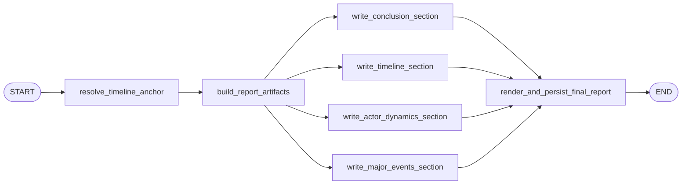

# Finalization Workflow

## Purpose

Finalization turns the completed runtime trace into stable report artifacts and rendered markdown.

## Active Path

Section writers run in parallel after the report artifacts are prepared.

## Node Responsibilities

### `resolve_timeline_anchor`

Uses a parser-first strategy:

1. parse explicit date or time cues from the scenario when possible
2. extract partial hints from incomplete scenario wording
3. call the `observer` role only when inference is still needed

The output is always one strict `TimelineAnchorDecision`.

### `build_report_artifacts`

Pure code-side node. It does not call an LLM.

It builds:

- `final_report`
- `llm_usage_summary`
- `report_projection_json`

It also writes a `final_report` runtime log event before markdown rendering begins.

Important boundary:

- this node does not build `simulation_log_jsonl`
- the executor backfills `simulation_log_jsonl` after graph execution finishes

### `write_conclusion_section`

Uses the `observer` role to write the conclusion section from shared report prompt inputs.

### `write_timeline_section`

Uses the `observer` role to write the timeline section from shared report prompt inputs.

### `write_actor_dynamics_section`

Uses the `observer` role to write the actor-dynamics section from shared report prompt inputs.

### `write_major_events_section`

Uses the `observer` role to write the major-events section from shared report prompt inputs.

### Validation behavior for all section writers

Each section writer:

- uses a text prompt, not a structured schema
- validates the returned text locally
- retries once with validation feedback when the first answer violates the section rules

### `render_and_persist_final_report`

Builds the final markdown document from validated section strings and saves the structured
`final_report` through the store.

Important boundary:

- this node renders markdown text into workflow state
- the presentation layer writes `final_report.md` to disk after the workflow completes

## Final Outputs

By the end of finalization, workflow state contains:

- `final_report`
- `llm_usage_summary`
- `report_projection_json`
- `report_conclusion_section`
- `report_timeline_section`
- `report_actor_dynamics_section`
- `report_major_events_section`
- `final_report_sections`
- `final_report_markdown`
- `stop_reason`
- `errors`

`simulation_log_jsonl` becomes part of the public output surface only after the executor reads the
completed JSONL file back from disk.
