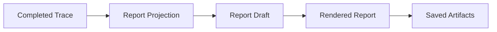

# Finalization Workflow

Finalization turns the completed runtime trace into stable report artifacts.

## Flow

## Responsibilities

Finalization should:

- build a structured final report from runtime state
- summarize model usage when available
- project timeline and actor dynamics from the completed trace
- draft report prose from the projection
- render the final markdown report
- expose errors and stop reason in the final output

The final report should explain the run that actually happened. It should not invent major
outcomes outside the completed trace.

## Report Sections

The rendered report contains:

- simulation conclusion
- actor results table
- timeline
- actor dynamics
- major events
- explicit errors or defaults when present

## Stage Output

Finalization produces:

- final report payload
- usage summary
- report projection
- rendered markdown report
- manifest-ready metadata
- stop reason
- explicit errors

## Related Docs

- final report contract: [`../contracts.md`](../contracts.md)
- analysis artifacts: [`../analysis.md`](../analysis.md)
