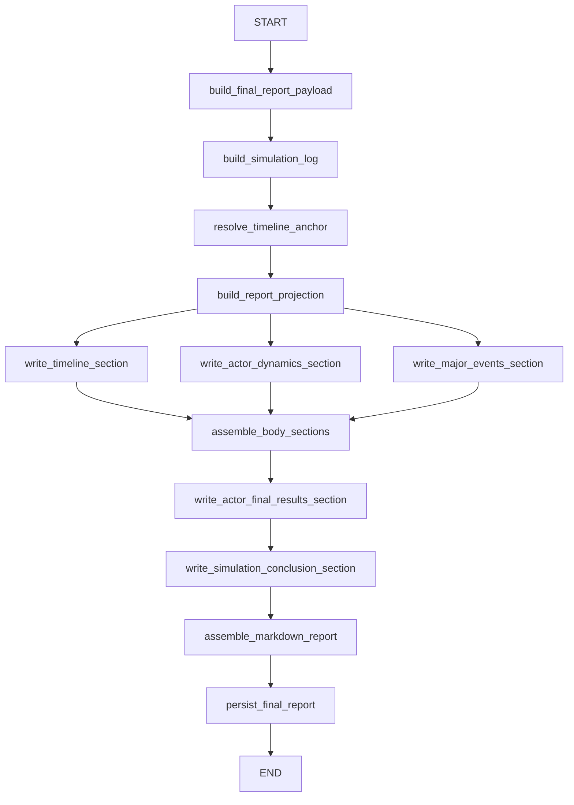

# Finalization Subgraph

## Purpose

The finalization subgraph converts runtime state into report-ready artifacts. It builds a
structured final report, derives a report projection, generates markdown sections, and
persists the final report JSON.

## Graph Shape

## Inputs and Outputs

| Input | Meaning |
| --- | --- |
| `activities` | canonical activity history |
| `observer_reports` | per-step summaries |
| `step_time_history` | normalized runtime time history |
| `step_focus_history` | focus history |
| `actor_intent_states` | final intent snapshots |
| `simulation_clock` | cumulative runtime clock |
| `world_state_summary` | latest world digest |

| Output | Meaning |
| --- | --- |
| `final_report` | structured final report JSON |
| `simulation_log_jsonl` | JSONL log string |
| `report_timeline_anchor_json` | absolute report-time anchor |
| `report_projection_json` | report-specific projection JSON |
| `report_body_sections_markdown` | assembled body markdown |
| `final_report_markdown` | full markdown report |

## Sequence Summary

1. `build_final_report_payload` creates the structured JSON summary.
2. `build_simulation_log` renders the JSONL log string.
3. `resolve_timeline_anchor` chooses one absolute timestamp anchor for the report.
4. `build_report_projection` derives timeline packets, actor digests, and endgame clues.
5. three body sections are generated in parallel:
   - timeline
   - actor dynamics
   - major events
6. `assemble_body_sections` puts those sections in a fixed order.
7. the final actor results section and conclusion section are generated next.
8. `assemble_markdown_report` renders the full markdown document.
9. `persist_final_report` stores the structured final report JSON.

The finalization prompts currently reuse the `observer` role for timeline-anchor inference
and report section writing.

## Report Projection Focus

The projection stage is where finalization becomes different from a raw log dump. It
derives report-friendly structures such as:

- `timeline_packets`
- `endgame_packets`
- `actor_digests`
- `intent_arc_packets`
- `final_actor_snapshots`
- `final_outcome_clues`

## Current Section Order

The assembled markdown report currently renders:

1. simulation conclusion
2. actor final results
3. simulation timeline
4. actor dynamics
5. major events and outcomes

## Important Current Behaviors

- the finalization graph persists structured final report JSON, not the markdown file
- `final_report.md` and `simulation.log.jsonl` files are written later by the presentation
  layer from the final state
- report timestamps are rebuilt from the absolute anchor plus accumulated elapsed minutes,
  not from a fixed step size
