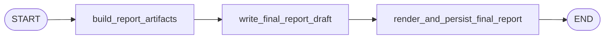

# Finalization Workflow

Finalization turns the completed runtime trace into stable report artifacts and rendered markdown.

## Active Path

## Stage Responsibilities

### `build_report_artifacts`

Pure code-side node. It does not call a model.

It builds:

- `final_report`
- `llm_usage_summary`
- `report_timeline_anchor_json`
- `report_projection_json`

When the scenario has an explicit date and time, the code uses that as the timeline anchor.
Otherwise it uses a deterministic default anchor.

### `write_final_report_draft`

Calls the `observer` role once and expects a `FinalReportDraft`.

The draft contains all report prose sections:

- `conclusion_section`
- `timeline_section`
- `actor_dynamics_section`
- `major_events_section`

There are no section-level rewrite calls.

### `render_and_persist_final_report`

Builds the final markdown document from the validated section strings and saves the structured
`final_report` through the store.

## Final Outputs

By the end of finalization, workflow state contains:

- `final_report`
- `llm_usage_summary`
- `report_projection_json`
- `report_timeline_anchor_json`
- `report_conclusion_section`
- `report_timeline_section`
- `report_actor_dynamics_section`
- `report_major_events_section`
- `final_report_sections`
- `final_report_markdown`
- `stop_reason`
- `errors`

## Parallel Behavior

Finalization does not create extra LLM fan-out when `--parallel` is enabled. It remains one report
draft call plus code-side rendering.
