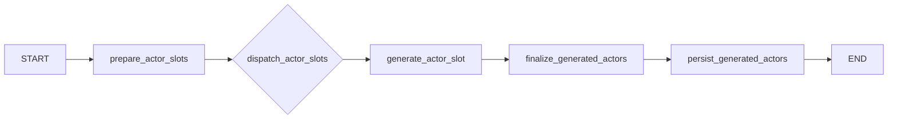

# Generation Subgraph

## Purpose

The generation subgraph turns the planning-stage cast roster into the runtime actor
registry. It is the fan-out/fan-in stage of the workflow.

## Graph Shape

## Inputs and Outputs

| Input | Meaning |
| --- | --- |
| `plan.cast_roster` | roster produced by planning |
| `plan.interpretation` | scenario interpretation |
| `plan.situation` | runtime-ready situation bundle |
| `plan.action_catalog` | scenario action menu |
| `plan.coordination_frame` | planner guidance for runtime |

| Output | Meaning |
| --- | --- |
| `actors` | finalized actor registry |
| `pending_actors` | storage handoff for persistence |
| `generation_latency_seconds` | total generation latency |

## How It Works

1. `prepare_actor_slots` converts the cast roster into slot-indexed work items.
2. `dispatch_actor_slots` fans out one generation task per slot.
3. `generate_actor_slot` creates one `ActorCard`.
4. `finalize_generated_actors` sorts results back into roster order and normalizes the
   actor registry.
5. `persist_generated_actors` stores the final actor list.

## Important Current Behaviors

- generation fails fast if planning did not produce a cast roster
- slot order is preserved through `slot_index`
- the finalized actor registry must match the expected cast order by `cast_id`
- the generator must produce at least two actors
- parse failure counts are accumulated back into shared state
