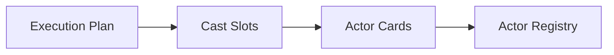

# Actor Generation Workflow

Actor generation turns planned cast slots into concrete actor cards.

## Flow

## Responsibilities

Actor generation creates runtime-useful actor data:

- stable id
- display name
- role
- narrative profile
- private goal
- voice
- preferred action types

The generated actor should match the planned cast slot. This keeps planning, runtime, and reports
using the same actor identity.

## Validation

The actor registry should be validated before runtime begins.

- every planned required actor has one generated actor card
- generated ids match planned cast ids
- actor order remains stable for reports and deterministic selection
- every actor has a display name and role
- the run has enough actors for interactions to be meaningful

If actor generation cannot produce a valid registry, the run should fail before runtime.

## Stage Output

Actor generation produces the finalized actor registry used by runtime and finalization.

Runtime consumes actors as stateful participants, not as isolated text snippets.

## Related Docs

- actor contract: [`../contracts.md`](../contracts.md)
- runtime workflow: [`runtime.md`](./runtime.md)
