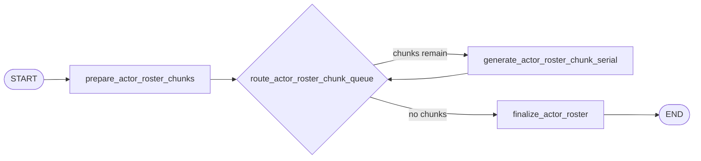

# Generation Workflow

Generation turns the planning cast roster into concrete actor cards.

## Active Path



The default serial graph processes actor chunks one at a time. The chunk size comes from
`runtime.actor_roster_chunk_size`, which defaults to 6, so scenarios with 6 or fewer actors use one
generation LLM call by default.

## Node Responsibilities

### `prepare_actor_roster_chunks`

Builds deterministic roster chunks from `plan.cast_roster`, resets generation-local buffers, and
records `generation_started_at`.

### `generate_actor_roster_chunk_serial`

Calls the `generator` role once for the next chunk and expects an `ActorRosterBundle`.
Each actor card keeps only runtime-useful fields: identity, role, narrative profile, private goal,
voice, and preferred action types.

The model receives:

- compact plan context
- action catalog
- coordination frame
- assigned cast items
- scenario cast-count controls

### `finalize_actor_roster`

Collects chunk results and finalizes the actor list.

Checks and side effects:

- restore cast order by `slot_index`
- validate generated cast ids still match the plan
- require at least 2 actors
- save actors through the store
- write an `actors_finalized` runtime log event
- aggregate generation parse-failure counts

## Parallel Variant

When `--parallel` is enabled, generation fans out only by actor roster chunk:

```text
prepare_actor_roster_chunks -> dispatch_actor_roster_chunks -> generate_actor_roster_chunk -> finalize_actor_roster
```

This preserves the same output while avoiding actor-per-call fan-out.
