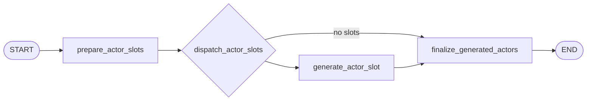

# Generation Workflow

## Purpose

Generation turns the planning cast roster into concrete actor cards.

## Active Path

`dispatch_actor_slots` is the conditional fan-out edge used by the generation subgraph.

## Node Responsibilities

### `prepare_actor_slots`

Builds one `CastSlotSpec` per planned cast item and resets generation-local buffers. It also
records `generation_started_at` for latency tracking.

### `dispatch_actor_slots`

Creates one `Send` payload per pending slot.

- if slots exist, the subgraph fans out to `generate_actor_slot`
- if there are no slots, the subgraph jumps directly to `finalize_generated_actors`

The no-slot path is mostly a defensive branch because planning validation should already prevent an
empty cast roster.

### `generate_actor_slot`

Calls the `generator` role with one strict `GeneratedActorCardDraft` contract built from:

- compact interpretation view
- compact situation view
- compact action catalog view
- compact coordination frame view
- one cast item
- the requested cast-count controls

The node then wraps the generated draft into a full `ActorCard` using the cast identity from the
slot, not from free-form model output.

### `finalize_generated_actors`

Collects fan-out results and finalizes the actor list.

Current checks and side effects:

- restore slot order by `slot_index`
- validate that generated `cast_id` order still matches the plan
- require at least 2 actors
- save actors through the store
- write an `actors_finalized` runtime log event
- aggregate generation parse-failure counts
- record `generation_latency_seconds`

## Stage Output

After generation, workflow state has:

- `actors`
- `generation_latency_seconds`
- updated `parse_failures`

Generation does not build activity feeds. Runtime initialization owns that step.
