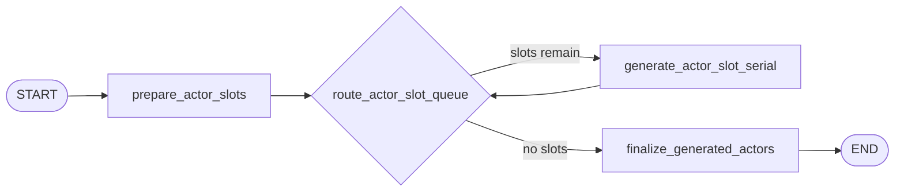

# Generation Workflow

Generation turns the planning cast roster into concrete actor cards.

## Active Path

This document describes the default serial generation graph. When `--parallel` is enabled,
generation may process multiple cast slots at the same time.

## Node Responsibilities

### `prepare_actor_slots`

Builds one `CastSlotSpec` per planned cast item and resets generation-local buffers. It also
records `generation_started_at` for latency tracking.

### `generate_actor_slot_serial`

Generates one actor card from:

- compact interpretation view
- compact situation view
- compact action catalog view
- compact coordination frame view
- one cast item
- the requested cast-count controls

The node then wraps the generated draft into a full `ActorCard` using the cast identity from the
planned slot and advances the pending slot queue by one.

### `finalize_generated_actors`

Collects accumulated slot results and finalizes the actor list.

Checks and side effects:

- restore slot order by `slot_index`
- validate that generated `cast_id` order still matches the plan
- require at least 2 actors
- save actors through the store
- write an `actors_finalized` runtime log event
- aggregate generation parse-failure counts
- record `generation_latency_seconds`

## Stage Output

After generation, workflow state has:

- `actors`
- `generation_latency_seconds`
- updated `parse_failures`

Generation does not build activity feeds. Runtime initialization owns that step.

## Parallel Variant

When a run is started with CLI `--parallel`, generation switches to the parallel path:

- `prepare_actor_slots -> dispatch_actor_slots -> generate_actor_slot -> finalize_generated_actors`

That variant preserves the same output and validation behavior while allowing concurrent slot-level
LLM calls.
