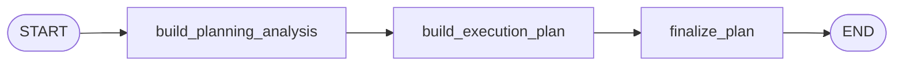

# Planning Workflow

## Purpose

Planning turns raw scenario text into one compact execution plan that downstream stages can use
without reopening the original scenario every time.

## Active Path

## Node Responsibilities

### `build_planning_analysis`

Generates `PlanningAnalysis` in one structured call. This bundle captures:

- brief summary
- premise
- time scope
- public context
- private context
- key pressures
- progression plan

### `build_execution_plan`

Generates `ExecutionPlanBundle` from the planning analysis plus the raw scenario text and
cast-count controls. This bundle contains:

- `situation`
- `action_catalog`
- `coordination_frame`
- `cast_roster`
- `major_events`

`cast_roster` generation is guided by `scenario_controls.num_cast` and
`scenario_controls.allow_additional_cast`.
`major_events` is scenario-dependent and may be empty when the scenario does not imply a
trackable shared event sequence.

### `finalize_plan`

Builds the persisted plan payload, validates cast uniqueness, and writes the plan to storage.

## Stage Output

The final `plan` retained in workflow state contains only the keys used downstream:

- `interpretation`
- `situation`
- `progression_plan`
- `action_catalog`
- `coordination_frame`
- `cast_roster`
- `major_events`

`build_planning_analysis` also writes `planned_max_rounds` into workflow state. This is the
planner-recommended target round budget and is distinct from the configured runtime hard ceiling.
