# Planning Subgraph

## Purpose

The planning subgraph converts raw scenario text into the structured bundle that the rest of
the system needs to run: pacing rules, situation summary, action catalog, coordination
frame, and cast roster.

## Node Order

```mermaid
flowchart LR
    START --> interpret_core
    interpret_core --> decide_runtime_progression
    decide_runtime_progression --> interpret_time_scope
    interpret_time_scope --> interpret_visibility_context
    interpret_visibility_context --> interpret_pressure_points
    interpret_pressure_points --> assemble_interpretation
    assemble_interpretation --> finalize_situation
    finalize_situation --> build_action_catalog
    build_action_catalog --> build_coordination_frame
    build_coordination_frame --> build_cast_roster
    build_cast_roster --> persist_plan
    persist_plan --> END
```

## Inputs and Outputs

| Input | Meaning |
| --- | --- |
| `scenario` | raw scenario text |
| `max_steps` | hard cap that also conditions planning prompts |
| shared runtime context | planner model, logger, storage |

| Output | Meaning |
| --- | --- |
| `pending_interpretation` | normalized scenario interpretation |
| `progression_plan` | dynamic time progression rules |
| `action_catalog` | allowed action menu |
| `coordination_frame` | runtime guidance for focus and background motion |
| `pending_cast_roster` | cast roster used by generation |
| `plan` | persisted planning bundle used by later stages |

## Stage Breakdown

| Node | Responsibility |
| --- | --- |
| `interpret_core` | extract the core premise as text |
| `decide_runtime_progression` | define dynamic pacing and allowed time units |
| `interpret_time_scope` | interpret the scenario start and end horizon |
| `interpret_visibility_context` | split public and private context |
| `interpret_pressure_points` | identify pressures and observation points |
| `assemble_interpretation` | combine the partial interpretation into `ScenarioInterpretation` |
| `finalize_situation` | produce the runtime-ready `SituationBundle` |
| `build_action_catalog` | create the scenario-wide action menu |
| `build_coordination_frame` | define runtime focus and background rules |
| `build_cast_roster` | emit the unique cast roster in NDJSON form |
| `persist_plan` | write the final plan bundle to storage |

## Planning Handoff Shape

The planning bundle handed to later stages contains at least:

- `interpretation`
- `situation`
- `progression_plan`
- `action_catalog`
- `coordination_frame`
- `cast_roster`

## Important Current Behaviors

- `max_steps` constrains multiple planning prompts and is not only a runtime stop cap
- the cast roster is parsed as NDJSON and validated for uniqueness
- planning persists the bundled `plan` to storage before generation starts
- the planning stage writes durable outputs and also leaves transient `pending_*` channels
  that are useful during the stage itself
