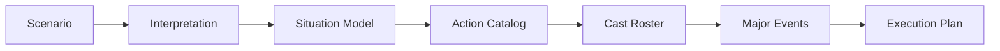

# Planning Workflow

Planning turns scenario text and scenario controls into an execution plan that later stages can use
without reinterpreting the original brief.

## Flow

## Responsibilities

Planning defines:

- what the scenario is about
- what pressures and constraints matter
- which action types are available
- which actors should exist
- which major events should drive the run
- how many rounds the run should target before finalization

The plan is the main contract between scenario interpretation and runtime behavior.

## Validation

Planning output should be internally consistent.

- cast ids are stable and unique
- display names are unique enough for reports
- cast count follows scenario controls
- major events have stable ids
- major events reference known actors
- event completion rules use known action types
- planned round windows fit inside the configured run ceiling

If the plan cannot be validated, the run should fail before actor generation.

## Stage Output

The execution plan contains:

- scenario interpretation
- situation model
- progression plan
- action catalog
- coordination frame
- cast roster
- major events

## Related Docs

- plan contract: [`../contracts.md`](../contracts.md)
- actor generation: [`generation.md`](./generation.md)
