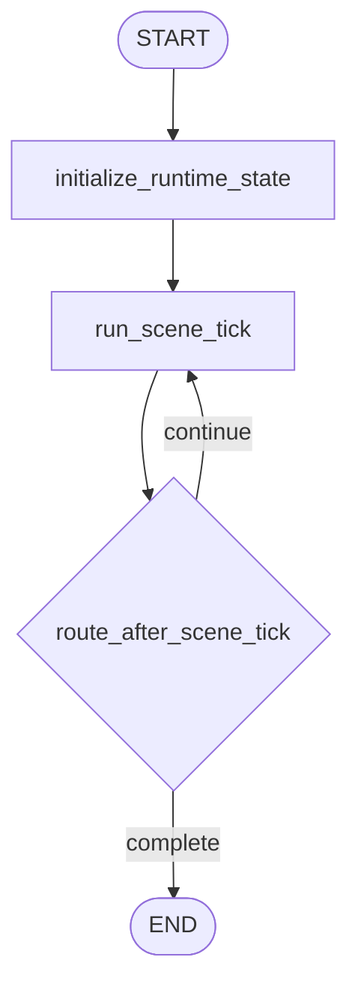

# Runtime Workflow

Runtime is the only looping stage. It selects the next event, builds deterministic action
candidates, asks for one `SceneDelta`, applies the delta, and decides whether another tick is
needed.

## Active Path

`--parallel` does not add runtime LLM fan-out. Runtime keeps one coordinator call per scene tick.

## Stage Responsibilities

### `initialize_runtime_state`

Builds the runtime-only starting point after planning and generation:

- initializes `activity_feeds`
- compiles the runtime `SimulationPlan`
- initializes `event_memory` from `plan.major_events`
- initializes actor intent snapshots
- builds the initial actor-facing scenario digest
- resets runtime scratch fields

### `run_scene_tick`

One tick performs:

- deterministic next-event selection
- deterministic scene actor selection, capped by `runtime.max_scene_actors`
- deterministic action candidate generation, capped by `runtime.max_scene_candidates`
- scene beat writing, capped by `runtime.max_scene_beats`
- one `SceneDelta` LLM call
- canonical action creation for scene beats
- event-memory update and transition recording
- intent-state merge
- simulation clock advancement
- compact observer report creation
- stop decision

The console DEBUG output summarizes the selected event, actors, candidates, scene beats, event
updates, time advance, and LLM cost metadata. Raw prompts and responses remain in the JSONL LLM log.

## Stop Behavior

The runtime loop ends when one of these happens:

- the hard round ceiling is reached
- `SceneDelta.stop_reason` requests completion and no required event remains unresolved
- repeated no-action ticks produce `no_progress`
- no unresolved event can be selected

`stop_reason` values remain:

- `""`
- `no_progress`
- `simulation_done`

## Stage Output

Runtime leaves behind the trace consumed by finalization:

- `activities`
- `observer_reports`
- `round_time_history`
- `event_memory`
- `event_memory_history`
- `actor_intent_states`
- `intent_history`
- `world_state_summary`
- `scene_tick_history`
- `stop_reason`
