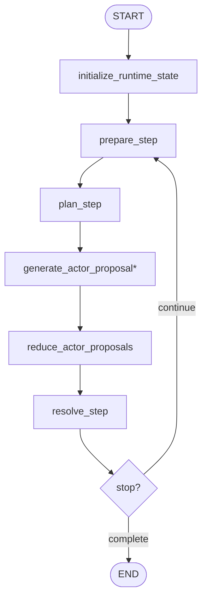

# Runtime Workflow

## Purpose

Runtime is the only looping stage. It chooses the next focus, fans out actor proposals, resolves
the step, and decides whether to continue.

## Active Path

`generate_actor_proposal*` fans out once per selected actor in the current step.

## Node Responsibilities

### `initialize_runtime_state`

Normalizes runtime counters and ensures the runtime loop starts from a clean state.

### `prepare_step`

Advances `step_index`, compresses focus candidates, resets current-step scratch fields, and starts
step timing.

### `plan_step`

Generates one `StepDirective` bundle:

- focus summary
- selection reason
- selected actor ids
- deferred actor ids
- focus slices
- background updates

It also appends the directive to `step_focus_history`.

### `generate_actor_proposal`

Generates one `ActorActionProposal` for one selected actor from compact runtime inputs.

### `reduce_actor_proposals`

Restores deterministic actor order after fan-in.

### `resolve_step`

Generates one `StepResolution` bundle, applies adopted actions, advances the simulation clock,
writes observer output, persists step artifacts, and sets stop state.

## Stop Behavior

The runtime loop ends when either:

- the resolution explicitly returns a non-empty `stop_reason`
- the runtime policy decides to stop, such as reaching `max_steps`

## Stage Output

Runtime leaves behind the full execution trace used by finalization:

- `activities`
- `observer_reports`
- `step_focus_history`
- `step_time_history`
- `background_updates`
- `world_state_summary`
- `stop_reason`
