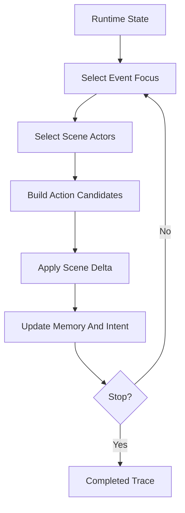

# Runtime Workflow

Runtime is the looping stage that advances the virtual world.

## Flow

## Round Responsibilities

Each round should:

- select one event focus from event memory
- select relevant actors
- build plausible action candidates
- adopt concrete interactions
- update actor intent
- update event progress
- advance simulation time
- write observer-facing summary data
- decide whether the run should continue

This keeps runtime grounded in explicit state instead of free-running narrative generation.

## Actor State

Runtime maintains actor-facing state across rounds.

Actor state includes:

- current intent
- recent memories
- relevant event pressures
- activity feed
- relationship signals
- recent actions and reactions

Later rounds use this state so actors can respond to what already happened.

## Stop Behavior

The runtime loop ends when one of these conditions is met:

- the hard round ceiling is reached
- the simulation reaches a valid completion state
- no meaningful progress can be made
- no unresolved event can be selected

The stop reason is recorded in final output and reports.

## Stage Output

Runtime leaves the trace consumed by finalization:

- adopted interactions
- observer reports
- round time history
- event memory
- event-memory history
- actor intent states
- intent history
- world-state summary
- stop reason
- explicit errors and defaults

## Related Docs

- event memory contract: [`../contracts.md`](../contracts.md)
- finalization workflow: [`finalization.md`](./finalization.md)
