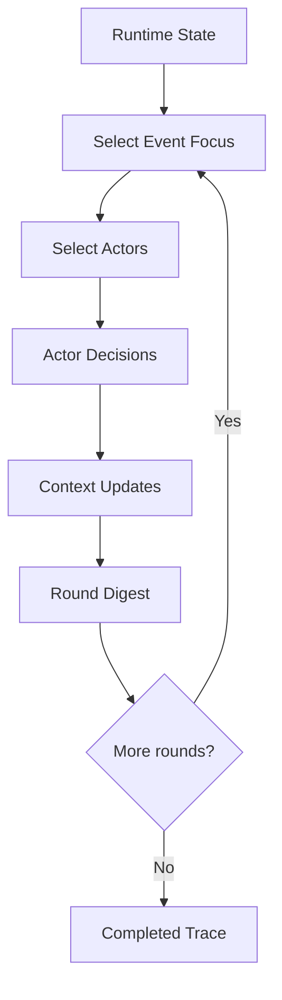

# Runtime Workflow

Runtime advances the virtual world through actor activity rounds.

## Flow

## Round Responsibilities

Each round can:

- focus on a major event
- ask selected actors for choices and messages
- record accepted interactions
- update actor context and intent
- emit actor messages
- emit `interaction.recorded`
- emit `round.completed`
- contribute graph timeline frames

`maxRound` controls the actor activity round count.

## Fast Mode

When `fastMode` is true, dependency-safe actor decisions and observer round reports run in
parallel while stages that depend on ordered state remain sequential.

The run emits a `log` event when fast mode is enabled.

## Timeline Frames

`RunStore.appendEvent` derives graph frames from:

- `actors.ready`
- `interaction.recorded`
- `round.completed`

The derived frames are written to `graph.timeline.json` and streamed as `graph.delta`.

## Stop Behavior

The current stop reasons are:

- `simulation_done`
- `no_progress`
- `failed`
- empty string before a terminal reason is known

Failed runs are handled by the server wrapper and written to the manifest with an error message.

## Related Docs

- finalization: [`finalization.md`](./finalization.md)
- event contract: [`../contracts.md`](../contracts.md)
