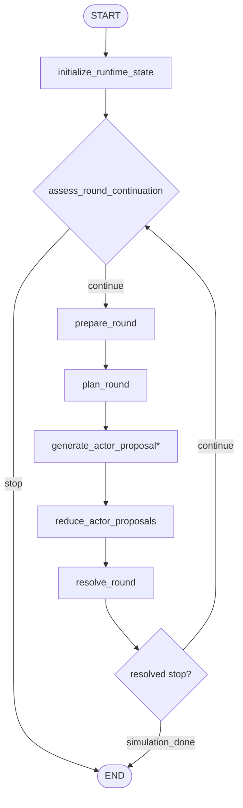

# Runtime Workflow

## Purpose

Runtime is the only looping stage. It chooses the next focus, fans out actor proposals, resolves
the round, and decides whether to continue.

## Active Path

`generate_actor_proposal*` fans out once per selected actor in the current round.

## Node Responsibilities

### `initialize_runtime_state`

Normalizes runtime counters and ensures the runtime loop starts from a clean state.

### `prepare_round`

Advances `round_index`, compresses focus candidates, resets current-round scratch fields, and
starts round timing.

### `assess_round_continuation`

Runs before each new round. It can end the runtime loop in two ways:

- deterministic `simulation_done` when `max_rounds` has already been reached
- coordinator-produced `no_progress` when another round would not add meaningful movement

### `plan_round`

Generates one `RoundDirective` bundle:

- focus summary
- selection reason
- selected actor ids
- deferred actor ids
- focus slices
- background updates

It also appends the directive to `round_focus_history`.

### `generate_actor_proposal`

Generates one `ActorActionProposal` for one selected actor from compact runtime inputs.

### `reduce_actor_proposals`

Restores deterministic actor order after fan-in.

### `resolve_round`

Generates one `RoundResolution` bundle, applies adopted actions, advances the simulation clock,
writes observer output, persists round artifacts, and sets stop state.

## Stop Behavior

The runtime loop ends when either:

- `assess_round_continuation` returns `no_progress`
- `assess_round_continuation` deterministically returns `simulation_done` after the round budget is exhausted
- `resolve_round` returns `simulation_done`

Active `stop_reason` values are:

- `""` for continue
- `no_progress` for a front-stop before the next round
- `simulation_done` for a completed simulation

## Stage Output

Runtime leaves behind the full execution trace used by finalization:

- `activities`
- `observer_reports`
- `round_focus_history`
- `round_time_history`
- `background_updates`
- `world_state_summary`
- `stop_reason`
