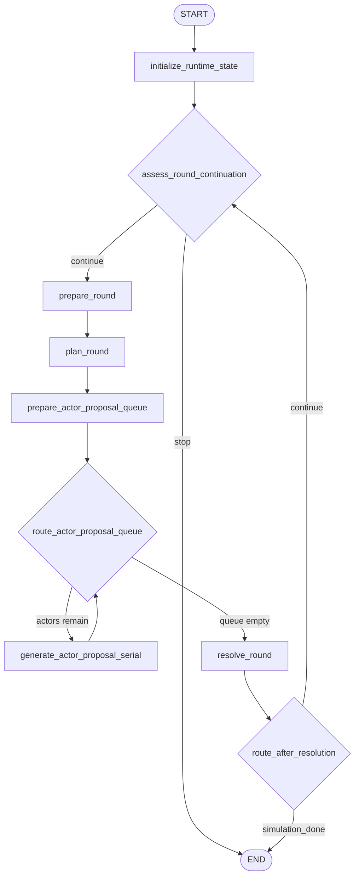

# Runtime Workflow

## Purpose

Runtime is the only looping stage. It selects the next focus, builds actor proposals, resolves
the round, updates event tracking, and decides whether another round is still useful.

## Active Path

This document describes the default serial runtime graph. The parallel variant still uses
`dispatch_selected_actor_proposals -> generate_actor_proposal -> reduce_actor_proposals` when
intra-run graph parallelism is enabled.

## Node Responsibilities

### `initialize_runtime_state`

Builds the runtime-only starting point after planning and generation:

- initializes `activity_feeds`
- initializes `event_memory` from `plan.major_events`
- initializes actor intent snapshots
- builds the initial actor-facing scenario digest
- resets runtime scratch fields

### `assess_round_continuation`

Runs before each new round.

Deterministic checks happen first:

- hard-stop completion once the configured hard stop is reached
- immediate completion once `planned_max_rounds` has been reached and no required unresolved
  events remain
- continued execution when required unresolved events still keep the endgame gate open
- stale-required-event stop when required unresolved events have gone overdue without evidence and
  stagnation has accumulated after the planner target

Only after those checks does the node ask the `coordinator` role whether the run should stop for
`no_progress`.

If required unresolved events remain, a coordinator-produced `no_progress` stop is suppressed and
the loop continues.

When event-memory transitions happen at this front-stop boundary, the node writes
`round_event_memory_updated` events and appends to `event_memory_history`.

### `prepare_round`

Prepares the next round by:

- incrementing `round_index`
- refreshing `event_memory`
- rebuilding compact focus candidates
- resetting round-local scratch fields
- starting round latency timing

### `plan_round`

Builds one `RoundDirective` bundle through the `coordinator` role.

It receives:

- focus candidates
- deferred actor views
- compact situation and coordination-frame views
- simulation clock
- event memory
- latest observer summary

After local normalization, the node:

- enforces focus-slice and actor-call limits
- normalizes selected and deferred cast ids
- may inject one stagnation-breaking background hook
- appends to `round_focus_history`
- writes `round_focus_selected`
- writes `round_background_updated` when background updates exist

### `prepare_actor_proposal_queue`

Copies `selected_cast_ids` into a round-local proposal queue for serial execution.

### `route_actor_proposal_queue`

Chooses the next branch:

- when actor ids remain, continue with `generate_actor_proposal_serial`
- when the queue is empty, jump to `resolve_round`

### `generate_actor_proposal_serial`

Builds one `ActorActionProposal` for one selected actor using:

- the actor card
- one focus slice
- visible action context
- unread backlog digest
- visible actors
- runtime guidance, including allowed actions and current intent state

The node also applies semantic validation and may fall back to an explicit forced-idle default
payload when parsing or validation fails. In the serial graph, proposal order is already
deterministic, so no separate reduce step is needed.

### `resolve_round`

Resolves the round in one `RoundResolution` bundle and then performs the code-side updates that the
LLM is not trusted to do directly.

Current responsibilities:

- filter invalid adopted cast ids
- apply adopted activities
- sanitize event updates
- update `event_memory` and append `event_memory_history`
- advance the simulation clock
- write observer output
- merge updated intent snapshots
- update stagnation counters
- persist round artifacts through the store
- write runtime log events for time advancement, adopted actions, observer output, and event-memory
  transitions
- set `stop_reason` when the resolver completes the simulation

## Stop Behavior

The runtime loop ends when one of these happens:

- `assess_round_continuation` returns `simulation_done`
- `assess_round_continuation` returns `no_progress`
- `resolve_round` returns `simulation_done`

The active stop policy combines:

- configured hard ceiling: `max_rounds`
- planner target: `planned_max_rounds`
- grace for unresolved required major events
- stale overdue required events after the planner target
- round-level resolver completion

`stop_reason` values remain:

- `""`
- `no_progress`
- `simulation_done`

## Stage Output

Runtime leaves behind the trace consumed by finalization:

- `activities`
- `observer_reports`
- `background_updates`
- `round_focus_history`
- `round_time_history`
- `event_memory`
- `event_memory_history`
- `actor_intent_states`
- `intent_history`
- `world_state_summary`
- `stop_reason`

## Parallel Variant

When a run is started with CLI `--parallel`, runtime switches to the parallel actor-proposal path:

- `plan_round -> dispatch_selected_actor_proposals -> generate_actor_proposal -> reduce_actor_proposals -> resolve_round`

That variant keeps the same round semantics but allows concurrent selected-actor proposal calls.
