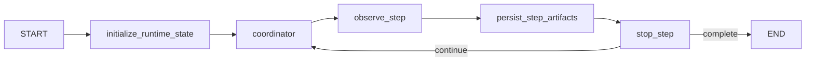

# Runtime Subgraph

## Purpose

The runtime subgraph owns the repeating step loop. It initializes runtime-only channels,
runs the coordinator subgraph, asks the observer for a step summary, persists step
artifacts, and decides whether to continue.

## Current Compiled Loop

## Inputs and Outputs

| Input | Meaning |
| --- | --- |
| `plan` | planning bundle |
| `actors` | runtime actor registry |
| runtime settings | step, focus, and routing limits |
| `rng_seed` | deterministic selection seed |

| Output | Meaning |
| --- | --- |
| `activities` | canonical runtime activity log |
| `observer_reports` | per-step summaries |
| `simulation_clock` | cumulative time snapshot |
| `step_time_history` | normalized time-advance records |
| `actor_intent_states` | latest intent snapshots |
| `intent_history` | per-step intent history |
| `stop_requested` / `stop_reason` | stop decision |

## Runtime Responsibilities

### `initialize_runtime_state`

Initializes the mailbox/feed state and clears runtime-only channels such as:

- `activity_feeds`
- `observer_reports`
- `focus_candidates`
- `step_focus_history`
- `actor_intent_states`
- `world_state_summary`

The current runtime reset does not include the older `observer_event_*` scratch channels.

### `coordinator`

Delegates the step execution core:

- focus candidate compression
- focus slice planning
- deferred actor digestion
- actor proposal fan-out and reduce
- action adoption
- intent updates
- time advancement

### `observe_step`

Produces the observer report for the current step and updates:

- `observer_reports`
- `pending_observer_report`
- `world_state_summary`
- `stagnation_steps`

The observer input is built from compact views, not from the full runtime state:

- compact latest-step actions
- compact latest background updates
- relevant intent subset
- `prior_state_digest`
- current clock and current step time-advance snapshot

### `persist_step_artifacts`

Persists the latest adopted activities together with the observer report.

### `stop_step`

Decides whether the runtime loop ends or returns to the coordinator.

## What the Observer Does Today

- summarizes the step in `ObserverReport`
- sets `momentum` and `atmosphere`
- refreshes `world_state_summary`
- contributes to stop logic through `momentum`
- reads compact prompt projections tailored to the latest step instead of the full activity
  history

## What the Observer Does Not Own Today

- it does not choose focus slices
- it does not adopt actor actions
- it does not own intent snapshot updates
- it does not own normalized time advancement in the current compiled path

Those responsibilities currently live in coordinator adjudication.

## Stop Conditions

The runtime stops when either condition is met:

- `step_index >= max_steps`
- stagnation accumulates after repeated low-momentum steps

## Important Current Behaviors

- runtime uses prompt projections to keep role inputs smaller than the full stored state
- the compiled runtime path is smaller than the full set of prompt modules present in the
  tree
- prompts such as step-time estimation or alternative event decomposition exist in the
  repository, but the current compiled path uses coordinator adjudication plus observer
  summary as the active runtime split
- persistence happens after each observed step, not only at the end of the run
