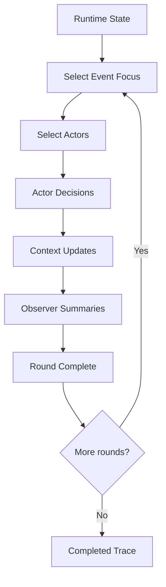

# Runtime Workflow

Runtime advances the virtual world through actor activity rounds.

## Flow

```mermaid
flowchart TD
    Start["Runtime State"] --> Select["Select Event Focus"]
    Select --> Actors["Select Actors"]
    Actors --> Decide["Actor Decisions"]
    Decide --> Context["Context Updates"]
    Context --> Observer["Observer Summaries"]
    Observer --> Round["Round Complete"]
    Round --> Stop{"More rounds?"}
    Stop -->|Yes| Select
    Stop -->|No| Done["Completed Trace"]
```

## Round Responsibilities

Each round can:

- focus on a major event
- ask selected actors for choices and messages
- record accepted interactions
- update actor context and intent
- emit actor messages
- emit `interaction.recorded`
- generate an observer round summary
- emit `report.delta`
- emit `round.completed`
- contribute graph timeline frames

`maxRound` is a hard limit by default. With opt-in `autonomousProgress`, `coordinator/progress.ts`
builds immutable previous/current evidence snapshots for the coordinator's exact `1`/`0` decision.
`1` permits one more round, including beyond the configured maximum; `0` stops after recording
the current round and observer summary. Repeated activity alone is not progress. Invalid outputs
use the existing exact-choice repair/retry path. See [configuration](../configuration.md).

## Fast Mode

When `fastMode` is true, dependency-safe actor decisions run in parallel. Rounds and observer
summaries remain sequential so each round can use prior observer summaries.

The run emits a `log` event when fast mode is enabled.

## Timeline Frames

`RunStore.appendEvent` derives graph frames from:

- `actors.ready`
- `interaction.recorded`
- `round.completed`

The derived frames are written to `graph.timeline.json` and streamed as `graph.delta`.

## Stop Behavior

The current stop reasons are:

- `simulation_done`
- `no_progress`
- `failed`
- empty string before a terminal reason is known

Failed runs are handled by the server wrapper and written to the manifest with an error message.

## Related Docs

- finalization: [`finalization.md`](./finalization.md)
- event contract: [`../contracts.md`](../contracts.md)
