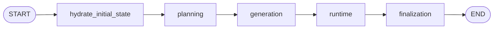

# Simulation Root Graph

## Purpose

The root graph defines the public workflow boundary and stage order.

## Active Path

## Public Boundary

The root graph uses:

- `input_schema=SimulationInputState`
- `state_schema=SimulationWorkflowState`
- `output_schema=SimulationOutputState`

That separation follows the LangGraph pattern of narrow public input/output with a richer internal
state for node communication.

## Hydration

`hydrate_initial_state` is the only node that consumes public input directly.

It expands:

- `run_id`
- `scenario`
- `max_rounds`
- `rng_seed`

into the fully initialized workflow state, including scratch channels such as:

- `planning_analysis`
- `round_focus_plan`
- `simulation_clock`
- `final_report_sections`
- `errors`

Downstream nodes assume those keys already exist.

## Runtime Context

The root graph also receives `WorkflowRuntimeContext`, which provides:

- settings
- store
- llms
- logger
- llm_usage_tracker

Those dependencies stay outside the state surface.
