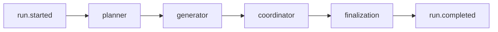

# Simulation Root Workflow

The server starts a run by calling `runSimulation` from `packages/core`.

## Input

`runSimulation` receives:

- `runId`
- normalized `ScenarioInput`
- normalized `LLMSettings`
- async `emit` callback for `RunEvent`
- optional `roundDelayMs`

The server owns persistence and passes an emitter that appends each event to `events.jsonl`, builds
timeline frames, and publishes SSE messages.

## Root Stage Order

## State

The workflow starts from `initialSimulationState(runId, scenario)` and returns the completed
`SimulationState`.

The final state is written to:

- `state.json`
- `report.md`

The server writes terminal manifest fields after the workflow resolves or fails.

## Events

The workflow emits:

- run lifecycle events
- node lifecycle events
- model messages and metrics
- actor readiness
- interactions
- actor messages
- per-round observer summaries
- round completion
- report deltas
- logs

The storage layer derives `graph.delta` events for actor readiness, interactions, and completed
rounds.

## Failure Behavior

If a stage throws, the server emits `run.failed`, writes a failed manifest with the error message,
and removes the run from the in-memory running set.

## Related Docs

- workflow hub: [`README.md`](./README.md)
- contracts: [`../contracts.md`](../contracts.md)
