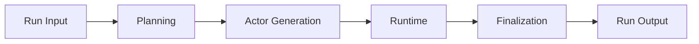

# Simulation Workflow

The root simulation workflow defines the public boundary and stage order for one run.

## Boundary

The workflow accepts compact run input:

- run id
- scenario body
- scenario controls
- maximum round limit
- deterministic seed when provided

It returns compact run output:

- run id
- final report payload
- rendered report
- event log reference
- usage summary
- stop reason
- explicit errors

## Stage Order

## State Initialization

Before planning begins, the workflow expands compact input into initialized state.

The initialized state includes:

- empty plan and actor buffers
- empty runtime activity and observer history
- initial event-memory fields
- initial actor intent fields
- initial simulation clock
- empty report buffers
- empty error list

Later stages should read this initialized state instead of rebuilding shared defaults.

## Stage Ownership

| Stage | Owns |
| --- | --- |
| Planning | scenario interpretation, action catalog, cast roster, and major events |
| Actor generation | concrete actor cards and actor registry validation |
| Runtime | event selection, actor actions, intent updates, event-memory updates, and stop decisions |
| Finalization | report projection, report drafting, markdown rendering, and final metadata |

## Durable Events

During execution, stable events are appended to `simulation.log.jsonl`.

The log is used for:

- inspection
- analysis
- performance summaries
- final artifact indexing

## Related Docs

- workflow hub: [`README.md`](./README.md)
- state and artifact contracts: [`../contracts.md`](../contracts.md)
- architecture: [`../architecture.md`](../architecture.md)
