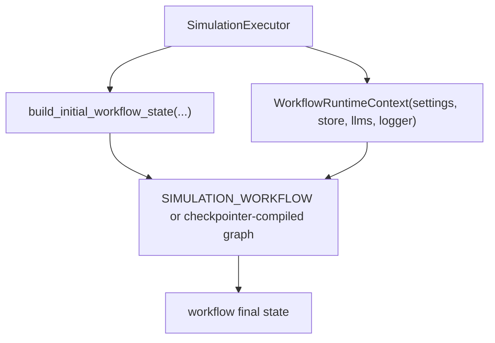

# Simulation Workflow

## Purpose

The simulation workflow is the root graph that assembles the project lifecycle into one
LangGraph app. It does not contain the detailed logic of every stage; it delegates those to
subgraphs and passes one shared workflow state through them in sequence.

## Root Assembly

## Inputs and Outputs

| Input | Meaning |
| --- | --- |
| `run_id` | unique run identifier created by the executor |
| `scenario` | raw scenario text |
| `max_steps` | runtime step cap loaded from settings |
| `rng_seed` | deterministic seed resolved before graph execution |
| `checkpoint_enabled` | whether execution may be recompiled with a checkpointer |

| Output | Meaning |
| --- | --- |
| `final_report` | structured final report JSON |
| `simulation_log_jsonl` | rendered JSONL log string |
| `report_projection_json` | finalization-only report projection |
| `final_report_markdown` | final markdown report in state |

## Subgraph Handoff

| From | To | Handoff surface |
| --- | --- | --- |
| planning | generation | `plan`, `action_catalog`, `coordination_frame`, cast roster |
| generation | runtime | `actors` |
| runtime | finalization | activities, observer reports, time history, focus history, actor state, stop reason |

## Execution Path

## Important Current Behaviors

- the repository keeps a compiled singleton `SIMULATION_WORKFLOW` for the normal path
- when checkpointing is enabled, the executor recompiles from `SIMULATION_WORKFLOW_GRAPH`
  with the active checkpointer
- graph invocation uses `ainvoke(..., version="v2")`
- file outputs are not written inside this workflow; they are written later from the final
  state by the presentation layer

## Related Docs

- planning internals: [`planning.md`](./planning.md)
- runtime internals: [`runtime.md`](./runtime.md)
- report assembly: [`finalization.md`](./finalization.md)
